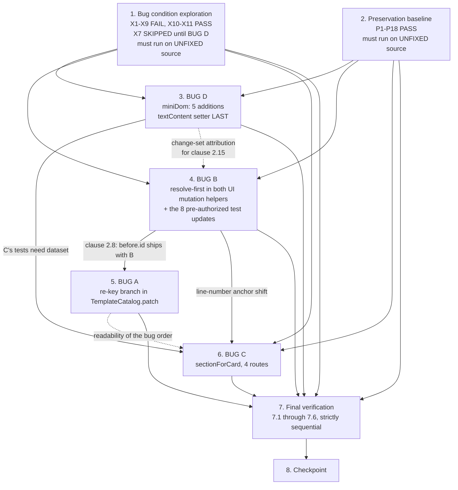

# Implementation Plan

## Overview

Four defects. Three files change — `js/templates/templateCatalog.js`, `js/templates/templates.js`, `tests/helpers/miniDom.js` — plus four new test files and cases added to two existing ones. Every claim in `bugfix.md` was reproduced against the working tree and `design.md` read every line reference and every affected test case in situ. Nothing below re-opens either document — this plan turns them into work.

**Fixed implementation order: BUG D → BUG B → BUG A → BUG C.** From the design's D6:

- **D first.** Independent of all three code fixes and confined to `tests/helpers/miniDom.js`. Landing it alone lets clause 2.15's measured baseline be re-confirmed against a change set containing nothing else, so a moved count is unambiguously the helper.
- **D → C** is a *test* dependency. BUG C's derivation is proved against a card produced by the real `renderTemplateCardMarkup` and parsed by miniDom, which needs `dataset`.
- **B → A** is clause 2.8, and it is the one hard edge. BUG A's primary discriminator is `previous.id`, and `patchUITemplate` can only supply a genuinely pre-patch `before` once the ordering is fixed. The `before.id` addition ships **as part of B's own edit**, so A arrives with its discriminator already in place.
- **C last.** Independent. It touches a function none of the others touch.

**BUG B and BUG A should land as one reviewable pair.** Between them there is a bounded temporary regression, stated here so a reviewer meets it in the plan rather than in a bisect: with B landed and A absent, the shared-shape rename now reaches `TemplateCatalog.patch(M, before)`, `byId[before.id]` exists, but the unrepaired `byId[id] === undefined` guard still takes the add branch — so the duplication fires. It is masked by S5's `markTemplatesDirty()` and the trailing `filterAndRender()`, exactly as it is masked today. **No worse than current behaviour**, and it closes at task 5.3. Do not ship B without A.

The change set, in full:

| File | Change | Task |
| --- | --- | --- |
| `tests/helpers/miniDom.js` | 5 additions — selector lists, `dataset`, `classList`, `style`, `textContent` setter | 3 |
| `js/templates/templates.js` | `removeUITemplate` and `patchUITemplate` rewritten in full | 4 |
| `js/templates/templateCatalog.js` | 2 module-private helpers + 1 new branch in `patch`, no new export | 5 |
| `js/templates/templates.js` | 1 new helper `sectionForCard`, 3 lines reordered in `importCurrentCardToTimeline` | 6 |
| `tests/catalog-patch-ordering-exploration.test.js` | **new** — X1-X11 | 1 |
| `tests/template-catalog.test.js` | extended — A1-A10, P1-P6 | 2, 5 |
| `tests/media-card-lifecycle-preservation.property.test.js` | extended — B1-B6, P7-P10, and the eight pre-authorized updates | 2, 4 |
| `tests/import-section-derivation.property.test.js` | **new** — C1-C5, P11-P12 | 2, 6 |
| `tests/helpers/miniDom.contract.test.js` | **new** — P13-P14 and the helper unit tables | 2, 3 |
| `tests/card-thumbnail-dom-patch.test.js` | **new** — D1-D9, P16 | 3 |

**`js/core/persistence.js` is not modified by any task.** That is deliberate, not incidental: D3 achieves the entry-identity invariant by mutating the array slot instead of repairing `patchEntry`, which keeps a whole-file CEP-scanned unit out of the change set (3.20) and keeps `_mutate`'s rollback semantics and the element-identity shape probes intact (3.9). **No file under `jsx/` is modified by any task** (3.18).

**S4 and S5 are RELOCATED, not added or removed.** Both `markTemplatesDirty()` calls move from inside the deleted scan loops into the resolved-record branches. Their count stays one per operation and their effect is unchanged; only their guard changes, from "the scan matched" to "a record was resolved" — which is the fix. Keep the `// S4` and `// S5` markers so the prior spec's S1-S7 table stays greppable.

**ES5 for `js/**`, and only for `js/**`.** Every task that edits `js/templates/templateCatalog.js` or `js/templates/templates.js` carries an `_ES5_Safe:_` annotation: no arrow functions, no `let`/`const`, no template literals, no spread/rest, no `class`, no `async`/`await`, no optional chaining, no nullish coalescing (3.19). **`tests/**` is outside that constraint** — BUG D's `dataset` uses a `Proxy` deliberately, and per D5 that choice is load-bearing rather than convenient: per-key accessors defined at parse time would let a write to a key with no `data-*` attribute yet become a plain own property that never reaches an attribute.

All line references are pre-edit. Every edit in `design.md` is specified by **anchor text**; line numbers are navigation aids. The one place the distinction matters is recorded at task 6.1.

The caveats that survive the fix — the test that stays red on purpose, the eight cases authorized to move, the three that must not, the baseline that must not shift, and the two defects this spec declines to touch — are consolidated in `## Notes`.

## Property coverage map

| Design property | Owning task | Coverage |
| --- | --- | --- |
| Property 1 — a re-keyed record stays one record | 5 (BUG A) | **New** — X1-X4 (task 1) + A1-A10 (task 5.4) |
| Property 2 — the add path and the catalog's contracts are unmoved | 5 (BUG A) | **Mixed** — P1 and P3 name the existing witnesses at `tests/template-catalog.test.js:152-154`, `:101`, `:116` and leave them **unmodified** (task 5.5); P2, P4, P5, P6 are new (tasks 2, 5.6) |
| Property 3 — the UI mutation helpers reach their mirror in both aliasing shapes | 4 (BUG B) | **New** — X5, X6 (task 1) + B1-B6 (task 4.3) + the rewritten items 1, 2, 3, 5, 6 (tasks 4.4-4.9) |
| Property 4 — both helpers keep every call, count and render decision | 4 (BUG B) | **Mixed** — P7, P9, P10 re-run the prior spec's `P1`, `P5`, `P6`, `P7`, `P8` **unmodified**; P8 is the `expectMirror` collapse in `F2-remove` / `F2-patch` (tasks 4.8, 4.9) |
| Property 5 — the import section describes the card | 6 (BUG C) | **New** — X7 (task 1, skipped until BUG D lands, unskipped at task 3.6) + C1, C2, C4, C5 (task 6.3) |
| Property 6 — every import that works today is byte-identical | 6 (BUG C) | **Mixed** — P11 is new (tasks 2, 6.5); P12 re-runs `tests/comp-pipeline-integration.test.js` FLOW 6 **unmodified** (task 6.4) |
| Property 7 — the DOM patch loops are reached and correct | 3 (BUG D) | **New** — X8, X9 (task 1) + D1-D9 (task 3.8) |
| Property 8 — the shared helper's existing surface and its consumers are unmoved | 3 (BUG D) | **Mixed** — P13, P14 are new (tasks 2, 3.7); P15 is a measurement over 15 suites, not a file; P16 re-runs `E3` and `P2c` **unmodified** (task 3.9) |
| Property 9 — runtime and scan constraints hold | 7 (verification) | **Mixed** — P17 re-runs `tests/media-cep-compatibility.test.js` **unmodified** (task 7.4); P18 is a new ES5 source scan (tasks 2, 7.6) |

Two homes need stating, because neither is obvious:

- **P15 is a measurement, not a test.** Task 2 records the pre-fix counts of the 15 miniDom-consuming suites; task 3.10 re-measures against the real implementation rather than `bugfix.md`'s probe; task 7.5 holds it.
- **P18 lives in `tests/catalog-patch-ordering-exploration.test.js`**, next to X10 and X11. It is a source-shape guard of the same character as those two refutation guards, it must run pre-fix and post-fix, and it cannot go in `tests/media-cep-compatibility.test.js` because P17 requires that file unmodified.

## Task Dependency Graph

Top level. Tasks 3 through 6 are the four bug tasks in the mandated order **BUG D → BUG B → BUG A → BUG C**. Solid edges are real dependencies; dotted edges are ordering only.



Sub-tasks. Order inside a bug task is fixed by construction: a helper exists before its call sites, a verify sub-task follows what it verifies, and BUG D's `textContent` edit is last because it is the only one of the five that modifies existing code.

```mermaid
graph TD
    subgraph BD["3. BUG D — tests/helpers/miniDom.js"]
        T31["3.1 selector lists"]
        T32["3.2 dataset (Proxy)"]
        T33["3.3 classList"]
        T34["3.4 style"]
        T35["3.5 textContent SETTER — apply LAST"]
        T36["3.6 unskip X7"]
        T37["3.7 new miniDom.contract.test.js"]
        T38["3.8 new card-thumbnail-dom-patch.test.js"]
        T39["3.9 confirm-only: item 11, E3 stays red"]
        T310["3.10 verify D"]
        T31 & T32 & T33 & T34 --> T35
        T31 & T32 --> T36
        T35 --> T37 & T38
        T37 & T38 --> T39 --> T310
    end

    subgraph BB["4. BUG B — js/templates/templates.js"]
        T41["4.1 removeUITemplate in full"]
        T42["4.2 patchUITemplate in full (+ before.id)"]
        T43["4.3 new B1-B6"]
        T44["4.4 item 1 F4-S5-aliasing-rename"]
        T45["4.5 item 2 rename-edges"]
        T46["4.6 item 3 F4-S4-aliasing-shared"]
        T47["4.7 item 4 F2-pin"]
        T48["4.8 item 5 F2-remove"]
        T49["4.9 item 6 F2-patch"]
        T410["4.10 item 7 S_SITES table"]
        T411["4.11 item 8 describe comment"]
        T412["4.12 verify B"]
        T41 & T42 --> T43
        T42 --> T44 & T45 & T47
        T41 --> T46
        T41 --> T48
        T42 --> T49
        T41 & T42 --> T410 --> T411
        T43 & T44 & T45 & T46 & T47 & T48 & T49 & T410 & T411 --> T412
    end

    subgraph BA["5. BUG A — js/templates/templateCatalog.js"]
        T51["5.1 priorIndexedId"]
        T52["5.2 reindexRecord"]
        T53["5.3 the re-key branch in patch"]
        T54["5.4 new A1-A10"]
        T55["5.5 confirm-only: item 9"]
        T56["5.6 verify A"]
        T51 & T52 --> T53 --> T54 & T55
        T54 & T55 --> T56
    end

    subgraph BC["6. BUG C — js/templates/templates.js"]
        T61["6.1 sectionForCard"]
        T62["6.2 the derivation call site"]
        T63["6.3 new import-section-derivation.property.test.js"]
        T64["6.4 confirm-only: item 10, FLOW 6"]
        T65["6.5 verify C"]
        T61 --> T62 --> T63 & T64
        T63 & T64 --> T65
    end

    subgraph V["7. Final verification"]
        T71["7.1 exploration suite"]
        T72["7.2 preservation suites"]
        T73["7.3 (a) per-suite verification command"]
        T74["7.4 (b) CEP compatibility, 25/25"]
        T75["7.5 (c) 15 miniDom suites, 1/171/172"]
        T76["7.6 (d) full-suite baseline"]
        T71 --> T72 --> T73 --> T74 --> T75 --> T76
    end
```



The same graph as machine-readable schedule definitions. `waves` is the mandated schedule and matches the fixed order; `anchorTextWaves` is the alternative that opens up if every edit is applied by anchor text rather than by line number. `schedulingOnlyEdges` records the two edges that are ordering convenience and **not** dependencies.

```json
{
  "version": 1,
  "taskCount": 8,
  "fixedBugOrder": ["BUG D", "BUG B", "BUG A", "BUG C"],
  "fixedTaskOrder": ["3", "4", "5", "6"],
  "reviewPairs": [
    {
      "tasks": ["4", "5"],
      "reason": "BUG B alone leaves a bounded temporary regression: the shared-shape rename reaches TemplateCatalog.patch, but with BUG A absent the byId[id] === undefined guard still takes the add branch, so the duplication fires — masked by S5 and the trailing filterAndRender exactly as it is masked today. No worse than current behaviour, and it is why B and A land as one reviewable pair."
    }
  ],
  "waves": [
    { "wave": 1, "name": "Observe on unfixed source", "tasks": ["1", "2"] },
    { "wave": 2, "name": "BUG D, alone, so clause 2.15's baseline is attributable", "tasks": ["3"] },
    { "wave": 3, "name": "BUG B", "tasks": ["4"] },
    { "wave": 4, "name": "BUG A, closing the temporary regression B opened", "tasks": ["5"] },
    { "wave": 5, "name": "BUG C", "tasks": ["6"] },
    { "wave": 6, "name": "Final verification", "tasks": ["7"] },
    { "wave": 7, "name": "Checkpoint", "tasks": ["8"] }
  ],
  "anchorTextWaves": [
    { "wave": 1, "name": "Observe on unfixed source", "tasks": ["1", "2"] },
    { "wave": 2, "name": "BUG D — still first, because BUG C's tests need dataset", "tasks": ["3"] },
    { "wave": 3, "name": "BUG B and BUG C in parallel; no textual overlap once anchors replace line numbers", "tasks": ["4", "6"] },
    { "wave": 4, "name": "BUG A — still after BUG B, clause 2.8 does not relax", "tasks": ["5"] },
    { "wave": 5, "name": "Final verification", "tasks": ["7"] },
    { "wave": 6, "name": "Checkpoint", "tasks": ["8"] }
  ],
  "tasks": [
    { "id": "1", "title": "Bug condition exploration test, X1-X11", "wave": 1, "dependsOn": [], "subTasks": [] },
    { "id": "2", "title": "Preservation property tests, P1-P18", "wave": 1, "dependsOn": [], "subTasks": [] },
    {
      "id": "3",
      "title": "BUG D — five additions to the shared test DOM",
      "wave": 2,
      "dependsOn": ["1", "2"],
      "subTasks": [
        { "id": "3.1", "dependsOn": [] },
        { "id": "3.2", "dependsOn": [] },
        { "id": "3.3", "dependsOn": [] },
        { "id": "3.4", "dependsOn": [] },
        { "id": "3.5", "dependsOn": ["3.1", "3.2", "3.3", "3.4"] },
        { "id": "3.6", "dependsOn": ["3.1", "3.2"] },
        { "id": "3.7", "dependsOn": ["3.5"] },
        { "id": "3.8", "dependsOn": ["3.5"] },
        { "id": "3.9", "dependsOn": ["3.7", "3.8"] },
        { "id": "3.10", "dependsOn": ["3.6", "3.9"] }
      ]
    },
    {
      "id": "4",
      "title": "BUG B — resolve-first in removeUITemplate and patchUITemplate",
      "wave": 3,
      "dependsOn": ["1", "2"],
      "subTasks": [
        { "id": "4.1", "dependsOn": [] },
        { "id": "4.2", "dependsOn": [] },
        { "id": "4.3", "dependsOn": ["4.1", "4.2"] },
        { "id": "4.4", "dependsOn": ["4.2"] },
        { "id": "4.5", "dependsOn": ["4.2"] },
        { "id": "4.6", "dependsOn": ["4.1"] },
        { "id": "4.7", "dependsOn": ["4.2"] },
        { "id": "4.8", "dependsOn": ["4.1"] },
        { "id": "4.9", "dependsOn": ["4.2"] },
        { "id": "4.10", "dependsOn": ["4.1", "4.2"] },
        { "id": "4.11", "dependsOn": ["4.10"] },
        { "id": "4.12", "dependsOn": ["4.3", "4.4", "4.5", "4.6", "4.7", "4.8", "4.9", "4.10", "4.11"] }
      ]
    },
    {
      "id": "5",
      "title": "BUG A — the re-key branch in TemplateCatalog.patch",
      "wave": 4,
      "dependsOn": ["1", "2", "4"],
      "subTasks": [
        { "id": "5.1", "dependsOn": [] },
        { "id": "5.2", "dependsOn": [] },
        { "id": "5.3", "dependsOn": ["5.1", "5.2"] },
        { "id": "5.4", "dependsOn": ["5.3"] },
        { "id": "5.5", "dependsOn": ["5.3"] },
        { "id": "5.6", "dependsOn": ["5.4", "5.5"] }
      ]
    },
    {
      "id": "6",
      "title": "BUG C — derive the import section from the card",
      "wave": 5,
      "dependsOn": ["1", "2", "3", "4"],
      "subTasks": [
        { "id": "6.1", "dependsOn": [] },
        { "id": "6.2", "dependsOn": ["6.1"] },
        { "id": "6.3", "dependsOn": ["6.2"] },
        { "id": "6.4", "dependsOn": ["6.2"] },
        { "id": "6.5", "dependsOn": ["6.3", "6.4"] }
      ]
    },
    {
      "id": "7",
      "title": "Final verification",
      "wave": 6,
      "dependsOn": ["1", "2", "3", "4", "5", "6"],
      "subTasks": [
        { "id": "7.1", "dependsOn": [] },
        { "id": "7.2", "dependsOn": ["7.1"] },
        { "id": "7.3", "dependsOn": ["7.2"] },
        { "id": "7.4", "dependsOn": ["7.3"] },
        { "id": "7.5", "dependsOn": ["7.4"] },
        { "id": "7.6", "dependsOn": ["7.5"] }
      ]
    },
    { "id": "8", "title": "Checkpoint", "wave": 7, "dependsOn": ["7"], "subTasks": [] }
  ],
  "schedulingOnlyEdges": [
    {
      "from": "3",
      "to": "4",
      "reason": "Change-set attribution, not a dependency. BUG D touches only tests/helpers/miniDom.js and BUG B only js/templates/templates.js. D goes first so clause 2.15's measured baseline (15 suites at 1 failed / 171 passed / 172 total; full suite at the stated counts) is re-confirmed against a change set containing nothing else — if a count moves it is unambiguously the helper."
    },
    {
      "from": "5",
      "to": "6",
      "reason": "Readability of the bug order. BUG C is behaviourally independent of both BUG A and BUG B; its only real inbound edges are BUG D (its tests need dataset) and BUG B (line-number anchor shift, since sectionForCard is inserted above removeUITemplate). Under anchor-text editing C runs in parallel with B."
    }
  ],
  "hardEdges": [
    {
      "from": "4",
      "to": "5",
      "reason": "Clause 2.8. BUG A's primary discriminator is previous.id, and patchUITemplate can only supply a pre-patch before once BUG B's ordering is fixed. The before.id addition ships as part of BUG B's own edit to the before literal, so BUG A arrives with its discriminator in place. Landing A first is safe but pointless: in the shared shape the mirror is never called, so A's fix would be unreachable on the path the bug report describes."
    },
    {
      "from": "3",
      "to": "6",
      "reason": "A test dependency. BUG C's derivation is proved against a card produced by the real renderTemplateCardMarkup and parsed by miniDom, which requires dataset. Without D, C's tests would hand-roll card objects and would no longer prove the tpl-<id> escape-then-parse round trip."
    },
    {
      "from": "4",
      "to": "6",
      "reason": "Line-number anchor shift only. sectionForCard is inserted after getTemplateSourcePath (:2151), above removeUITemplate (:2219), so applying C first shifts B's anchors. Disjoint function bodies otherwise. Relaxes entirely under anchor-text editing."
    }
  ]
}
```

The same constraints as a listing, with the reason each edge exists.

- **1** and **2** gate every bug task and are independent of each other. Both must be written and run against UNFIXED source: task 1's value is the nine recorded failures, task 2's is a green baseline of *observed* behaviour. Once any fix lands neither observation can be made again, so nothing from tasks 3-6 may be applied before both exist and have been run. The one exception is structural rather than behavioural: **X7 cannot run at all until BUG D lands**, so it is written skipped and unskipped at 3.6.
- **3 (BUG D)** is first. Its inbound edge to **4** is ordering only; its inbound edge to **6** is real.
  - **3.1, 3.2, 3.3, 3.4** are mutually independent — four additive `MiniElement.prototype` accessors plus two mapper functions and one traversal change, at distinct sites.
  - **3.5** depends on all four: it is the only one of the five that **edits existing code**, so it goes last and the four additive accessors review independently of it. The `textContent` descriptor is non-configurable, so the setter must be added at the original `Object.defineProperty` call rather than bolted on.
  - **3.6** depends on **3.1** and **3.2** only — X7 needs a selector list and `dataset`, nothing else.
  - **3.7** and **3.8** depend on **3.5**: both drive the full helper surface.
  - **3.9** is confirm-only and follows the two new files, because it is checking that they did not disturb `E3`.
  - **3.10** re-measures clause 2.15 against the real implementation.
- **4 (BUG B)**.
  - **4.1** and **4.2** are independent: two disjoint function bodies, each replaced in full.
  - **4.3** needs both — B4 drives `removeUITemplate`, B1/B2/B3/B5/B6 drive `patchUITemplate`.
  - **4.4-4.9** are the six pre-authorized case rewrites; each depends only on the helper it observes. They are mutually independent and can be applied in any order.
  - **4.10** needs both helpers landed, because it re-states the aliasing claim for all four S-sites. **4.11** follows it, because the `describe` comment is the narrative version of the same claim.
  - **4.12** verifies B and depends on every sub-task.
- **5 (BUG A)** follows **4** — the only hard edge in the plan.
  - **5.1** and **5.2** are independent helper insertions. **5.3** calls both.
  - **5.4** and **5.5** follow **5.3** and are independent of each other: 5.4 adds cases, 5.5 confirms three that must not move.
  - **5.6** verifies A and confirms the temporary regression B opened is closed.
- **6 (BUG C)** is last.
  - **6.1** gates **6.2**: the call site invokes a helper that must exist. Note that `sectionForCard` is a top-level `function` declaration and therefore hoisted, so the *insertion position* is free even though the order of the two sub-tasks is not.
  - **6.3** and **6.4** follow **6.2** and are independent: 6.3 adds a new file, 6.4 re-runs an untouched one.
  - **6.5** verifies C.
- **7** depends on **1**, **2** and all of **3-6**. **7.1 → 7.2 → 7.3 → 7.4 → 7.5 → 7.6** is strictly sequential, narrowest scope first. A failure at 7.1 or 7.2 is a fix defect and localizes to one bug; a failure that first appears at 7.3-7.6 is a regression in code the spec did not intend to touch, and knowing which earlier stage was green is what makes it diagnosable.
- **8** depends on all of **7**.

**Parallelization under anchor-text editing.** Three of the four inter-bug edges relax: D → B was never a dependency, A → C was never a dependency, and B → C is a line-number artefact. What does **not** relax: tasks **1** and **2** still gate all four bug tasks, **D still precedes C** because C's tests need `dataset`, **B still precedes A** because clause 2.8 is behavioural, sub-task order inside each bug task is unchanged, and task **7** still follows all four. The task list is written to the line-number-safe order, so an implementer who has not switched to anchor-text editing must follow it exactly.

---

## Tasks

- [x] 1. Write bug condition exploration test
  - **Property 1: Bug Condition** - A re-keyed record stays one record
  - **IMPORTANT**: Write this file BEFORE any fix lands, in `tests/catalog-patch-ordering-exploration.test.js`
  - **CRITICAL**: X1-X9 MUST FAIL on unfixed code — the failures confirm the four root causes. **DO NOT attempt to fix the test or the code when they fail.** The failures are the deliverable
  - **NOTE**: X1-X9 encode the expected behaviour, so their flip to passing is what validates the fixes at task 7.1. X10 and X11 are refutation guards that PASS on unfixed code — a failure there refutes a premise and sends that bug back to re-hypothesis rather than into an implementation
  - **Scoped PBT Approach**: every bug here is deterministic, so each case is scoped to concrete failing inputs for reproducibility. Generation moves to the fix-checking properties in tasks 3.8, 4.3, 5.4 and 6.3
  - Bug condition under test is `isBugA OR isBugB OR isBugC OR isBugD` from the design's `isBugCondition`. All four contribute a clause, so all four get failing cases
  - Harness: vm realm loading `js/templates/templates.js` and `js/templates/templateCatalog.js` through `tests/helpers/loadHelpers.js` with `lenient: false`, following `tests/media-card-lifecycle-preservation.property.test.js`' realm pattern
  - X1 — `isBugA`, a re-key duplicates: build over three records in one `comp` section with ids `a`/`b`/`c` and category `Cat`; mutate the middle record's `id` to `b-new` in place; call `catalog.patch(record, { category, favorite, section })`. Assert `size() === 3`, `idsFor(section,"All").length === 3`, `sectionCounts(section).all === 3`. Confirms hypothesis 1. **Expect FAIL**
  - X2 — `isBugA`, the leak is cumulative: two successive re-keys of the same record. Assert `idsFor(section,"All")` still has three entries. Distinguishes "one duplicate" from "one per rename". **Expect FAIL**
  - X3 — `isBugA`, the old name stays searchable: after a re-key, assert `idsFor(section,"All", oldName)` is empty and `idsFor(section,"All", newName)` returns the record. Confirms 1.3. **Expect FAIL**
  - X4 — `isBugA`, rename-then-delete leaves a ghost: re-key, then `remove`. Assert `get(oldId)` is `undefined`, `idsFor(section,"All").length === 2`, `sectionCounts(section).all === 2`. Confirms 1.4 — the consequence `bugfix.md` found beyond the original report. **Expect FAIL**
  - X5 — `isBugB`, the shared-shape middle rename fires nothing: five records, `allTemplates === li._entries`, rename at index 2 with `filterAndRender` stubbed. Assert `TemplateCatalog.get(newId)` is the mutated record. Confirms hypothesis 2 and pins the exact gap. **Expect FAIL**
  - X6 — `isBugB`, the shared-shape favourite toggle loses the count: three unfavourited records, shared shape, `patchUITemplate(name, cat, { favorite: true })` with `filterAndRender` stubbed. Assert `sectionCounts(section).favorites === 1`. Confirms hypothesis 3 — the second-order consequence, invisible in the cloned shape. **Expect FAIL**
  - X7 — `isBugC`, the import section ignores the card: render a `footage` record's card through the real `renderTemplateCardMarkup`, parse it, set `currentSection` to `comp`, capture `importTemplates`' payload. Assert `payload.templates[0].section === "footage"`. Confirms hypothesis 4. **WRITE IT SKIPPED**: it needs `dataset` to parse a card into something the derivation can read, which does not exist until BUG D lands. Use `test.skip` with the reason **in the case label** — e.g. `X7 [SKIPPED until BUG D lands: needs miniDom dataset to drive a parsed card]` — so the skip is self-explaining in the runner output. **Task 3.6 unskips it**, after which it runs against still-unfixed BUG C code and **is expected to FAIL**; task 6.5 flips it to PASS
  - X8 — `isBugD`, the selector list matches nothing: parse two cards, one `.card` and one `.icon-card`, into a miniDom document. Assert `document.querySelectorAll(".card, .icon-card").length === 2`. Confirms hypothesis 5's first half — and assert **deliberately** that no exception is raised anywhere in the call, which corrects the originally reported mechanism from "throws into the outer catch" to "silently iterates zero times". **Expect FAIL**
  - X9 — `isBugD`, the loop body throws on four counts: with the selector list patched **locally in the test only**, call `refreshCardThumbnail` and `markCardFailed` against a parsed document and assert each completes without throwing — four assertions, one per absent surface. Confirms hypothesis 5's second half and proves the fix needs four additions, not one. **Expect FAIL, four times.** After task 3.1 the local selector patch becomes a redundant no-op; leave it in place so the case stays self-contained
  - X10 — refutation guard for BUG A's premise: `catalog.patch(fresh)` for a record the catalog has never indexed still acts as an **add**. **Expect PASS** — a failure means the add path is already broken and BUG A's premise is wrong
  - X11 — refutation guard for BUG C's premise: assert a rendered card's parsed attributes include `data-file`, `data-cat`, `data-folder`, `data-thumb` and an `id` of `"tpl-" + record.id`, and **no** `data-section`. **Expect PASS** — a failure refutes the premise that the section must be *derived* rather than read, and would make clause 2.10's "SHALL NOT invent a new `data-*` attribute" the wrong call
  - Run on UNFIXED source and document every counterexample: X1-X4 give `size()` 4 not 3, `idsFor` `["a","b","c","b-new"]`, `counts` `{all:4,cats:{Cat:4}}`, `idsFor(…, oldName)` returning the stale id, and `get(oldId)` still resolving after `remove`; X5 gives `realm.catalog.patch.length === 0`, `realm.marks.length === 0`, `catalogSourceChanged() === false`, `TemplateCatalog.get(oldId).name` still the old name and every shape probe unmoved; X6 gives `favorites: 0` where a rebuild reports `1`, with `before.favorite === mutated.favorite`; X7 (once unskipped) gives `section === "comp"` while `sourcePath` came from the `footage` record — the two-rules-for-one-record signature; X8 gives `length === 0` with no thrown error; X9 gives `TypeError: Cannot read properties of undefined (reading 'folder')`, then `… (reading 'remove')`, then `… (setting 'cssText')`, then `TypeError: Cannot set property textContent of #<MiniElement> which has only a getter`
  - Mark complete when the file is written, run, and the nine failures, two passes and one documented skip are recorded
  - _Requirements: 1.1, 1.2, 1.3, 1.4, 1.5, 1.6, 1.7, 1.8, 1.9, 1.10, 1.11, 1.12, 1.13, 1.14, 1.15, 1.16, 1.17_

- [x] 2. Write preservation property tests (BEFORE implementing any fix)
  - **Property 2: Preservation** - The add path and the catalog's contracts are unmoved
  - **IMPORTANT**: Follow observation-first methodology — run the UNFIXED code for each non-bug input class, record what it actually does, then encode that. Do not encode what the design says it *should* do
  - Property-based, because these obligations are universally quantified over records, mutation sequences, category strings, path strings and selector strings — exactly where hand-picked examples miss
  - For BUG A and BUG B the "original" side is computed **inside the test**, from a fresh `build` over the same records or from the pre-fix expression, so equality is asserted against the old rule rather than against a snapshot that can rot
  - Files: P1-P6 into `tests/template-catalog.test.js`; P7-P10 into `tests/media-card-lifecycle-preservation.property.test.js`; P11-P12 into `tests/import-section-derivation.property.test.js`; P13-P14 into `tests/helpers/miniDom.contract.test.js`; P16 into `tests/card-thumbnail-dom-patch.test.js`; **P18 into `tests/catalog-patch-ordering-exploration.test.js`** next to X10/X11, because it is a source-shape guard of the same character and cannot go into `tests/media-cep-compatibility.test.js` (P17 requires that file unmodified). P15 and P17 are measurements and re-runs, not new code
  - P1 → Property 2 (3.1): name `tests/template-catalog.test.js:152-154` as the regression witness for `patch(fresh)` acting as an **add**. **Do not modify it.** Task 5.5 confirms it
  - P2 → Property 2 (2.4, 3.1), the identity-scan false-positive guard: `patch(freshClone)` where `freshClone` carries an indexed record's exact field values **including its `id`**, and separately where it carries a different id but identical everything else. Both must **add**, not re-key. Both pass trivially pre-fix — record that honestly. **The discriminating power only exists once route 2 exists**, so the meaningful run is deferred to task 5.6. This is the only way route 2 could be got wrong, so it is asserted rather than argued
  - P3 → Property 2 (3.2): name `tests/template-catalog.test.js:101` (favourite toggle) and `:116` (category change) as witnesses; **do not modify them**. Add a property over 500 same-id patches — favourite, category, both — asserting the whole public surface (`size`, `idsFor`, `categories`, `sectionCounts`, `get`) equals a fresh rebuild's
  - P4 → Property 2 (2.4): `recordId(t) === null` behaves exactly as before — `addToLists` registers it under the string key `"null"`. This is D1's deliberate non-change, made executable so it stays a decision rather than becoming an oversight
  - P5 → Property 2 (3.3): after `patch` and after `remove`, `sourceStamp()` is unchanged; only `build` and `stampSource` move it
  - P6 → Property 2 (3.4): `byId[id] === t` — a reference, never a clone — and `sectionIds` holds ids; `categories(section)` returns `["All","Favorites",…discovery order]` with no duplicates
  - P7 → Property 4 (3.7): name the prior spec's `P1` in `tests/media-card-lifecycle-preservation.property.test.js` — `_getTemplateFolderPath` over 2000 generated non-media records, byte equality. **Do not modify it.** `_getTemplateFolderPath` is not edited by this spec, so it holds by construction; re-running it is the confirmation
  - P8 → Property 4 (3.5, 3.6, 3.8): observe and record `F2-remove`'s and `F2-patch`'s **current** aliasing-conditional expectations — `expectMirror = w.aliased ? 0 : 1` and `expectMirror = (w.aliased && movesMatchKey) ? 0 : 1` — with the counts each produces per generated world. **DEFERRED**: the collapse to `expectMirror = 1` cannot pass pre-fix, and lands in tasks 4.8 and 4.9
  - P9 → Property 4 (3.5): name the prior spec's `P8` `recordChangedView` routing property — `filterAndRender` exactly when `recordChangedView` holds and `patchTemplateCard` otherwise, over favourite/rename/move × search × `currentCategory === "Favorites"`. **Do not modify it**
  - P10 → Property 4 (3.9): name the prior spec's `P5` (build fires once across K renders with no mutation), `P6` (the `refreshCardThumbnail` exclusion witness) and `P7` (constant-length clone rewrite caught by the element-identity probes). **Do not modify them.** `P7` matters twice here: D3 keeps `patchEntry`'s clone replacement precisely so those probes stay live
  - P11 → Property 6 (3.10): for 400 generated records rendered in their **own** section, record the whole payload computed by the pre-fix rule (`section = currentSection`) field by field — `rootPath` and `templates[0].{id,name,category,section,sourcePath,folderPath}`. **DEFERRED**: the byte-identity equality against the fixed code lands in task 6.5. Note the payload's `id` is the **name**, not the record id
  - P12 → Property 6 (3.11, 3.13): name `tests/comp-pipeline-integration.test.js` FLOW 6, both tests, as the witnesses that `makeCardFake()` completes without throwing and that the `.importing` / `.imported` and toast assertions hold. **Do not modify them.** Task 6.4 confirms them
  - P13 → Property 8 (3.14, 3.15): record the pre-fix results corpus for single-selector `querySelector` / `querySelectorAll` over 300 generated trees; `getElementById` for ids containing commas, entities, spaces and `#`; the `escapeTemplateCardAttribute` → parse → `.id` round trip over 1000 generated record ids; `innerHTML` get and set; the `textContent` **getter** over nested trees; the void-element set. **DEFERRED**: the equality against the extended helper lands in task 3.7
  - P14 → Property 8 (3.16): record that `tests/performance/startup-reconcile.property.test.js` installs an `outerHTML` accessor and a live `innerHTML` getter, `startup-warm-paint.property` installs `insertAdjacentHTML` per element, and `startup-lifecycle.property` reuses the `innerHTML` descriptor — and that **none of the three redefines `textContent`**, which is why 3.5 can leave the descriptor non-configurable. Re-run all three as-is; **no edit**
  - P15 → Property 8 (2.15): **a measurement, not a test file.** Run the 15 miniDom-consuming suites on unfixed source and record the counts: `keyed-media-card-helper`, `media-async-io.property`, `media-card-lifecycle-exploration`, `media-card-lifecycle-preservation.property`, `media-hover-controller`, `media-hover-controller.property`, `media-import-coordinator`, `media-index-migration.property`, `media-pipeline-integration`, `single-card-patch-job-completion.property`, and `performance/{cold-start-progressive.property, fast-media-terminal-regression, startup-lifecycle.property, startup-reconcile.property, startup-warm-paint.property}`. Expected: **1 failed / 171 passed / 172 total**, the single failure being `E3`. **DEFERRED**: re-measurement against the real implementation — not `bugfix.md`'s probe — lands in tasks 3.10 and 7.5
  - P16 → Property 8 (3.17): record `refreshCardThumbnail`'s and `markCardFailed`'s model-and-index halves as they run today — the index patch fields `{ thumbStatus: "ready", thumbnailPath: <raw> }` and `{ thumbStatus: "failed" }`, the record field writes, `TemplateCatalog.patch` present with **no** `markTemplatesDirty()` for the former, `markTemplatesDirty()` (S6) present with **no** catalog mirror for the latter. Name `E3` (red, `DIAGNOSTIC`) and `P2c` (green) as the witnesses. **DEFERRED**: the "unchanged *while newly reaching the DOM loop*" half is unobservable pre-fix and lands in task 3.9
  - P17 → Property 9 (3.20, 3.21): run `npx jest tests/media-cep-compatibility.test.js --runInBand` on unfixed source and record **25/25**. Name it as a witness; **do not modify the file.** It holds by construction — no whole-file unit is edited, `js/core/persistence.js` is untouched, and neither `escapeTemplateCardAttribute` nor `renderTemplateCardMarkup` is edited, so both region scans extract identical text at a shifted start line. Task 7.4 confirms it
  - P18 → Property 9 (3.19): an ES5 syntax scan over `js/templates/templateCatalog.js` and `js/templates/templates.js` — no arrow function, `let`/`const`, template literal, spread/rest, `class`, `async`/`await`, `?.` or `??`. Trivially green pre-fix; it exists so every later `js/**` edit is checked by a test rather than by review. **`tests/**` is explicitly out of scope for this property** — BUG D's `dataset` uses a `Proxy` on purpose
  - **DEFERRED to the bug tasks, collected so none is lost.** Each of these cannot pass on unfixed code, because it references behaviour or a helper that does not exist yet:
    - P2's route-2 discrimination — meaningless until `priorIndexedId` exists → **task 5.6**
    - P8's `expectMirror` collapse to `1` — fails pre-fix by construction → **tasks 4.8, 4.9**
    - P11's payload byte-identity equality — the fixed side does not exist → **task 6.5**
    - P13's equality against the extended helper — the additions do not exist → **task 3.7**
    - P15's re-measurement against the real implementation → **tasks 3.10, 7.5**
    - P16's "unchanged while the DOM loop is newly reached" — the loop is unreachable pre-fix → **task 3.9**
    - P18's meaningful run — no `js/**` edit exists to scan → **tasks 4.12, 5.6, 6.5, 7.6**
  - Run on UNFIXED code. **EXPECTED OUTCOME: every non-deferred case PASSES**, establishing the baseline to preserve
  - Mark complete when the files are written, run, and green on unfixed code, and when the P15 and P17 measurements are recorded
  - _Requirements: 3.1, 3.2, 3.3, 3.4, 3.5, 3.6, 3.7, 3.8, 3.9, 3.10, 3.11, 3.12, 3.13, 3.14, 3.15, 3.16, 3.17, 3.18, 3.19, 3.20, 3.21, 3.22, 3.23, 3.24_

- [ ] 3. BUG D — five additions to the shared test DOM (first, per the fixed order)

  **`tests/helpers/miniDom.js` is the only file this task edits.** Five additions: four are new `MiniElement.prototype` accessors plus two mapper functions and one traversal change; the fifth **edits an existing `Object.defineProperty` call** and therefore goes last. Per D5 the additions land in the **shared** helper, not a scoped fake: `bugfix.md` measured a probe of all five at zero movement across the 15 consuming suites and across the full suite, and a scoped fake would leave the shared helper unable to express the selector the production code actually uses. **`tests/**` is outside clause 3.19's ES5 constraint** — 3.2's `Proxy` is a deliberate choice, not an oversight.

  - [x] 3.1 Add comma-separated selector-list support
    - Add `splitSelectorList(selector)` and `matchesAny(element, selectors)` above `collect`; change `collect`'s second parameter from a single selector to an **array**; update three call sites
    - `MiniElement.prototype.querySelectorAll` → `collect(this, splitSelectorList(selector), [])`; `document.querySelectorAll` → `collect(document.documentElement, splitSelectorList(selector), [])`; `document.getElementById` → `collect(document.documentElement, ["#" + String(id)], [])`
    - **One traversal**, matching any selector in the list, so results stay in **document order** with **no duplicates** — an element carrying both `.card` and `.icon-card` appears once. Running `collect` per selector and concatenating would give neither, and D9 asserts exactly this
    - **The split lives here and NOT in `matchesSelector`.** That is load-bearing: ids in this codebase are `"tpl-" + <record id>` and the property suites generate hostile record ids, so splitting an id on commas would be a real regression. Routing the split through `querySelectorAll` alone makes it structurally impossible, and `getElementById` passes a **one-element array** that can never be split
    - `matchesSelector` is **not touched**, so single-selector behaviour is identical by construction (3.15). `MiniElement.prototype.querySelector` and `document.querySelector` are unchanged; they delegate
    - _Bug_Condition: `isBugD(input)` — `querySelectorAll(".card, .icon-card").length === 0` while matching cards exist_
    - _Expected_Behavior: Property 7 — the loops are reached, in document order, with no duplicates (2.13)_
    - _Preservation: Property 8 — single-selector parity and `getElementById` comma safety (3.15)_
    - _Requirements: 1.14, 2.13, 3.15_

  - [x] 3.2 Add `dataset`
    - Add `datasetKeyToAttribute(key)` and `attributeToDatasetKey(name)`, plus one lazily created accessor near the `className` accessor, cached on the element as `_dataset` and read through on every access so a `setAttribute` can never leave it stale
    - Traps: `get`, `set`, `has`, `deleteProperty`, `ownKeys`, `getOwnPropertyDescriptor`. **The last two are required together** — a `Proxy` reporting `ownKeys` without matching descriptors throws on `Object.keys` — and together they make `for…in` over `dataset` work
    - Standard key mapping: `dataset.folder` ↔ `data-folder`, `dataset.mediaType` ↔ `data-media-type`. Note the card markup emits `data-mediatype` all-lowercase, so it reads as `dataset.mediatype`. That is the DOM's own rule, not a helper quirk — do not "fix" it
    - `get` and `has` **return early for non-string keys**. Without that, a symbol probe — Jest's printer and `util.inspect` both make several — reaches `String(symbol)` and throws
    - **A `Proxy`, not per-key accessors defined at parse time.** A write to a key with no `data-*` attribute yet (`c.dataset.thumb = url` on an element built by `createElement`, or `btn.dataset.cat = cat` in `buildCategoryTabs`) would otherwise silently become a plain own property and never reach an attribute. `tests/**` is outside clause 3.19, so ES6 here is deliberate
    - **Reachability side effect, named rather than discovered.** With `dataset` and the `textContent` setter present, `buildCategoryTabs` (`btn.dataset.cat`, `btn.textContent`) and `buildCategoryPanel` (`item.dataset.cat`) now run to completion under miniDom instead of throwing, and `updateCategoryCountsOnly` can read those rows back. The probe measured the full suite unmoved, so no current assertion depends on the throw — but a reviewer seeing new code execute in an old suite should find this note, not a surprise
    - _Bug_Condition: `isBugD(input)` — `c.dataset` is `undefined`, so `c.dataset.folder` raises a `TypeError` (1.15)_
    - _Expected_Behavior: Property 7 — the `data-thumb` update lands (2.14, 2.16)_
    - _Preservation: Property 8 — single left-to-right attribute-entity decoding unchanged, so `tpl-<id>` identity survives escape-then-parse (3.14)_
    - _Requirements: 1.15, 2.14, 3.14_

  - [ ] 3.3 Add `classList`
    - Add `classTokens(element)` and one accessor returning a **fresh object per access**, backed by `className`, with `contains`, `add`, `remove` and `toggle`
    - `add` and `remove` are variadic like the real DOM; `toggle` takes the optional `force` argument and **returns the resulting state** — `js/ui/header.js` and `js/ui/modals.js` both call `toggle(name, cond)`
    - Token order is preserved and duplicates are never introduced. A write rewrites `class` as `tokens.join(" ")`, which normalises whitespace — but **only on a write**, so a read-only `contains` leaves `className` byte-identical (3.15)
    - Fresh per access rather than cached, so it cannot go stale after a `className` reassignment. It is only ever used transiently (`card.classList.add("importing")`), so caching buys nothing
    - Scope is exactly the four methods clause 2.14 names: **no `length`, no index access, no `replace`** — nothing in `js/**` uses them
    - _Bug_Condition: `isBugD(input)` — `c.classList` is `undefined`, so `.remove("thumb-failed")` and `.add("thumb-failed")` raise (1.15)_
    - _Expected_Behavior: Property 7 — `thumb-failed` removed on success, added on failure (2.14, 2.16)_
    - _Preservation: Property 8 — the reflected `className` is unchanged by a read-only `contains` (3.15)_
    - _Requirements: 1.15, 2.14, 3.15_

  - [ ] 3.4 Add `style`
    - One accessor returning a lazily created plain object cached as `_style`, so writes are observable
    - Deliberately **not** a CSS parser and **not** reflected into or out of the `style` attribute: nothing in `js/**` reads `getAttribute("style")`, and `badge.style.cssText = "…"` only needs to read back
    - **Document that limitation in the helper** so a future test does not assume reflection it will not get
    - _Bug_Condition: `isBugD(input)` — `box.style` and `badge.style` are `undefined`, so `badge.style.cssText = …` raises (1.15)_
    - _Expected_Behavior: Property 7 — the badge's `cssText` and the box's `position` are observable (2.14, 2.16)_
    - _Preservation: Property 8 — no existing surface reads or writes `style`, so nothing moves (3.15)_
    - _Requirements: 1.15, 2.14_

  - [ ] 3.5 Add the `textContent` **setter** — apply this LAST
    - **This is the only one of the five that modifies existing code.** Edit the existing `Object.defineProperty(MiniElement.prototype, "textContent", …)` call to add a `set`. The descriptor is **non-configurable**, so the setter cannot be bolted on from outside — it must be added at the original descriptor
    - Apply it after 3.1-3.4 so those four additive accessors review independently of an edit to existing code
    - The setter detaches every child, appends a single `MiniText` for a non-empty value, and appends nothing for `""` / `null` / `undefined`. It also updates the cached `_innerHTML` to the entity-escaped text so the `innerHTML` getter stays consistent with the children
    - **The getter is untouched, including its concatenation semantics** (3.15). The descriptor **stays non-configurable** — making it configurable would be an unrequested behaviour change, and per P14 none of the three extending suites redefines `textContent`; they redefine `innerHTML` / `outerHTML` / `insertAdjacentHTML` (3.16)
    - No change to `decodeEntities`, `parseAttributes`, `matchesSelector`, `parseInto`, the `VOID_ELEMENTS` set, `MiniFragment`, `parseSingleElement`, or the module's exports
    - _Bug_Condition: `isBugD(input)` — `MiniElement.prototype.textContent` has a getter only, so `badge.textContent = "!"` throws under `"use strict"` (1.15)_
    - _Expected_Behavior: Property 7 — `badge.textContent === "!"` (2.14, 2.16)_
    - _Preservation: Property 8 — the getter's concatenation semantics and the three extending suites' redefinitions both unmoved (3.15, 3.16)_
    - _Requirements: 1.15, 2.14, 3.15, 3.16_

  - [ ] 3.6 Unskip X7 and record its counterexample
    - Remove the `test.skip` from X7 in `tests/catalog-patch-ordering-exploration.test.js` and drop the `[SKIPPED until BUG D lands…]` marker from its label
    - X7 needs 3.1 (the selector list) and 3.2 (`dataset`) only; it does not wait on 3.3-3.5
    - Run it. **EXPECTED OUTCOME: FAILS** — BUG C is still unfixed, so `payload.templates[0].section === "comp"` while the record is in `footage`. **This failure is the deliverable**: it is hypothesis 4's counterexample, and it is the first moment in the plan at which it can be observed. Task 6.5 flips it to PASS
    - Record the counterexample alongside X1-X6, X8, X9 in the same place, so all nine live together
    - _Bug_Condition: `isBugC(input)` — the card's section is recoverable and differs from `currentSection`_
    - _Expected_Behavior: Property 5 — asserted here, satisfied at task 6.2_
    - _Requirements: 1.10, 1.13_

  - [ ] 3.7 Write `tests/helpers/miniDom.contract.test.js`
    - New file. The helper's own contract, kept separate from the production loops — different subjects, different harnesses. Adding either to `tests/media-card-lifecycle-preservation.property.test.js` would move the 70/70 clause 3.22 pins for reasons unrelated to preservation
    - Add P13's **deferred equality**: single-selector `querySelector` / `querySelectorAll` byte-identical to the pre-fix results recorded in task 2 over the same 300 generated trees; `getElementById` for ids containing commas, entities, spaces and `#`; the `escapeTemplateCardAttribute` → parse → `.id` round trip over the same 1000 generated record ids; `innerHTML` get and set; the `textContent` **getter** over nested trees; the void-element set
    - Add P14: run assertions that the three extending suites' descriptor installs still succeed against the extended prototype
    - Unit tables, per the design's Unit Tests section:
      - `splitSelectorList`: one selector; two; three with irregular whitespace; a trailing comma; an empty string; **a selector containing a comma inside no quotes — documented as unsupported and returning both halves**
      - `dataset`: read a missing key (`undefined`, not `null`); write then read; write then `getAttribute`; `delete`; `in`; `Object.keys`; a camelCase key; **a symbol key**
      - `classList`: `add` a duplicate; `remove` an absent token; `toggle` with and without `force`; token order after a mixed sequence; `contains` leaving `className` byte-identical
      - `textContent` setter: `""`, `null`, `undefined`, a value containing `<`, `&` and `>`, and a set over an element that already had parsed children; **the getter re-read after each**
    - _Properties: Property 8 (preservation)_
    - _Requirements: 2.13, 2.14, 3.14, 3.15, 3.16_

  - [ ] 3.8 Write `tests/card-thumbnail-dom-patch.test.js`
    - New file, driving the **real** `refreshCardThumbnail` and `markCardFailed` against a parsed document. **Neither function is edited by this spec** — this task closes a coverage gap, it does not change behaviour
    - D1 → `.card` with an existing ``: `img.src === url`, `c.dataset.thumb === url`, no new element inserted, `thumb-failed` removed
    - D2 → `.card` with a `.thumb-box` holding **no** `` (a non-media record with no thumbnail, so the renderer emitted the placeholder SVG): one `` inserted, `src` decoding back to the busted URL
    - D3 → a pre-existing `.thumb-fail-badge` is removed on success, and is the **only** node removed
    - D4 → `markCardFailed`: `thumb-failed` added, one `.thumb-fail-badge` inserted into the box, `badge.title === "Thumbnail render failed"`, `getAttribute("aria-label")` the same string, `textContent === "!"`, and a `style.cssText` containing `position:absolute`. Note `title` is a plain property (D5 leaves it unreflected on purpose), so assert `badge.title` and **not** `getAttribute("title")`
    - D5 → `markCardFailed` twice for the same folder inserts exactly one badge
    - D6 → the `.icon-card` variant, markup authored in the test since the prior spec deleted `renderIcons`: the inserted `` carries **no** `class` attribute
    - D7 → three realms, because production checks `window.getComputedStyle` and then calls the **bare** global: (a) `window.getComputedStyle` present returning `{position:"static"}` with a bare `getComputedStyle` injected → `box.style.position === "relative"`; (b) no bare global → the `ReferenceError` is caught and `position` is set anyway; (c) `window` present but no `getComputedStyle` → `box.style` is never written
    - D8 → no-match: a folder matching no card leaves every card's attributes, classes and children byte-identical and raises nothing
    - D9 → `querySelectorAll(".card, .icon-card")` over a tree containing one `.card`, one `.icon-card` and an element carrying **both** classes returns **three** nodes, in document order, with no duplicates
    - Add P16's **deferred half**: with the DOM loop now newly reached, `refreshCardThumbnail`'s and `markCardFailed`'s model-and-index halves are still exactly what task 2 recorded — the index patch fields, the record field writes, `TemplateCatalog.patch` with no mark for one, the mark with no mirror for the other. Clause 1.17 is why this is checkable at all: both halves already ran before the DOM loop, so the prior spec's assertions were made against code that really executed
    - Integration case: render a card with no thumbnail, call `markCardFailed` (badge appears, `thumb-failed` added), then `refreshCardThumbnail` (badge removed, `thumb-failed` removed, `` inserted with the busted URL, `data-thumb` updated) — the four pieces of shipped UI behaviour that had never been executed, in the order a user hits them
    - _Properties: Property 7 (fix), Property 8 (preservation)_
    - _Requirements: 1.16, 1.17, 2.16, 3.17_

  - [ ] 3.9 Confirm-only — item 11: `E3` stays red and keeps its label
    - **`tests/media-card-lifecycle-exploration.test.js` is NOT edited.** Re-run it: `npx jest tests/media-card-lifecycle-exploration.test.js --runInBand`
    - **EXPECTED OUTCOME: 1 failed / 9 passed.** `E3` still FAILS and keeps its `DIAGNOSTIC` label; its post-fix inverse `P2c` still PASSES (3.23)
    - `E3` is the prior spec's permanently-red diagnostic, which its design decision D1 deliberately declines to satisfy. **Do not "fix" it, do not delete it, do not relabel it.** Nothing in this spec touches `refreshCardThumbnail`'s index patch, which is what `E3` asserts against
    - The reason this confirmation belongs to BUG D and not elsewhere: `media-card-lifecycle-exploration` is one of the 15 miniDom-consuming suites, so the helper additions are the only thing in this spec that could disturb it. It is also the single failure inside P15's 1 failed / 171 passed / 172 total, so if it moves, 3.10's count moves with it
    - _Properties: Property 8 (preservation)_
    - _Requirements: 3.17, 3.23_

  - [ ] 3.10 Verify BUG D — fix check and preservation
    - Re-run X8 and X9 from task 1. **EXPECTED OUTCOME: both flip from FAIL to PASS** — X8's `length === 2`, and X9's four no-throw assertions
    - Re-run X7 from task 3.6. **EXPECTED OUTCOME: still FAILS** — BUG C is unfixed. Confirm the failure text is the section mismatch and not a `dataset` error, which is what proves 3.2 landed
    - Run the two new files: `npx jest tests/helpers/miniDom.contract.test.js tests/card-thumbnail-dom-patch.test.js --runInBand`. **EXPECTED OUTCOME: green**
    - **P15's re-measurement — clause 2.15's acceptance criterion, against the real implementation rather than the probe.** Run all 15 miniDom-consuming suites and confirm **1 failed / 171 passed / 172 total**, identical to task 2's recorded baseline. Per clause 2.15, **if any count moves, that is a defect in the implementation, not a reason to fall back to a scoped fake** — diagnose the addition that moved it
    - Confirm from the diff that the change set for this task is **`tests/helpers/miniDom.js` plus three test files, and nothing else**. No `js/**` file is edited by task 3, so no ES5 annotation applies to it
    - _Properties: Property 7 (fix), Property 8 (preservation)_
    - _Requirements: 2.13, 2.14, 2.15, 2.16, 3.14, 3.15, 3.16, 3.17_

- [ ] 4. BUG B — resolve-first in both UI mutation helpers (land as one reviewable pair with task 5)

  **`js/templates/templates.js` only.** Both helper bodies are replaced in full; everything from `patchUITemplate`'s `var structural =` onward is unchanged. **`js/core/persistence.js` is NOT edited** — D3 achieves the entry-identity invariant by mutating the array slot rather than repairing `patchEntry`, which keeps a whole-file CEP-scanned unit out of the change set (3.20) and keeps `_mutate`'s rollback semantics and the element-identity shape probes intact (3.9). `_getTemplateFolderPath`, `_findUITemplateRecord`, `markTemplatesDirty`, `catalogSourceChanged` and `ensureCatalogFresh` are not modified either.

  **Read before starting task 5:** with B landed and A absent, the shared-shape rename reaches `TemplateCatalog.patch(M, before)` and `byId[before.id]` exists, but the unrepaired guard still takes the add branch — so the duplication fires, masked by S5 and the trailing `filterAndRender()` exactly as it is masked today. Bounded, no worse than current behaviour, and closed at task 5.3.

  - [ ] 4.1 Replace `removeUITemplate` in full
    - `js/templates/templates.js:2219-2233`. Resolve-first prologue, then match the mutation target by **object identity**
    - Order: `_getTemplateFolderPath(name, cat)` → `_findUITemplateRecord(name, cat)` → `li.removeEntry(folderPath)` + `saveLibraryIndex()` → `if (removed) { … }` → `filterAndRender()`
    - Inside the `if (removed)` block: `var at = allTemplates.indexOf(removed); if (at !== -1) allTemplates.splice(at, 1);` then `TemplateCatalog.remove(removed)` then `markTemplatesDirty();  // S4`
    - **Identity, not another `name` + `category` scan.** `removeEntry` splices, so the pre-resolved *index* is invalid the moment it returns and only the *reference* survives. `indexOf` returning `-1` is exactly the right signal — in the shared shape `removeEntry` already spliced this object out, so there is nothing left to splice. Re-scanning by name could splice a **second same-named record**; splicing unconditionally would corrupt the length. Identity is the only rule correct in both shapes
    - **S4 is RELOCATED, not added.** It moves out of the deleted scan loop into the `if (removed)` block. Count stays one per removal, so the prior spec's `expectedMarks: 1` is unchanged. **Keep the `// S4` marker** so the prior spec's table stays greppable
    - `_getTemplateFolderPath` is called before any index call and against the same array as `_findUITemplateRecord`, so both resolve the same object — the invariant `_findUITemplateRecord`'s own comment states. The duplicate O(N) scan is accepted; per D3, adding an optional record parameter would touch the function the prior spec's `P1` pins over 2000 generated records
    - _Bug_Condition: `isBugB(input)` where `input.entryPoint = removeUITemplate` and `allTemplates IS li._entries`_
    - _Expected_Behavior: Property 3 — the mirror and the mark are reached in the shared shape exactly as in the cloned shape (2.5)_
    - _Preservation: Property 4 — `li.removeEntry` + exactly one `saveLibraryIndex()`, exactly one `TemplateCatalog.remove`, exactly one `markTemplatesDirty()`, `allTemplates.length` down by exactly one in **both** shapes, ends in `filterAndRender()` (3.6, 3.8)_
    - _ES5_Safe: no arrow functions, no let/const, no template literals, no spread/rest, no class, no async/await, no optional chaining, no nullish coalescing (3.19)_
    - _Requirements: 1.6, 1.8, 2.5, 2.6, 3.6, 3.8, 3.19_

  - [ ] 4.2 Replace `patchUITemplate`'s head and loop, including `before.id`
    - `js/templates/templates.js:2234-2290`. Same resolve-first prologue, different epilogue: address the mutation target by the **pre-resolved INDEX**
    - Order: `_getTemplateFolderPath` → `var target = _findUITemplateRecord(name, cat)` → `var slot = target ? allTemplates.indexOf(target) : -1` → the `before` literal → `li.patchEntry(folderPath, patchObj)` + `saveLibraryIndex()` → `if (target) { … }`
    - Inside `if (target)`: `var rec = (slot !== -1 && allTemplates[slot]) ? allTemplates[slot] : target;` then the `patchObj` field loop onto `rec`, then `newName` / `newCat`, then `mutated = rec`, then `TemplateCatalog.patch(mutated, before)` then `markTemplatesDirty();  // S5`
    - **Mutate the array slot, not the pre-resolved reference.** In the shared shape `patchEntry` replaces the element, so after it there are two objects: `R` (pre-resolved, indexed by the catalog) and `M` (in the slot, carrying the merged fields and the pinned `folderPath`). Mutating `R` — the obvious reading of "resolve first" — would leave the catalog pointing at an object the array no longer contains: a **new** divergence outliving the call. `rec` is `M` in the shared shape and `target` in the cloned shape; in both, it is the object the model holds, the object `li._entries` holds and the object `byId` ends up holding
    - `slot` is stable across `patchEntry` by construction: `patchEntry` assigns `_entries[idx]` and never splices, so length and order are preserved; and in the cloned shape `allTemplates` is not touched at all
    - **The `before` literal is `{ id, category, favorite, section }`, read off `target` BEFORE `patchEntry` runs.** All four matter:
      - `id` is what BUG A's route 1 discriminator consumes. **This is clause 2.8's dependency, and it ships here** — task 5 arrives with its discriminator already in place
      - `favorite` is what makes `TemplateCatalog.patch`'s `p.favorite !== t.favorite` test see a **real transition**, so the favourites count is adjusted exactly once per toggle. Read from the merged clone it saw no transition at all, and a favourite toggle not being `structural`, nothing else recomputed the count (2.7)
      - `category` and `section` complete the pre-patch snapshot `patch` needs for its structural path. `section` is `getTemplateSection(target)`
    - **Drop the dead `var liEntry = null;` / `liEntry = li.patchEntry(…)` pair.** `patchEntry` returns `_mutate`'s **boolean** and `liEntry` is never read anywhere in the function
    - **S5 is RELOCATED, not added.** Out of the deleted scan loop into the `if (target)` block. Count stays one per patch. **Keep the `// S5` marker**
    - Everything from `var structural = newName !== undefined || newCat !== undefined;` onward is **unchanged**, including the `recordChangedView` test with its `structural` and `currentCategory === "Favorites"` clauses and its `buildCategoryTabs` / `buildCategoryPanel` calls (3.5)
    - Two consequences of keeping the clone, recorded rather than worked around, both pre-existing and unchanged by this edit: (a) `patchObj` values of `undefined` are deleted from `merged` by `patchEntry` but assigned by the in-memory loop — under the shared alias the delete wins and the assignment re-adds the key with value `undefined`; `JSON.stringify` and `normalizeLibraryEntry` both drop `undefined`, so nothing persists differently, and no production caller passes it. (b) The `folderPath` pin: a caller putting `folderPath` in `patchObj` moves the entry away from its key. Today's behaviour, staying today's behaviour — but after this edit it holds for the rename and move shapes too, not only the shapes whose scan happened to match. Task 4.7 promotes that from prose to an assertion
    - If `li.patchEntry` fails, `_mutate` restores `this._entries` to a fresh array of copies, so `allTemplates` is no longer the index's array and `allTemplates[slot]` is still `target`; the mutation and the mirror land on `target` exactly as today, and `needsFullScan` is raised as today. **No special case needed** — B6 asserts it
    - _Bug_Condition: `isBugB(input)` where `input.entryPoint = patchUITemplate` and either `movesTheMatchKey(patchObj)` or `patchObj.favorite` is present_
    - _Expected_Behavior: Property 3 — the mirror and the mark reached in both shapes; `before` carries pre-patch `id`, `category`, `favorite`, `section` (2.5, 2.6, 2.7, 2.8)_
    - _Preservation: Property 4 — `li.patchEntry` + exactly one `saveLibraryIndex()`, exactly one `TemplateCatalog.patch(mutated, before)`, exactly one `markTemplatesDirty()`, the same `recordChangedView` decision, `merged.folderPath` still pinned, `needsFullScan()` false on success and the existing rollback on rejection (3.5, 3.7, 3.8)_
    - _ES5_Safe: no arrow functions, no let/const, no template literals, no spread/rest, no class, no async/await, no optional chaining, no nullish coalescing (3.19)_
    - _Requirements: 1.6, 1.7, 1.8, 1.9, 2.5, 2.6, 2.7, 2.8, 3.5, 3.7, 3.8, 3.19_

  - [ ] 4.3 Add cases B1-B6 to `tests/media-card-lifecycle-preservation.property.test.js`
    - **All six run with `filterAndRender` / `patchTemplateCard` / `buildCategoryTabs` / `buildCategoryPanel` stubbed**, so the mirror's own effect is observable **before** any rebuild can mask it. That is the point: these cases prove the fix, the pre-authorized cases in 4.4-4.9 prove the signal
    - B1 → shared shape, rename at a MIDDLE index: `realm.catalog.patch.length === 1`, `realm.marks.length === 1`, `marks[0].sourceChanged === true`, `realm.catalog.build === 0`, `get(newId) === allTemplates[MID]`, `get(oldId) === undefined`, `size()` unchanged, `idsFor(section,"All")[MID] === newId`. X5's inverse
    - B2 → shared shape, **move** (category change) at a MIDDLE index: same shape, plus `sectionCounts(section).cats` and `categories(section)` equal to a rebuild's
    - B3 → shared shape, favourite toggle: `sectionCounts(section).favorites === 1` with `realm.catalog.build === 0`, and equal to a rebuild's. Clause 2.7's executable form and X6's inverse
    - B4 → shared shape, `removeUITemplate`: `realm.catalog.remove.length === 1`, `realm.marks.length === 1`, `allTemplates.length === N - 1` (**no double splice** — this is what 4.1's identity check buys), `TemplateCatalog.size() === N - 1`, `li.has(folder) === false`, `li.needsFullScan() === false`
    - B5 → property over {shared, cloned} × {favorite, rename, move} × index ∈ {0, middle, last}: the mirror count, the mark count and the post-call catalog state are **mode-independent**, and the catalog equals a rebuild over the resulting `allTemplates` in every cell
    - B6 → `li.patchEntry` rejected (a folder the index does not hold): rollback, `needsFullScan() === true`, `lastError()` non-null, and the in-memory mutation plus the mirror still landing on the resolved record — **byte-identical to the pre-fix behaviour, computed in-test**
    - Note for B1 and B2: `get(newId) === undefined` is what a *missing* key returns from `byId`, so assert `toBeUndefined()`, not `toBeNull()`
    - _Properties: Property 3 (fix)_
    - _Requirements: 2.5, 2.6, 2.7_

  - [ ] 4.4 Item 1 — rewrite `F4-S5-aliasing-rename`
    - "S5 rename in shared mode at a MIDDLE index: nothing fires". **Rename the test to say that everything fires**, and replace the 32-line `RECORDED, NOT ENDORSED` comment with a description of the fixed behaviour
    - Assertions that **move**: `expect(realm.marks.length).toBe(0)` → **`1`**; `expect(realm.catalog.patch.length).toBe(0)` → **`1`**; `expect(ctx._templatesRevision).toBe(revisionBefore)` → **`revisionBefore + 1`**; `expect(ctx.TemplateCatalog.get("t2").name).toBe(oldName)` → **`expect(ctx.TemplateCatalog.get("t2")).toBeUndefined()`**
    - Assertions to **add**: `expect(realm.marks[0].sourceChanged).toBe(true)` (matches the favourite case; clause 2.6); `expect(realm.catalog.build).toBe(1)`; `expect(ctx.TemplateCatalog.get("t2-renamed")).toBe(ctx.allTemplates[MID])`; `expect(ctx.TemplateCatalog.size()).toBe(SIZE)`; `expect(ctx.TemplateCatalog.idsFor(SECTION, "All")[MID]).toBe("t2-renamed")`
    - Assertions that **stay unchanged**: `expect(ctx.allTemplates[MID].name).toBe(oldName + " R")`; `expect(ctx.allTemplates[MID]).not.toBe(target)` — D3 keeps `patchEntry`'s clone replacement, so the element really is a new object; `expect(realm.getIndex().needsFullScan()).toBe(false)`; and **all five `shapeProbeDelta` assertions at `false`**, which are the point of the case: the counter, not a probe, is the mechanism
    - **`expect(ctx.catalogSourceChanged()).toBe(false)` stays `false` — for the OPPOSITE reason.** `bugfix.md` item 1 predicted `true`; that prediction is wrong. The mark is raised **and then absorbed** by the entry point's own `filterAndRender`, so it reads `false` at the point the case measures. `F4-S4-aliasing-shared` already shows this pattern. **The newly added `expect(realm.catalog.build).toBe(1)` is what distinguishes "raised and absorbed" from "never raised"** — without it the case cannot tell the fixed world from the broken one. Carry that reasoning into the case comment, not just the diff
    - Because the trailing rebuild masks the mirror here, the catalog-exactness claims are *also* asserted with `filterAndRender` stubbed, in B1 — **this case proves the signal, B1 proves the fix**
    - _Properties: Property 3 (fix), Property 4 (preservation)_
    - _Requirements: 2.5, 2.6, 3.5, 3.9, 3.22_

  - [ ] 4.5 Item 2 — rewrite `F4-S5-aliasing-rename-edges`
    - "FIRST and LAST index: the element-identity probes cover it"
    - Assertions that **move**: `expect(realm.marks.length).toBe(0)` → **`1`** for both indices; `expect(realm.catalog.patch.length).toBe(0)` → **`1`** for both indices
    - Assertion to **add**: `expect(ctx.TemplateCatalog.get(oldIdFor(idx))).toBeUndefined()` for both indices
    - Assertions that **stay unchanged**: `expect(delta.firstElementMoved).toBe(true)` and `expect(delta.lastElementMoved).toBe(true)` — D3 keeps the clone replacement, so the replaced element is still a new object and the probe still fires; `expect(realm.catalog.build).toBe(1)`, now attributable to the mark **as well as** the probe; `expect(ctx.catalogSourceChanged()).toBe(false)`; `expect(ctx.TemplateCatalog.get("renamed-" + idx).name).toBe(oldName + " R")`
    - **Delete the comment "Same missed scan as the middle-index case…"** — the scan no longer misses in either case
    - _Properties: Property 3 (fix), Property 4 (preservation)_
    - _Requirements: 2.5, 2.6, 3.9, 3.22_

  - [ ] 4.6 Item 3 — rewrite `F4-S4-aliasing-shared`
    - "removeEntry splices the shared array before the scan runs". **Rename it: the title's premise is now false**
    - Assertions that **move**: `expect(realm.marks.length).toBe(0)` → **`1`**; `expect(realm.catalog.remove.length).toBe(0)` → **`1`**; `expect(ctx._templatesRevision).toBe(revisionBefore)` → **`revisionBefore + 1`**
    - Assertion to **add**: `expect(realm.marks[0].sourceChanged).toBe(true)`
    - Assertions that **stay unchanged**: `expect(li.has(target.folderPath)).toBe(false)`; `expect(li.needsFullScan()).toBe(false)`; `expect(ctx.allTemplates.length).toBe(SIZE - 1)` — **the identity check in 4.1 is what prevents a second splice**; `expect(ctx.allTemplates.indexOf(target)).toBe(-1)`; `expect(delta.lengthMoved).toBe(true)`; `expect(realm.catalog.build).toBe(1)`; `expect(ctx.catalogSourceChanged()).toBe(false)`; `expect(ctx.TemplateCatalog.size()).toBe(SIZE - 1)`
    - _Properties: Property 3 (fix), Property 4 (preservation)_
    - _Requirements: 2.5, 2.6, 3.6, 3.8, 3.22_

  - [ ] 4.7 Item 4 — correct `F2-pin`'s rationale and promote its observation to assertions
    - "a patch that tries to move `folderPath` is pinned to the index key". **The four existing `expect` calls all read the cloned world and stay green, unchanged**
    - Rewrite the `note` string's **rationale**, not its claim. The claim survives — under D3 the in-memory loop still writes `patchObj`'s fields onto the object `patchEntry` pinned, so the shared entry still moves away from its key. What is stale is *why* the case is stated in cloned mode: it is because the aliasing overwrites the pin, **not** because the shared scan happened to match. Add that after this spec the overwrite reaches the **rename and move** shapes too, not only the shapes whose scan matched
    - **Promote the observation to assertions** so the claim cannot rot: add `expect(shared.li.getEntry(shared.folder)).toBeNull()` and `expect(shared.li.has("Z:/moved")).toBe(true)`, and **drop `sharedStillResolvable` from the `observe` payload**. It is deterministic after the fix, so recording it in prose is strictly weaker than asserting it
    - _Properties: Property 4 (preservation)_
    - _Requirements: 3.7, 3.22_

  - [ ] 4.8 Item 5 — collapse `F2-remove`'s `expectMirror`
    - "removeUITemplate drops the backing entry…"
    - `const expectMirror = w.aliased ? 0 : 1;` → **`const expectMirror = 1;`**, consumed unchanged by `expect(w.realm.catalog.remove.length).toBe(expectMirror)`. Inline the literal or keep the name for diff legibility — either is fine, but **the aliasing conditional must go**
    - **Delete the comment** "Removal always moves the match target, so the mirror fires only when the array is NOT the index's own entry list"
    - `expect(aliasSeen.shared).toBeGreaterThan(0)` and `expect(aliasSeen.cloned).toBeGreaterThan(0)` **stay**. Both shapes must still be generated — that is now the *point*, since the expectation is mode-independent
    - **Add `expect(w.realm.marks.length).toBe(1)`**, which the case does not currently assert in either mode
    - This is P8's deferred half from task 2 for the removal side
    - _Properties: Property 4 (preservation)_
    - _Requirements: 3.6, 3.8, 3.22_

  - [ ] 4.9 Item 6 — collapse `F2-patch`'s `expectMirror` and REMOVE the `mirrorSeen` guard
    - "patchUITemplate lands every patched field on the backing entry…"
    - `const expectMirror = (w.aliased && movesMatchKey) ? 0 : 1;` → **`const expectMirror = 1;`**. The `movesMatchKey` computation becomes dead and is **deleted with it**
    - **`expect(mirrorSeen["0"]).toBeGreaterThan(0)` is REMOVED, not inverted.** Carry this reasoning into the case, because it is the one change in items 1-8 a reviewer is most likely to want to argue with: `mirrorSeen` is keyed by `String(expectMirror)`, and `expectMirror` is now the constant `1`, so `mirrorSeen["0"]` **can never be incremented** — the guard is *unsatisfiable*, not merely wrong. Inverting it to `toBe(0)` or `toBeUndefined()` would assert that a bucket of a now-constant tally is empty: a tautology restating the line above it, with no failure mode that means anything
    - **The non-vacuity it protected moves to `aliasSeen`.** Delete `mirrorSeen` altogether and add `expect(aliasSeen.shared).toBeGreaterThan(0)` and `expect(aliasSeen.cloned).toBeGreaterThan(0)` in its place, mirroring `F2-remove`. That preserves exactly the property the guard existed for — both aliasing shapes were generated — and states it **about the input space, where it is checkable**, rather than about a derived expectation
    - `expect(mirrorSeen["1"]).toBeGreaterThan(0)` goes with the tally, subsumed by `expect(w.realm.catalog.patch.length).toBe(1)` running on **every** generated case
    - `expect(kindSeen.favorite).toBeGreaterThan(0)` / `.rename` / `.move` **stay unchanged**
    - **Add `expect(w.realm.marks.length).toBe(1)`**
    - **Delete the comment** "The mirror is skipped exactly when the array is aliased AND the patch moves a field the match rule keys on"
    - This is P8's deferred half from task 2 for the patch side
    - _Properties: Property 4 (preservation)_
    - _Requirements: 3.5, 3.7, 3.8, 3.22_

  - [ ] 4.10 Item 7 — update the `S_SITES` table entries for S4, S5, S6, S7
    - **S4 (`removeUITemplate`)**: the comment "Cloned aliasing: … The shared shape — where it does not — is pinned separately in the aliasing block below" is now false and **must be rewritten**. `aliasing: "cloned"` **may stay** — the site's `drive` assertions (`realm.catalog.remove.length === 1`, `needsFullScan() === false`) are now mode-independent. **Recommended: keep `"cloned"`** so the table stays a like-for-like comparison across all seven sites, and let B4 carry the shared shape
    - **S5 (`patchUITemplate`, favourite toggle)**: already mode-independent before this spec, because a favourite toggle does not move the match key. Its `aliasing: "cloned"` was never load-bearing and the comment explaining why it matches in both modes stays accurate. **No change required.** B3 carries the favourites-count claim the site cannot make
    - **S6 (`markCardFailed`)**: `aliasing: "cloned"` **stays and stays justified** — it scans by `folderPath` with no index call before it, so it is already mode-independent
    - **S7 (`renderOptimisticCard`)**: `aliasing: "cloned"` **stays and stays justified**, and record why in the table so the mode reads as deliberate rather than incidental: `renderOptimisticCard` calls `li.insertAtHead` and then `allTemplates.unshift(tpl)`, which in the shared shape inserts the record **twice**. That is a **pre-existing aliasing defect outside all four bugs in this spec** — see `## Notes`. **Do not fix it here**
    - `expectedMarks: 1` is **unchanged for all four sites**: S4 and S5 are relocated, not duplicated
    - _Properties: Property 3 (fix), Property 4 (preservation)_
    - _Requirements: 3.5, 3.6, 3.22_

  - [ ] 4.11 Item 8 — rewrite the `describe` block comment
    - The block at "The aliasing boundary S4 and S5 sit on" carries a 27-line factual narrative of the four-way case split, ending "it needs its own spec". **This spec is that spec**
    - **Keep the four-way table** — it is still the clearest statement of what the shapes are — but restate each row's outcome for the fixed behaviour, and replace the closing "it needs its own spec" with a pointer to this one
    - The specific sentences that are now false and must go: **"in that shape NEITHER runs"**; **"The middle-index rename is an aliasing defect in patchUITemplate's own ordering, NOT something an extra markTemplatesDirty could reach"**; and the whole **"If a later change fixes the ordering, this case goes RED with the new behaviour"** paragraph — which has now happened, in tasks 4.4 and 4.5
    - The middle sentence is worth replacing with care rather than deleting: it was *correct* about why an extra `markTemplatesDirty()` could not help — the call would sit in a branch that never executes — and that reasoning is exactly what justifies relocating S4 and S5 instead of adding an eighth site
    - _Properties: Property 3 (fix)_
    - _Requirements: 2.5, 3.22_

  - [ ] 4.12 Verify BUG B — fix check and preservation
    - Re-run X5 and X6 from task 1. **EXPECTED OUTCOME: both flip from FAIL to PASS**
    - Run `npx jest tests/media-card-lifecycle-preservation.property.test.js --runInBand`. **EXPECTED OUTCOME: green** — B1-B6 plus the six rewritten cases plus the other 60-plus cases untouched
    - Confirm P7, P9 and P10 are **green and unmodified**: the prior spec's `P1` (`_getTemplateFolderPath` over 2000 non-media records), `P8` (the `recordChangedView` routing property), `P5` (one build across K no-op renders), `P6` (the `refreshCardThumbnail` exclusion witness) and `P7` (constant-length clone rewrite caught by the element-identity probes). `P7` is the one to watch: D3 keeps `patchEntry`'s clone replacement precisely so those probes stay live
    - Run P18's ES5 scan over `js/templates/templates.js`. **EXPECTED OUTCOME: green**
    - **Confirm `js/core/persistence.js` is unmodified** in the diff, and that both `// S4` and `// S5` markers are still present and greppable
    - **Known and expected at this point: the BUG A duplication now fires on the shared-shape rename.** It is masked by S5 and the trailing `filterAndRender()`, so no test goes red — but do not mistake the green for "A is unnecessary". Proceed directly to task 5
    - _Properties: Property 3 (fix), Property 4 (preservation), Property 9 (ES5 scan)_
    - _Requirements: 2.5, 2.6, 2.7, 2.8, 3.5, 3.6, 3.7, 3.8, 3.9, 3.19, 3.22_

- [ ] 5. BUG A — the re-key branch in `TemplateCatalog.patch` (after BUG B, clause 2.8)

  **`js/templates/templateCatalog.js` only.** Two module-private helpers plus one new branch in `patch`. **No new export** — `_rebuildSectionCategories` stays the module's only underscore export, and the tests assert through the public surface (`size`, `idsFor`, `categories`, `sectionCounts`, `get`) against a full rebuild, which is what clause 2.1 actually requires. A unit test on a private helper would pin an implementation detail instead. The file is ES5 today and stays ES5 (3.19).

  **This task closes the temporary regression task 4 opened.** Land it with task 4 as one reviewable pair.

  - [ ] 5.1 Add `priorIndexedId(t, previous, id)`
    - Insert immediately after `removeFromLists` (ends at `:105`), before `clear`
    - Returns the id the record is **already indexed under** when that differs from the id it now carries — i.e. the record was **re-keyed** rather than created. `null` for a record the catalog has never indexed, which keeps `patch()` an **add**
    - **Two routes, in this order, because each covers a shape the other structurally cannot:**
      1. **`previous.id`** — the caller's pre-patch snapshot. Guarded on `previous && previous.id !== undefined && previous.id !== null && previous.id !== id && byId[previous.id] !== undefined`. The only route that works when the caller also **replaced the record object** — the shared-array shape, where the index hands `patchUITemplate` a merged clone, so the object arriving at `patch` has genuinely never been indexed and only the caller can assert it is the same record. **This is the route task 4.2's `before.id` feeds**
      2. **An identity scan over `byId`** for `byId[k] === t`, with a `hasOwnProperty` guard. The only route that works when the caller passed no snapshot but mutated the record's id **in place**
    - **Cost is bounded and acceptable**: route 2 runs only on the `byId[id] === undefined` branch — one user-initiated rename or one `renderOptimisticCard` insert. `size()` already performs a `for…in` over `byId` on every `catalogSourceChanged()` call, a far hotter path, so this adds no new order of cost to the module
    - **No false positives, and that is why P2 exists.** Route 2 can only match when some `byId[k] === t` while `recordId(t) !== k`, which *is* a re-key by definition. A brand-new record carrying an indexed record's field values is a **different object**, so it is added. P2 in task 5.6 makes that executable rather than argued
    - **Deliberate non-change: `recordId(t) === null`.** The existing guard sends a `null` id straight to `addToLists`, registering it under the string key `"null"`. A record whose id became `null` while indexed under a real id would still leak. No caller produces it, `null` ids are a pathology rather than a rename, and routing them through the re-key path would change the add behaviour clause 3.1 protects. **Left exactly as it is** — P4 asserts it, so it stays a decision rather than becoming an oversight
    - _Bug_Condition: `isBugA(input)` — `byId[recordId(t)]` is `undefined` **and** the catalog already indexes that record under a different id_
    - _Expected_Behavior: Property 1 — a re-key is recognised as one record under a new id (2.1, 2.4)_
    - _Preservation: Property 2 — a record the catalog has never indexed is still added; a `null` id still behaves as before (3.1)_
    - _ES5_Safe: no arrow functions, no let/const, no template literals, no spread/rest, no class, no async/await, no optional chaining, no nullish coalescing (3.19)_
    - _Requirements: 1.1, 2.1, 2.4, 2.8, 3.1, 3.19_

  - [ ] 5.2 Add `reindexRecord(t, oldId, newId)`
    - Insert immediately after `priorIndexedId`
    - **In-place key swap.** Find the bucket holding `oldId` by scanning `sectionIds` (with a `hasOwnProperty` guard), `delete byId[oldId]`, `delete searchHay[oldId]`, then: if the old and new sections are the same, `sectionIds[oldSection][at] = newId` — **one assignment, position preserved**; otherwise splice `oldId` out, `sectionBuckets(newSection)`, and push `newId`. Then `byId[newId] = t` and `searchHay[newId] = hayFor(t)`. Return the old section, or `null` when the id was in no bucket
    - **Swap, not remove-then-insert-at-index.** Both preserve position, but `splice(at,1)` followed by `splice(at,0,newId)` is two array rewrites to express one substitution and leaves a window in which the section's length is wrong — irrelevant today because nothing observes it mid-call, which is exactly the kind of "irrelevant today" this spec exists to remove. The swap cannot get the position wrong
    - **`searchHay`: both halves are load-bearing, neither is optional.** The `delete` is what makes `idsFor(section,"All", oldName)` stop returning the record; without it the old haystack survives and only list membership hides it, which would make search correctness depend on `sectionIds`. The re-stamp is **not a copy** — `hayFor(t)` is recomputed from the record's *current* name, category, type, section and dim, so a rename is findable under its new name immediately (2.2)
    - **The bucket is found by scanning, not by trusting `previous.section`**, so the answer is right even for a caller passing a stale or absent snapshot. This is what handles 1.4's latent cross-section variant, which has no production caller today
    - `sectionCatIds`, `sectionCats` and `counts` are **not** hand-patched here — the caller runs `rebuildSectionCategories` next. See 5.3
    - _Bug_Condition: `isBugA(input)` — a re-key needing retirement of the old key, entry and haystack_
    - _Expected_Behavior: Property 1 — old `byId` key, old `sectionIds` entry and old `searchHay` entry retired; the new id occupies the old id's **position** (2.1, 2.2, 2.3)_
    - _Preservation: Property 2 — `byId` and `sectionIds` still hold **references and ids**, never clones (3.4)_
    - _ES5_Safe: no arrow functions, no let/const, no template literals, no spread/rest, no class, no async/await, no optional chaining, no nullish coalescing (3.19)_
    - _Requirements: 1.2, 1.3, 1.4, 2.1, 2.2, 2.3, 3.4, 3.19_

  - [ ] 5.3 Add the re-key branch to `patch`
    - `patch` at `:170`. One new branch **above** the existing guard; **the guard itself and everything below it are unchanged**
    - Shape: `if (id !== null && byId[id] === undefined) { var oldId = priorIndexedId(t, previous, id); if (oldId !== null) { var fromSection = reindexRecord(t, oldId, id); var toSection = sectionOf(t); rebuildSectionCategories(toSection); if (fromSection !== null && fromSection !== toSection) rebuildSectionCategories(fromSection); return; } }`
    - **`rebuildSectionCategories` rather than hand-patching the derived structures.** After the swap, `sectionIds` is exactly what a full `build` over the same records would produce — same length, same order, the record's own new id at the record's own position — so the existing rebuild reproduces a full build's `sectionCatIds`, its first-discovery `catOrder`, its `counts.cats`, its `counts.favorites` (assigned, `:164`) and its `counts.all = ids.length` (`:165`). Hand-patching would need to know whether the category also moved, whether the favourite flag moved, and whether the old id's category bucket had emptied — three conditions the rebuild answers for free. `patch` already documents this reasoning for its same-id structural path; the re-key path is the same argument with one substitution first
    - **The favourite delta at `:183-187` is not reached on this branch, and does not need to be.** `rebuildSectionCategories` **assigns** `counts.favorites`, so a delta applied first would be overwritten and a delta not applied costs nothing
    - **Both sections are rebuilt on a cross-section re-key**, guarded on `fromSection !== toSection` so the same-section case rebuilds once
    - Write the comment to say what the unfixed branch actually did, because that is the part a future reader will not reconstruct: the add branch pushed a **second** `sectionIds` entry and registered a **second** `byId` key **per rename, cumulatively**, inflated `counts.all` and `counts.cats[cat]`, left the pre-rename `searchHay` findable under the **old name**, and left `byId[oldId]` alive through a later `remove` — so a rename-then-delete left a **ghost record the grid still rendered**
    - **This closes the temporary regression task 4 opened.** From here the shared-shape rename reaches the mirror *and* the mirror is correct
    - _Bug_Condition: `isBugA(input)` — the full condition, both routes_
    - _Expected_Behavior: Property 1 — after the patch, `size()`, `idsFor`, `categories` and `sectionCounts` are identical to a full `build` over the same records (2.1, 2.2, 2.3)_
    - _Preservation: Property 2 — the add path, the same-id incremental path, `sourceRevision` left unstamped, and `categories(section)`'s shape all unchanged (3.1, 3.2, 3.3, 3.4)_
    - _ES5_Safe: no arrow functions, no let/const, no template literals, no spread/rest, no class, no async/await, no optional chaining, no nullish coalescing; `var`, `function`, `for…in` with `hasOwnProperty`, `indexOf`, `delete` throughout (3.19)_
    - _Requirements: 1.1, 1.2, 1.3, 1.4, 2.1, 2.2, 2.3, 2.4, 3.1, 3.2, 3.3, 3.4, 3.19_

  - [ ] 5.4 Add cases A1-A10 to `tests/template-catalog.test.js`
    - Extend the catalog's own suite rather than adding a file: it is 6/6 today and already built around the incremental-equals-rebuild invariant that **is** clause 2.1, and clause 3.2 explicitly anticipates "new cases only from this spec". A new file would re-erect the same vm realm and the same brute-force cross-check
    - **Every case is cross-checked against an independent `build` over the same records**, in the file's existing style
    - A1 → re-key in place, `previous` carries the pre-patch id: `size`, `idsFor(section,"All")`, `idsFor(section,cat)`, `categories`, `sectionCounts` all equal a fresh rebuild's, and **the new id sits at the old id's index**
    - A2 → re-key with the record **object replaced** (`patch(clone, {id: oldId, …})`) — the shared shape. Same parity assertions. **The case only route 1 can discriminate**
    - A3 → re-key in place with **no** `previous`. Same parity assertions. **The case only route 2 can discriminate**
    - A4 → two successive re-keys: `size()` and `idsFor` length unchanged, no leaked entry. X2's inverse
    - A5 → re-key then `remove`: `get(oldId)` and `get(newId)` both `undefined`; `idsFor` and `counts.all` equal a rebuild over the remaining records. X4's inverse
    - A6 → re-key then search: `idsFor(section,"All",oldName)` empty, `idsFor(section,"All",newName)` returns the record. X3's inverse
    - A8 → re-key **and** section change together: removed from the old section's `sectionIds`, present in the new one, counted once; **both** sections' `counts` and `categories` equal a rebuild's
    - A10 → property, 500 generated re-key sequences over 1-40 records × {in place, replaced} × {with, without `previous`} × {same, different category}: after **every step**, the whole public surface equals a rebuild over the same records
    - Unit coverage from the design's Unit Tests section, asserted through the public surface: `priorIndexedId`'s route 1 hit, route 1 with `previous.id` equal to the current id, route 1 with a `previous.id` the catalog does not hold (falls through to route 2), route 2 hit, both miss, and `previous` as `undefined` / `null` / `{}`; `reindexRecord`'s same-section swap at index 0, middle and last, cross-section move, an `oldId` in no bucket at all, and a section with exactly one record
    - _Properties: Property 1 (fix)_
    - _Requirements: 2.1, 2.2, 2.3_

  - [ ] 5.5 Confirm-only — item 9: three cases in `tests/template-catalog.test.js` that must NOT be weakened
    - **`:152-154` is unmodified.** `catalog.patch(fresh)` where `fresh` is a genuinely new record with an id absent from `byId` must still act as an **add**. This is the case BUG A's fix must not break while it stops treating a *changed* id as new, and it is what `renderOptimisticCard` (`templates.js:3093-3094`) depends on
    - **`:101` (favourite toggle) and `:116` (category change) are unmodified**, along with every incremental-equals-rebuild cross-check in the file
    - **Do not adjust, relax, re-scope or re-word any of the three.** The file's 6/6 becomes 6 + the new cases from 5.4, all passing
    - P2 in task 5.6 exists specifically to make the identity scan's only failure mode — mistaking a fresh clone for a re-key — executable, **so the `:152-154` guarantee is defended by two tests rather than one**
    - Verify: `npx jest tests/template-catalog.test.js --runInBand`, all three green, and confirm from the diff that no line in the range `:95-160` changed
    - _Properties: Property 2 (preservation)_
    - _Requirements: 2.4, 3.1, 3.2_

  - [ ] 5.6 Verify BUG A — fix check and preservation
    - Re-run X1, X2, X3 and X4 from task 1. **EXPECTED OUTCOME: all four flip from FAIL to PASS**
    - Re-run X10. **EXPECTED OUTCOME: still PASSES** — it asserted the add path, which this fix must leave alone
    - Add P2's **deferred half**, now that route 2 exists and the assertion has discriminating power: `patch(freshClone)` where `freshClone` carries an indexed record's exact field values **including its `id`**, and separately a different id with identical everything else. **Both must add, not re-key.** This is the only way route 2 could be got wrong
    - Confirm P1, P3, P4, P5 and P6 green: the two named witnesses unmodified, the 500-same-id-patch parity property, the `recordId(t) === null` non-change, `sourceStamp()` unmoved by `patch` and `remove`, and `byId` holding references with `categories(section)` duplicate-free
    - Run P18's ES5 scan over `js/templates/templateCatalog.js`. **EXPECTED OUTCOME: green.** Confirm no new export was added — `_rebuildSectionCategories` is still the only underscore export
    - **Confirm the temporary regression from task 4 is closed**: re-run B1 and item 1's `F4-S5-aliasing-rename` and confirm `TemplateCatalog.size()` is unchanged by a rename and `idsFor(SECTION,"All")[MID]` is the new id. Those two assertions were added in 4.4 and 4.3 precisely to catch the duplication, so their passing is what proves A landed
    - Integration: full reopen-then-rename — persist an index, run the real `startupWarmPaint` (shared shape), rename a middle card through `confirmRename`, and assert the grid's next paint shows the new name, the category counts are right, a search for the old name misses and a search for the new name hits. Then full rename-then-delete: rename a middle card, delete it, assert nothing resolvable survives in the catalog or the persisted index. **This is the compound BUG A + BUG B failure, end to end** — the reason the two land as a pair
    - _Properties: Property 1 (fix), Property 2 (preservation), Property 9 (ES5 scan)_
    - _Requirements: 2.1, 2.2, 2.3, 2.4, 3.1, 3.2, 3.3, 3.4, 3.19_

- [ ] 6. BUG C — derive the import section from the card (last, independent)

  **`js/templates/templates.js` only.** One new helper plus three reordered lines and one changed source. **The payload line and the toast block are NOT edited** — the toast already branches on the `section` local the fix reassigns, so it reads the derived value with no textual change (3.12). **No new `data-*` attribute** (2.10): X11 proved the card carries none, and the section is recoverable three ways without one.

  - [ ] 6.1 Add `sectionForCard(card, name, cat)`
    - Insert immediately after `getTemplateSourcePath` (ends at `:2151`), above the `safeCategorySegment` comment block. **Outside both `tests/media-cep-compatibility.test.js` region-scanned bodies** (`escapeTemplateCardAttribute`, `renderTemplateCardMarkup`)
    - **The declaration is hoisted, so the insertion position is free** — but if edits are being applied by line number, this insertion shifts BUG B's anchors at `:2219` and `:2234`, which is why task 4 precedes task 6
    - **Four routes, in clause 2.10's order, all four implemented:**
      1. `card.id` → strip `"tpl-"` → `TemplateCatalog.get(id).section`. The only **exact** route: it identifies the record rather than matching one, so it is right even when two sections hold a card with the same name and category. O(1), and the id round-trips through `escapeTemplateCardAttribute` and an attribute parse unchanged. Guards: `typeof card.id === "string"`, prefix check, `typeof TemplateCatalog !== "undefined"`, `TemplateCatalog.get` present, record found, `record.section` truthy
      2. Section-agnostic `allTemplates` match on `name` + `category`. **The rule `getTemplateSourcePath` already applies to the same card for the same payload's `rootPath` and `sourcePath`**, so where 1 and 2 agree the payload stops deriving two fields of one record by two different rules — 1.10's actual complaint. Guards: record found, `record.section` truthy
      3. Third-from-last segment of `card.dataset.folder`, after normalising `\` to `/` and stripping trailing slashes. **The only route needing no model state**, so it still answers when the DOM and `allTemplates` have diverged — precisely the condition 1.13 says makes the current derivation unsafe. Guards: at least 4 segments, and the segment must be an **own key of `SECTION_SCAN_FOLDERS`**
      4. `currentSection`. Today's behaviour, reached only when nothing else answered (2.12)
    - **`SECTION_SCAN_FOLDERS` is the validity set for route 3.** Its keys are exactly the nine canonical sections, it lives in the same file, and it is already the map the file uses to decide whether a section is one it knows. **No new table**
    - **Routes 1 and 2 read `record.section` directly, not `getTemplateSection(record)`.** Deliberate: `getTemplateSection` falls back to `t.type`, which for a media record is `"media"` — not a section. Normalisation happens once, at the call site, on the derived string
    - **`card.id` is read as a PROPERTY and `getAttribute` is never called**, so a plain object carrying only `dataset` / `style` / `classList` degrades to route 3 or 4 instead of throwing. `card` `null` returns `currentSection` immediately. This is what makes item 10 hold — see 6.4
    - **Comment placement (3.21).** The helper sits outside both region-scanned bodies, so the raw-text `/\.jsx\b/` guard does not reach it. Write the comments to describe the host **by role** anyway — "the host selects the import routine by this value" — and **name no ExtendScript file**, so the text stays safe if a future refactor moves it
    - _Bug_Condition: `isBugC(input)` — the card's section is recoverable and differs from `currentSection`_
    - _Expected_Behavior: Property 5 — the card-derived section, by the first route that answers, with no new `data-*` attribute (2.9, 2.10)_
    - _Preservation: Property 6 — a card resolving no section falls through to `currentSection`; a card object with no `id` and no `getAttribute` completes without throwing (2.12, 3.13)_
    - _ES5_Safe: no arrow functions, no let/const, no template literals, no spread/rest, no class, no async/await, no optional chaining, no nullish coalescing (3.19)_
    - _Requirements: 1.10, 1.13, 2.9, 2.10, 2.12, 3.13, 3.19, 3.21_

  - [ ] 6.2 Change the derivation in `importCurrentCardToTimeline`
    - `:2542-2546`. **Three lines reorder and one changes source. Nothing else in the function is touched**
    - The `name` and `cat` reads move **above** the derivation — both are plain `dataset` reads with no side effects — then `var section = sectionForCard(card, name, cat);` replaces `var section = currentSection;`, and `normSection` keeps being computed as `getTemplateSection({ section: section })` from that local. `cardFolder` stays where it is
    - **Normalisation is unchanged (2.11).** The derived string goes through the identical `getTemplateSection` / `normalizeSectionName` path `currentSection` goes through today. `normalizeSectionName` is the identity on every `SECTIONS.*` value — its three remappings are the legacy spellings `transition`, `png`, and `textprops` / `text-properties` / `text_properties` — so for every card in the active section the payload's `section` is **byte-identical** (3.10)
    - **`:2615`'s `section: normSection` is NOT edited.** **The success-toast block at `:2641-2643` is NOT edited** — it already branches on the `section` local, so it now reads the derived value with **no textual change**, and the branch still reads "the same value it branches on today" (3.12). The reason to *want* the derived value: the toast tells the user what happened, and what happened is decided by the routine the host selected from the section. "Composition imported" after an image was routed to the image importer would be a lie, and it would be a lie in exactly the case this fix exists to make possible
    - **`id`, `rootPath` and `sourcePath` are NOT edited.** `id` stays the **name**; `rootPath` and `sourcePath` stay `getTemplateSourcePath(name, cat)`. Clause 3.10 pins the payload byte-for-byte and rewiring two more fields would risk it for no requirement. **Where route 1's record and `getTemplateSourcePath`'s record differ, the residual inconsistency is inside `getTemplateSourcePath` and is out of scope** — see `## Notes`
    - **Two consumers ride along, both correctly.** `resolveCached` reconstructs `folderPath` from `template.section` when the card supplied none (`:2581-2590`) and now gets the derived value, closing 1.13's metadata-cache miss. `template.folderPath` still takes `card.dataset.folder` first, so nothing changes for a card that supplied one
    - _Bug_Condition: `isBugC(input)` — the payload's section no longer comes from global state_
    - _Expected_Behavior: Property 5 — the derived section is sent, through the same normalisation (2.9, 2.11)_
    - _Preservation: Property 6 — byte-identical payload for a card in the active section; one `importBatch` through `callHost` at `{ timeoutMs: 120000 }` with the engine backstop at `130000`; `.importing` added on start and removed on settle; a timeout still an error toast naming that After Effects did not respond; the same three toast outcomes (3.10, 3.11, 3.12)_
    - _ES5_Safe: no arrow functions, no let/const, no template literals, no spread/rest, no class, no async/await, no optional chaining, no nullish coalescing (3.19)_
    - _Requirements: 1.10, 1.11, 1.12, 2.9, 2.11, 3.10, 3.11, 3.12, 3.19_

  - [ ] 6.3 Write `tests/import-section-derivation.property.test.js`
    - New file, loading `js/templates/templates.js` through `tests/helpers/loadHelpers.js` with `lenient: false`, following `tests/media-card-lifecycle-preservation.property.test.js`' realm pattern. A focused file rather than an extension of `tests/comp-pipeline-integration.test.js`: FLOW 6 must not be weakened (item 10) and its harness is built for **transport failure**, not section derivation
    - **It drives the real `renderTemplateCardMarkup` → parse → derive round trip**, which FLOW 6's hand-rolled card cannot. That is why this file needs BUG D landed
    - C1 → route table: id resolves / id absent but name+category matches / both absent but `data-folder` well formed / nothing answers → the expected section for each, **over all nine sections**
    - C2 → property, 400 generated records × 9 `currentSection` values: for a card produced by the real `renderTemplateCardMarkup` and parsed by miniDom, the derived section equals the record's own `section` **regardless of `currentSection`**, and the payload's `section` equals `getTemplateSection({section: record.section})`
    - C4 → route-3 guards: a `data-folder` whose third-from-last segment is not a `SECTION_SCAN_FOLDERS` key falls through; so does one with fewer than four segments; so does an empty one. **Each lands on `currentSection`**
    - C5 → the toast reads the derived section: a `comp` card imported while `currentSection` is `icon` produces **"Composition imported"**; a `text_props` card produces **"Applied to text"**; every other section produces **"Imported successfully"**
    - Unit coverage from the design's Unit Tests section: each of the four routes in isolation and each guard failing into the next; `card` `null`; a card with `id` present but not `tpl-`-prefixed; a card whose `tpl-` id resolves to a record with **no `section`**; `TemplateCatalog` absent from the realm; `dataset` absent from the card object
    - Add P11's **deferred half**: for the 400 generated records rendered in their **own** section, the whole payload computed by the fixed code equals the payload computed from the pre-fix rule (`currentSection`) recorded in task 2 — **field by field**
    - Integration case: render a `footage` card, switch `currentSection` to `comp` **without repainting**, import the stale card, and assert the payload carries `footage` and the success toast reads "Imported successfully"
    - _Properties: Property 5 (fix), Property 6 (preservation)_
    - _Requirements: 2.9, 2.10, 2.11, 2.12, 3.10, 3.12_

  - [ ] 6.4 Confirm-only — item 10: `tests/comp-pipeline-integration.test.js` FLOW 6 must NOT be weakened
    - **The file is NOT edited.** Re-run it: `npx jest tests/comp-pipeline-integration.test.js --runInBand`
    - **EXPECTED OUTCOME: green, with clause 3.22's counts unmoved.** Both FLOW 6 tests pass unchanged
    - Why it holds, so a failure here is diagnosable rather than mysterious: `makeCardFake()` supplies `{ dataset, style, classList }` with **no `id` and no `getAttribute`**. The derivation reads `card.id` as a property behind a `typeof` guard and **never calls `getAttribute`**, so route 1 is skipped and route 3 answers from `dataset.folder` — which is `"C:/lib/comp/Cat/T1"`, whose third-from-last segment is `comp`, **equal to the harness's default `currentSection` of `SECTIONS.COMP`**
    - Both tests assert on `.importing` / `.imported` class state and on the toast text; **neither asserts the payload's `section`**, and both surface **error** toasts rather than success toasts, so D4's toast decision cannot reach them
    - **Do not adjust the fake, do not add an `id` to it, do not add a `getAttribute`.** The fake's shape is the regression witness for 3.13 — its lack of those two members is what makes the guards checkable
    - _Properties: Property 6 (preservation)_
    - _Requirements: 3.11, 3.13, 3.22_

  - [ ] 6.5 Verify BUG C — fix check and preservation
    - Re-run X7, unskipped at 3.6 and failing since then. **EXPECTED OUTCOME: flips from FAIL to PASS** — `payload.templates[0].section === "footage"` while `currentSection` is `comp`
    - Re-run X11. **EXPECTED OUTCOME: still PASSES** — no `data-section` attribute was invented (2.10)
    - Run `npx jest tests/import-section-derivation.property.test.js --runInBand`. **EXPECTED OUTCOME: green**
    - Confirm P11's byte-identity holds field by field and P12 is green and unmodified
    - Run P18's ES5 scan over `js/templates/templates.js`. **EXPECTED OUTCOME: green**
    - **Confirm from the diff that `:2615`'s payload line and the `:2641-2643` toast block are untouched**, and that the only changed lines in `importCurrentCardToTimeline` are the three reordered reads and the one changed `section` source
    - _Properties: Property 5 (fix), Property 6 (preservation), Property 9 (ES5 scan)_
    - _Requirements: 2.9, 2.10, 2.11, 2.12, 3.10, 3.11, 3.12, 3.13, 3.19, 3.21_

- [ ] 7. Final verification — run in this order

  Strictly sequential, narrowest scope first. A failure at 7.1 or 7.2 is a fix defect and localizes to one bug; a failure that first appears at 7.3-7.6 is a regression in code this spec did not intend to touch, and knowing which earlier stage was green is what makes it diagnosable.

  - [ ] 7.1 Re-run the exploration suite
    - **Property 1: Expected Behavior** - A re-keyed record stays one record
    - **IMPORTANT**: re-run the SAME file from task 1 — do **NOT** write a new test. It encodes the expected behaviour, so its passing is what confirms the fixes
    - `npx jest tests/catalog-patch-ordering-exploration.test.js --runInBand`
    - **EXPECTED OUTCOME**: X1-X9 all PASS — X1-X4 flipped by task 5, X5-X6 by task 4, X7 by task 6, X8-X9 by task 3. X10 and X11 still PASS, having never failed. **X7 must no longer be skipped** — if it reports as skipped, task 3.6 was missed and the case has never run against fixed code
    - P18's ES5 scan lives in this file and must be green over both edited `js/**` files
    - _Requirements: 2.1, 2.2, 2.3, 2.5, 2.6, 2.7, 2.9, 2.11, 2.13, 2.14, 3.19_

  - [ ] 7.2 Re-run the preservation suites
    - **Property 2: Preservation** - The add path and the catalog's contracts are unmoved
    - **IMPORTANT**: re-run the SAME files from task 2, now carrying the additions from 3.7, 3.8, 4.3-4.11, 5.4 and 6.3 — do **NOT** rewrite the baseline cases
    - `npx jest tests/template-catalog.test.js tests/media-card-lifecycle-preservation.property.test.js tests/import-section-derivation.property.test.js tests/helpers/miniDom.contract.test.js tests/card-thumbnail-dom-patch.test.js --runInBand`
    - **EXPECTED OUTCOME**: every case PASSES, including P2 (the identity-scan false-positive guard), P4 (`recordId(t) === null` unchanged), P7 (`_getTemplateFolderPath` over 2000 non-media records), P10 (`P5`, `P6` and `P7` — the clone rewrite still caught by the element-identity probes), P13 (single-selector parity and `getElementById` comma safety) and P16 (the model-and-index halves unchanged while the DOM loop is newly reached)
    - Confirm the counts: `tests/template-catalog.test.js` at 6 + the new A cases; `tests/media-card-lifecycle-preservation.property.test.js` at 70 with only items 1-8 moved, per clause 3.22
    - _Requirements: 3.1, 3.2, 3.3, 3.4, 3.5, 3.6, 3.7, 3.8, 3.9, 3.10, 3.11, 3.12, 3.13, 3.14, 3.15, 3.16, 3.17, 3.22_

  - [ ] 7.3 (a) Run the design's per-suite verification command
    - `npx jest tests/template-catalog.test.js tests/media-card-lifecycle-exploration.test.js tests/media-card-lifecycle-preservation.property.test.js tests/import-section-derivation.property.test.js tests/helpers/miniDom.contract.test.js tests/card-thumbnail-dom-patch.test.js tests/comp-pipeline-integration.test.js tests/comp-pipeline-bug-exploration.test.js tests/comp-pipeline-preservation.property.test.js tests/media-cep-compatibility.test.js tests/keyed-media-card-helper.test.js tests/single-card-patch-job-completion.property.test.js tests/media-async-io.property.test.js tests/media-hover-controller.test.js tests/media-hover-controller.property.test.js tests/media-import-coordinator.test.js tests/media-index-migration.property.test.js tests/media-pipeline-integration.test.js tests/performance/cold-start-progressive.property.test.js tests/performance/fast-media-terminal-regression.test.js tests/performance/startup-lifecycle.property.test.js tests/performance/startup-reconcile.property.test.js tests/performance/startup-warm-paint.property.test.js --runInBand`
    - This is the design's verification command verbatim, with the three new files and `tests/media-cep-compatibility.test.js` in place
    - **EXPECTED OUTCOME**: green apart from the one designed failure — `tests/media-card-lifecycle-exploration.test.js` at **1 failed / 9 passed**, the failure being `E3` with its `DIAGNOSTIC` label (3.23)
    - Confirm inside the run: `tests/comp-pipeline-bug-exploration.test.js` at **22/22** and `tests/comp-pipeline-preservation.property.test.js` at **47/47** (3.22)
    - _Requirements: 3.22, 3.23_

  - [ ] 7.4 (b) Run the CEP compatibility scan
    - `npx jest tests/media-cep-compatibility.test.js --runInBand`
    - **EXPECTED OUTCOME: 25/25.** This is P17, and it holds by construction: no whole-file unit is edited (`js/core/fastMediaEngine.js`, `js/core/scheduler.js`, `js/core/persistence.js`, `js/core/observability.js`, `js/core/keyedMediaCardHelper.js` are all untouched), and neither region-scanned body (`escapeTemplateCardAttribute`, `renderTemplateCardMarkup`) is edited, so both region scans extract identical text at a shifted start line
    - **If it fails on the Requirement 7.7 guard, the cause is a comment.** The guard scans **raw** text — comments and string literals included — for `/\.jsx\b/`. BUG C's comments necessarily describe the host's dispatch behaviour; task 6.1 places them outside both scanned regions and writes them by **role**, never by ExtendScript filename. Fix the comment, not the guard
    - _Requirements: 3.19, 3.20, 3.21_

  - [ ] 7.5 (c) Re-measure the 15 miniDom-consuming suites
    - `npx jest tests/keyed-media-card-helper.test.js tests/media-async-io.property.test.js tests/media-card-lifecycle-exploration.test.js tests/media-card-lifecycle-preservation.property.test.js tests/media-hover-controller.test.js tests/media-hover-controller.property.test.js tests/media-import-coordinator.test.js tests/media-index-migration.property.test.js tests/media-pipeline-integration.test.js tests/single-card-patch-job-completion.property.test.js tests/performance/cold-start-progressive.property.test.js tests/performance/fast-media-terminal-regression.test.js tests/performance/startup-lifecycle.property.test.js tests/performance/startup-reconcile.property.test.js tests/performance/startup-warm-paint.property.test.js --runInBand`
    - The same 15 suites `bugfix.md` measured, listed in P15's order
    - **EXPECTED OUTCOME: 1 failed / 171 passed / 172 total.** This is clause 2.15's measured acceptance criterion, **re-checked against the real implementation rather than `bugfix.md`'s probe** — the probe is not the implementation, which is why this runs a second time after 3.10
    - The single failure is `E3`, per 3.23. Note this measurement includes cases moved by items 1-8, all inside `media-card-lifecycle-preservation.property` — so the **total** of 172 is what to check for movement, not just the failure count
    - Per clause 2.15: **if any count moves, that is a defect in the implementation, not a reason to fall back to a scoped fake**
    - _Requirements: 2.15, 3.14, 3.15, 3.16, 3.23_

  - [ ] 7.6 (d) Hold the full-suite baseline
    - `npx jest --runInBand`
    - **EXPECTED OUTCOME: exactly 10 failed suites / 98 failed tests and 110 passed suites / 1383 passed tests, PLUS this spec's new passes, and nothing else moved in either direction** (3.24)
    - This spec's new passes come from exactly five places: `tests/catalog-patch-ordering-exploration.test.js`, `tests/import-section-derivation.property.test.js`, `tests/helpers/miniDom.contract.test.js`, `tests/card-thumbnail-dom-patch.test.js`, and the new cases added to `tests/template-catalog.test.js` and `tests/media-card-lifecycle-preservation.property.test.js`. **Any other movement is a regression**
    - The nine pre-existing failures stay **unfixed and out of scope**: `tests/token-stability`, `tests/shared-systems`, `tests/accent-theme`, `tests/header-contract`, `tests/templates-contract`, `tests/class-contract`, `tests/token-foundation`, `tests/responsive-grid`, `tests/performance/contract-baseline`. **The tenth failing suite is `tests/media-card-lifecycle-exploration.test.js` at 1 failed / 9 passed**, per 3.23 — it is part of the baseline, not a new break
    - Run P18's ES5 scan one final time over both edited `js/**` files
    - _Requirements: 3.19, 3.22, 3.23, 3.24_

- [ ] 8. Checkpoint - Ensure all tests pass
  - All of 7.1 through 7.6 green, with the two documented exceptions: **`E3` still fails by design and keeps its `DIAGNOSTIC` label**, and the **nine baseline suites still fail at their existing counts**
  - Confirm the change set is exactly: `js/templates/templateCatalog.js`, `js/templates/templates.js`, `tests/helpers/miniDom.js`, **four** new test files (`tests/catalog-patch-ordering-exploration.test.js`, `tests/import-section-derivation.property.test.js`, `tests/helpers/miniDom.contract.test.js`, `tests/card-thumbnail-dom-patch.test.js`), and cases added to two existing test files (`tests/template-catalog.test.js`, `tests/media-card-lifecycle-preservation.property.test.js`) — **and nothing else**
  - **Confirm no file under `jsx/` is modified** (3.18) and **`js/core/persistence.js` is unmodified** (D3, 3.20)
  - Confirm every `js/**` edit is ES5-safe: no arrow functions, no `let`/`const`, no template literals, no spread/rest, no `class`, no `async`/`await`, no optional chaining, no nullish coalescing (3.19). **`tests/**` is outside that constraint** — BUG D's `dataset` uses a `Proxy` deliberately
  - Confirm both `// S4` and `// S5` markers are present and greppable, and that the prior spec's `expectedMarks: 1` is unchanged for both
  - Confirm the two out-of-scope defects in `## Notes` are recorded somewhere durable — they were surfaced by this design and each needs its own spec
  - Ask the user if questions arise

---

## Notes

Every caveat below is already stated inside the task that owns it. This section exists so none has to be rediscovered by reading the whole plan.

**The fixed order is BUG D → BUG B → BUG A → BUG C, and only one edge is behavioural.** `B → A` is clause 2.8: BUG A's primary discriminator is `previous.id`, which is only pre-patch once BUG B's ordering is fixed, and the `before.id` addition ships as part of BUG B's own edit. `D → C` is a test dependency — C's derivation is proved against a card parsed by miniDom, which needs `dataset`. `B → C` is a line-number anchor shift only. `D → B` and `A → C` are ordering convenience: D goes first so clause 2.15's baseline is attributable to a change set containing nothing else, and C sits last for readability. Under anchor-text editing, B and C can run in parallel; **`D → C` and `B → A` do not relax**.

**BUG B and BUG A land as one reviewable pair, and the gap between them is a known, bounded regression.** With B landed and A absent, the shared-shape rename reaches `TemplateCatalog.patch(M, before)`, `byId[before.id]` exists, but the unrepaired `byId[id] === undefined` guard still takes the add branch — so the duplication fires. It is masked by S5's `markTemplatesDirty()` and the trailing `filterAndRender()`, **exactly as it is masked today**, so no test goes red and no user sees anything new. Do not read that green as evidence A is unnecessary. Task 5.6's `TemplateCatalog.size()` and `idsFor(...)[MID]` assertions are what close it. Owned by tasks 4, 4.12, 5.3, 5.6.

**Eight test cases are pre-authorized to change; three are not.** The eight are all in `tests/media-card-lifecycle-preservation.property.test.js`, they assert BUG B's behaviour as "RECORDED, NOT ENDORSED", and their own in-file comments state that a fix must update the case rather than revert the fix. They are substantial work, not a footnote — tasks 4.4 through 4.11, one per item. Two of them carry reasoning that is easy to get backwards:

- **Item 1's `expect(ctx.catalogSourceChanged()).toBe(false)` stays `false` — for the opposite reason.** `bugfix.md` predicted `true`; that prediction is wrong. The mark is raised **and then absorbed** by the entry point's own `filterAndRender`, so it reads `false` at the point the case measures — the same pattern `F4-S4-aliasing-shared` already shows. The newly added `expect(realm.catalog.build).toBe(1)` is the assertion that distinguishes "raised and absorbed" from "never raised"; without it the case cannot tell the fixed world from the broken one.
- **Item 6's `expect(mirrorSeen["0"]).toBeGreaterThan(0)` is REMOVED, not inverted.** `mirrorSeen` is keyed by `String(expectMirror)` and `expectMirror` becomes the constant `1`, so the bucket can never be incremented: the guard is *unsatisfiable*, not merely wrong. Inverting it would assert that a bucket of a now-constant tally is empty — a tautology with no meaningful failure mode. The non-vacuity it protected moves to `aliasSeen.shared` / `aliasSeen.cloned`, which states the same property **about the input space, where it is checkable**.

The three that must **not** be weakened get explicit confirm-only sub-tasks: `tests/template-catalog.test.js:152-154` / `:101` / `:116` (task 5.5), `tests/comp-pipeline-integration.test.js` FLOW 6's `makeCardFake()` (task 6.4), and `E3` (task 3.9).

**`E3` stays failing after the fix, and that is correct.** It is the prior spec's permanently-red diagnostic, which its design decision D1 deliberately declines to satisfy. Nothing in this spec touches `refreshCardThumbnail`'s index patch, which is what `E3` asserts against. It must **stay red, keep its `DIAGNOSTIC` label, and not be deleted**; its post-fix inverse `P2c` stays green. It is also the single failure inside clause 2.15's 1 failed / 171 passed / 172 total, so if it moves, that measurement moves with it. Owned by tasks 3.9, 7.3, 7.5, 7.6.

**`js/core/persistence.js` is not modified, and that is a decision.** `patchEntry`'s clone replacement is the source of BUG B's second-order damage and changing it looks like the direct fix. Three alternatives were considered and rejected in D3; the chosen shape achieves the entry-identity invariant by **mutating the array slot** instead. This keeps a whole-file CEP-scanned unit out of the change set (3.20), keeps `_mutate`'s transactional rollback semantics intact, and keeps the element-identity shape probes clause 3.9 requires alive. **No file under `jsx/` is modified either** (3.18) — no fix here needs an ExtendScript change.

**S4 and S5 are relocated, not added or removed.** Both `markTemplatesDirty()` calls move out of the deleted scan loops into the resolved-record branches. Count unchanged at one per operation, effect unchanged, guard changed from "the scan matched" to "a record was resolved" — which is the fix. **Keep the `// S4` and `// S5` markers greppable** so the prior spec's S1-S7 table still resolves. This is the only place this spec touches that table.

**ES5 for `js/**`, and `tests/**` is outside it.** Every `js/**` edit carries an `_ES5_Safe:_` annotation (3.19): no arrow functions, no `let`/`const`, no template literals, no spread/rest, no `class`, no `async`/`await`, no optional chaining, no nullish coalescing. `js/templates/templateCatalog.js` is ES5 today and stays ES5. **`tests/helpers/miniDom.js`'s `dataset` uses a `Proxy` on purpose** — per D5 that is load-bearing, not convenient: per-key accessors defined at parse time would let a write to a key with no `data-*` attribute yet become a plain own property that never reaches an attribute, which is exactly what `c.dataset.thumb = url` does on an element built by `createElement`.

**Two out-of-scope defects the design surfaced. Each needs its own spec — do not fix either here.**

1. **`renderOptimisticCard` inserts a record twice under the shared alias.** It calls `li.insertAtHead` and then `allTemplates.unshift(tpl)`. In the cloned shape those are two arrays and the result is one record in each; in the shared shape `allTemplates === li._entries`, so the same array receives the record **twice**. This is why the prior spec's `S_SITES` entry for **S7** carries `aliasing: "cloned"`, and task 4.10 records that the mode is **deliberate rather than incidental** so a future reader does not "simplify" it. It is outside all four bugs in this spec: none of them touches `renderOptimisticCard`, and clause 3.1 explicitly protects the add path it depends on.

2. **`getTemplateSourcePath`'s record may differ from the one BUG C's route 1 resolves.** Route 1 identifies the record **exactly**, from the card's `tpl-<id>` element id. `getTemplateSourcePath(name, cat)` **matches** a record on `name` + `category` with no section clause, so where two sections hold a card with the same name and category it can answer with a different record than route 1 did. Task 6.2 deliberately does **not** rewire `rootPath` / `sourcePath` to route 1's record: clause 3.10 pins the payload byte-for-byte and rewiring two more fields would risk it for no requirement in this spec. **The residual inconsistency is inside `getTemplateSourcePath`, not inside the derivation** — recorded here so it is not rediscovered as a new defect, and so the spec that fixes it starts from the right function.

**The full change set.** Two production files, one shared test helper, four new test files, two extended test files:

- `js/templates/templateCatalog.js` — BUG A: `priorIndexedId`, `reindexRecord`, one branch in `patch`. No new export.
- `js/templates/templates.js` — BUG B: `removeUITemplate` and `patchUITemplate` replaced in full. BUG C: `sectionForCard` plus three reordered lines in `importCurrentCardToTimeline`.
- `tests/helpers/miniDom.js` — BUG D: five additions, the `textContent` setter last.
- `tests/catalog-patch-ordering-exploration.test.js` — new. X1-X11 and P18.
- `tests/import-section-derivation.property.test.js` — new. C1, C2, C4, C5 and P11. The design's case numbering has gaps; the enumerations in tasks 5.4 and 6.3 are the authoritative lists, not the range labels.
- `tests/helpers/miniDom.contract.test.js` — new. P13, P14 and the helper unit tables.
- `tests/card-thumbnail-dom-patch.test.js` — new. D1-D9, P16.
- `tests/template-catalog.test.js` — extended. A1-A10 and P1-P6; `:101`, `:116` and `:152-154` **unmodified**.
- `tests/media-card-lifecycle-preservation.property.test.js` — extended. B1-B6, P7-P10, and the eight pre-authorized updates.

Nothing else. `tests/comp-pipeline-integration.test.js`, `tests/media-card-lifecycle-exploration.test.js` and `tests/media-cep-compatibility.test.js` are **re-run, never edited**.
