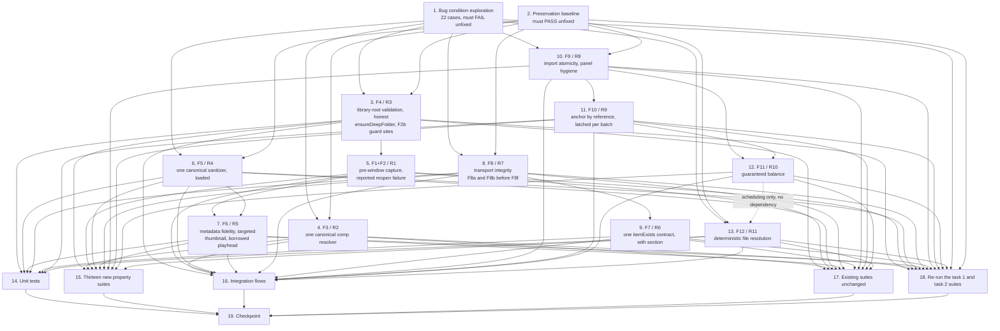

# Implementation Plan

## Overview

Twenty-seven bug conditions (1.1–1.27) collapse into eleven root causes (R1–R11) fixed by twelve fix blocks (F1–F12), all specified in `bugfix.md`. This plan runs the exploratory bugfix workflow: prove the defects on unfixed code (task 1), capture the preservation baseline on unfixed code (task 2), apply F1–F12 in dependency order (tasks 3–13), then verify (tasks 14–18).

Every task that edits a `.jsx` file is additionally bound by the ES3 gate recorded in `## Notes`, and by the test-change and baseline rules recorded there.

## Task Dependency Graph



The same graph as machine-readable wave definitions. `waves` is the parallel execution schedule; `tasks` carries the per-task `dependsOn` list each wave assignment is derived from. `schedulingOnlyEdges` records the dotted 12 → 13 edge, which is ordering convenience and NOT a dependency — task 13 is independent of every other fix, which is why it schedules in wave 2.

```json
{
  "version": 1,
  "taskCount": 19,
  "waves": [
    {
      "wave": 1,
      "name": "Observe on unfixed code",
      "tasks": ["1", "2"]
    },
    {
      "wave": 2,
      "name": "Fixes with no implementation dependencies",
      "tasks": ["3", "4", "6", "8", "10", "13"]
    },
    {
      "wave": 3,
      "name": "Fixes gated on wave 2",
      "tasks": ["5", "9", "11"]
    },
    {
      "wave": 4,
      "name": "Fixes gated on wave 3",
      "tasks": ["7", "12"]
    },
    {
      "wave": 5,
      "name": "Verification of the implemented fixes",
      "tasks": ["14", "15", "16", "17"]
    },
    {
      "wave": 6,
      "name": "Re-run the pre-fix suites",
      "tasks": ["18"]
    },
    {
      "wave": 7,
      "name": "Checkpoint",
      "tasks": ["19"]
    }
  ],
  "tasks": [
    {
      "id": "1",
      "title": "Bug condition exploration",
      "wave": 1,
      "dependsOn": []
    },
    {
      "id": "2",
      "title": "Preservation baseline",
      "wave": 1,
      "dependsOn": []
    },
    {
      "id": "3",
      "title": "F4 / R3 — library-root validation, honest ensureDeepFolder, F2b guard sites",
      "wave": 2,
      "dependsOn": ["1", "2"]
    },
    {
      "id": "4",
      "title": "F3 / R2 — one canonical comp resolver",
      "wave": 2,
      "dependsOn": ["1", "2"]
    },
    {
      "id": "5",
      "title": "F1+F2 / R1 — pre-window capture, reported reopen failure",
      "wave": 3,
      "dependsOn": ["3"]
    },
    {
      "id": "6",
      "title": "F5 / R4 — one canonical sanitizer, loaded",
      "wave": 2,
      "dependsOn": ["1", "2"]
    },
    {
      "id": "7",
      "title": "F6 / R5 — metadata fidelity, targeted thumbnail, borrowed playhead",
      "wave": 4,
      "dependsOn": ["5", "6"]
    },
    {
      "id": "8",
      "title": "F8 / R7 — transport integrity, F8a and F8b before F8f",
      "wave": 2,
      "dependsOn": ["1", "2"]
    },
    {
      "id": "9",
      "title": "F7 / R6 — one itemExists contract, with section",
      "wave": 3,
      "dependsOn": ["8"]
    },
    {
      "id": "10",
      "title": "F9 / R8 — import atomicity, panel hygiene",
      "wave": 2,
      "dependsOn": ["1", "2"]
    },
    {
      "id": "11",
      "title": "F10 / R9 — anchor by reference, latched per batch",
      "wave": 3,
      "dependsOn": ["10"]
    },
    {
      "id": "12",
      "title": "F11 / R10 — guaranteed balance",
      "wave": 4,
      "dependsOn": ["10", "11"]
    },
    {
      "id": "13",
      "title": "F12 / R11 — deterministic file resolution",
      "wave": 2,
      "dependsOn": ["1", "2"]
    },
    {
      "id": "14",
      "title": "Unit tests",
      "wave": 5,
      "dependsOn": ["3", "6", "7", "8", "9", "11", "13"]
    },
    {
      "id": "15",
      "title": "Thirteen new property suites",
      "wave": 5,
      "dependsOn": ["3", "4", "5", "6", "7", "8", "10", "11", "12", "13"]
    },
    {
      "id": "16",
      "title": "Integration flows",
      "wave": 5,
      "dependsOn": ["3", "4", "5", "6", "7", "8", "9", "10", "11", "12", "13"]
    },
    {
      "id": "17",
      "title": "Existing suites unchanged",
      "wave": 5,
      "dependsOn": ["3", "4", "5", "6", "7", "8", "9", "10", "11", "12", "13"]
    },
    {
      "id": "18",
      "title": "Re-run the task 1 and task 2 suites",
      "wave": 6,
      "dependsOn": ["1", "2", "3", "4", "5", "6", "7", "8", "9", "10", "11", "12", "13"]
    },
    {
      "id": "19",
      "title": "Checkpoint",
      "wave": 7,
      "dependsOn": ["14", "15", "16", "17", "18"]
    }
  ],
  "schedulingOnlyEdges": [
    {
      "from": "12",
      "to": "13",
      "reason": "Ordering convenience only. Task 13 (F12 / R11) is independent of every other fix, so it is not gated on task 12 and schedules in wave 2."
    }
  ]
}
```

The same constraints as a listing, with the reason each edge exists (every reason is already recorded in the task body it comes from):

- **1** and **2** both come first and are independent of each other: task 1 must be written and failing, and task 2 must be written and passing, on unfixed code — after any fix lands neither observation can be made again.
- **3 (F4)** is first among the implementation tasks: `ensureDeepFolder` returning `null` is a contract change, so its seven dereferencing guard sites must land with it. F2's folder-resolution replacement (F2b) is one of those sites and is applied in 3.2.
- **4 (F3)** is independent of every other fix — pure selection inspection, no project mutation. It is grouped next to 3 only because both edit `jsx/core.jsx`.
- **5 (F1+F2)** depends on **3**: the F2b guards applied in 3.2 must be in place before the `coreSaveLayerType` reopen tail is rewritten.
- **6 (F5)** is independent of **5** but must precede **7**: the canonical sanitizer is what makes the panel-derived `folderPath` equal the host-derived one that F6's `meta.json` write and the optimistic card key on.
- **7 (F6)** depends on **5** and **6**: the format fields and the `renderComp`/`renderFrame` thumbnail target come from F1's pre-reopen capture; the folder path they are written to comes from F5.
- **8 (F8)** precedes **9**, and internally F8a/F8b precede F8f: `decodeBridgeStrict` must exist on both sides before the guarded import transport relies on `callHost` reporting decode failures.
- **9 (F7)** depends on **8**: the panel-side existence check must route through a `callHost` that already reports malformed payloads.
- **10 (F9)** precedes **12**: F9's outer cleanup `finally` must exist before F11c's inner suppression `finally`, so the unwind order is inner (suppression off) then outer (cleanup, then `csEndUndoGroup`).
- **11 (F10)** depends on **10** and precedes **12**: F10c latches the anchor at `jsx/import.jsx:569` and F11a rewrites `:566-568` directly above it, so F10 lands first.
- **12 (F11)** depends on **10** and **11** for both reasons above.
- **13 (F12)** is independent of every other fix and is scheduled last; the dotted edge is ordering convenience, not a dependency.
- **14** depends on **3, 6, 7, 8, 9, 11, 13** — the fixes whose units it exercises (`validateLibraryRoot`/`ensureDeepFolder`, `sanitizeNameStrict`, `renderFrameToPng`, `escapeJSON`/`decodeBridgeStrict`/`parseHostBatchResult`, `itemExists`/`findCompItemInFolderByName`, `placeLayerAtPlayhead`/`csResolveImportAnchor`, `csPickDeterministicFile`).
- **15** depends on **3, 4, 5, 6, 7, 8, 10, 11, 12, 13** — one suite per property, each over the fix it proves.
- **16** depends on all of **3-13**: each flow crosses several fixes end to end.
- **17** depends on all of **3-13**: it is the regression sweep over every host and panel edit, including the ES3 static gate.
- **18** depends on **1**, **2**, and all of **3-13**: it re-runs the two suites written before the fixes.
- **19** depends on everything.

## Tasks

- [x] 1. Write bug condition exploration test
  - **Property 1: Bug Condition** - Comp/Template Pipeline Operations Behave As Specified And Are Reported As They Happened
  - **CRITICAL**: This test MUST FAIL on unfixed code - failure confirms the bug exists
  - **DO NOT attempt to fix the test or the code when it fails**
  - **NOTE**: This test encodes the expected behavior - it will validate the fix when it passes after implementation
  - **GOAL**: Surface one concrete counterexample per bug condition, confirming or refuting the root causes in the design's "Hypothesized Root Cause" section. A case that PASSES on unfixed code has refuted its hypothesis and the analysis for that condition must be redone.
  - **Scoped PBT Approach**: These defects are deterministic, so scope each property to the concrete failing input(s) named in the design's "Exploratory Bug Condition Checking" section rather than generating broadly; broad generation belongs to the suites in task 15.
  - Create `tests/comp-pipeline-bug-exploration.test.js`, following the shape of the existing `tests/bug-condition-exploration.test.js`
  - Harness A (function slicing into a `vm`): slice `saveActiveComp`, `coreSaveLayerType`, `getStrictSaveType`, `resolveCompForSave`, `itemExists`, `toolkitOrganizeTemplateImport`, `importCompDirect`, `placeLayerAtPlayhead` and `importBatch` using the `sliceFn(src, name)` brace-walk pattern from `tests/save-window-invariants.test.js:27-38`
  - Fakes required: (a) item fakes that throw on EVERY property read once `app.open()` has been called (this is how reference invalidation is simulated), (b) a configurable-throwing `app.open`, (c) counters for `beginSuppressDialogs`/`endSuppressDialogs` and `beginUndoGroup`/`endUndoGroup`, (d) recorders for `addFolder`/`remove`/`parentFolder` mutations, reusing `tests/helpers/aeFakes.js`
  - Harness B (whole-file sandbox): load `jsx/core.jsx` and `jsx/helpers.jsx` through `tests/helpers/loadHelpers.js` for the pure functions (`getSafeName`, `escapeJSON`/`jsonStringify`, `decodeBridge`, `renderFrameToPng`)
  - Case 1 — Stale result reference (**1.1**): a successful save returns a string starting with `"Error:"` and `openCalls.length === 2`. Assert a JSON success payload and `openCalls.length === 1`
  - Case 2 — Stale `renderFrame` (**1.2**): `coreSaveLayerType` returns a `"Save Error: …"` string instead of an object. Assert `typeof result === "object" && result.ok === true`
  - Case 3 — Reopen failure reported as success (**1.5**): `app.open` throws post-window, the reply is `ok:true`. Assert a failure whose message contains the template path
  - Case 4 — Resolver disagreement, empty selection (**1.3**): `getStrictSaveType` → `type:"comp"` while `resolveCompForSave` → `ok:false`. Assert both agree
  - Case 5 — Resolver disagreement, mixed project selection (**1.4**): announced `suggestedName` is Comp B while `resolveCompForSave` returns Comp A. Assert identity
  - Case 6 — Empty/relative root (**1.6**): `r = ""` reaches `ensureDeepFolder` and creates `/comp/...`. Assert rejection with no `create` call
  - Case 7 — Folder creation failure (**1.7**): `Folder.create()` returns false; assert `reduceCalls === 0`
  - Case 8 — Traversal name (**1.8**): `getSafeName("..") === ".."`. Assert a safe, non-traversing segment
  - Case 9 — Format fields absent (**1.9**, **1.10**): the host result has no `width`/`section`, the panel writes no `dim`/`assetsDir`. Assert both present
  - Case 10 — Thumbnail target discarded (**1.11**): `renderTemplateThumbnail.length === 2` and the rendered time equals `workAreaStart + 0.3 * workAreaDuration` regardless of the recorded frame. Assert `frame / frameRate`
  - Case 11 — Playhead moved (**1.12**): `comp.time` after `renderFrameToPng` differs from before. Assert equality on both the success and the throwing path
  - Case 12 — `itemExists` contract (**1.13**, **1.14**): the decoded reply is a folder name, `=== "true"` is false, and a 3-argument call searches `comp` for a `layer` save. Assert `{exists:true,id:"…"}` and the requested section
  - Case 13 — Malformed hex divergence (**1.15**): for `"0048006"` and a 14-char payload the panel and host decoders return different strings and neither reports. Assert identical `{ok:false}`
  - Case 14 — Invalid JSON (**1.16**): `JSON.parse(jsonStringify({e:"a\u0001b"}))` throws, and `"a\r\nb"` loses its `\r`. Assert parse success and round-trip
  - Case 15 — Untimed import (**1.17**): with a transport that never invokes its callback the result callback never runs and `.importing` is never cleared. Assert a settled failure result within the timeout
  - Case 16 — Import leak (**1.18**): force the `"No comp found!"` early return; imported item ids remain. Assert the id multiset is restored
  - Case 17 — Root folder accumulation (**1.19**, **1.20**): three successive imports add three root folders, and a solid-only import leaves an empty one. Assert one reused container and zero empty folders
  - Case 18 — Wrong anchor (**1.21**): two layers named `BG`; the imported layer lands above the wrong one. Assert it lands above the selected reference
  - Case 19 — Batch anchor drift (**1.22**): a 3-template batch; templates 2 and 3 anchor to the previous insert. Assert all three anchor to the original selection
  - Case 20 — Suppression stuck (**1.23**): make `app.open` throw inside a restore handler; `suppressBegin - suppressEnd === 1`. Assert equality
  - Case 21 — Batch guard inversion (**1.24**): make `beginUndoGroup` throw; assert the per-section routines still open their own groups (`undoBegin >= 1`) instead of zero
  - Case 22 — Non-deterministic `.aep` (**1.25**): feed `["b.aep","project.aep"]` and its reverse; the resolved file differs. Assert `project.aep` both ways
  - Note: conditions **1.26** and **1.27** are static/cross-implementation defects with no runtime counterexample to slice; they are proven by task 15's `sanitizer-cross-implementation` and `panel-script-manifest` suites instead
  - Run test on UNFIXED code
  - **EXPECTED OUTCOME**: All 22 cases FAIL (this is correct - it proves the bugs exist)
  - Document each counterexample: an `"Error: … Exception: …"` reply from a save whose `project.aep` exists on disk; two `app.open` calls for one save; `ok:true` after a thrown reopen; two different composition names from the two resolvers; a folder created at the volume root; `".."` surviving sanitization; `meta.json` without `width`/`dim`/`assetsDir`; a thumbnail rendered at the wrong frame; a moved playhead; `exists === false` for a template that exists; two decodings of one malformed payload; a `JSON.parse` throw on host-produced JSON; a never-settling import; leaked project items; N root folders after N imports; a layer above the wrong anchor; unbalanced suppression counters; zero undo groups for a whole batch; order-dependent file resolution
  - Mark task complete when the test is written, run, and every failure is documented
  - _Bug_Conditions: 1.1-1.25_
  - _Requirements: 2.1, 2.2, 2.3, 2.4, 2.5, 2.6, 2.7, 2.8, 2.9, 2.10, 2.11, 2.12, 2.13, 2.14, 2.15, 2.16, 2.17, 2.18, 2.19, 2.20, 2.21, 2.22, 2.23, 2.24, 2.25_

- [x] 2. Write preservation property tests (BEFORE implementing fix)
  - **Property 2: Preservation** - Non-Buggy Inputs Are Byte-For-Byte Unchanged
  - **IMPORTANT**: Follow observation-first methodology - run the UNFIXED code for every input class where `isBugCondition` is false, record the actual outputs, then assert those recorded outputs
  - Create `tests/comp-pipeline-preservation.property.test.js` (this is the design's new PBT suite 14; it is written here and re-run in task 18)
  - Property-based generation is the right instrument: the preserved surface is broad and the regressions that matter are edge cases a fixed table will not reach (a name exactly 255 characters, a payload that is a multiple of four AND corrupt, a batch where template 3 of 5 fails, a comp with `frameRate === 0`)
  - Use `tests/helpers/generate-baseline.js` to snapshot the unfixed outputs, and `fast-check` generators for the input classes
  - Case 1 — Reduce-first ordering (**3.4**): the recorded `app` call sequence on a successful save is exactly `beginUndoGroup → save(PROTECTIVE) → reduceProject → save(TARGET) → endUndoGroup → beginSuppressDialogs → open → endSuppressDialogs`, with `saveCalls.length === 2` and `reduceCalls === 1`
  - Case 2 — Protective-save abort (**3.1**): protective save throws → `reduceCalls === 0`, `openCalls.length === 0`, `undoEnd === undoBegin`, message `"Protective save failed — aborted, your project is untouched."`
  - Case 3 — Reopen invariants (**3.2**, **3.3**): over generated failure-injection points, a pre-window throw → zero reopens; a post-window throw → exactly one, and a failed restore still ends with the manual-reopen instruction
  - Case 4 — Unsaved project (**3.5**): `app.project.file = null` → `"Please save your project first!"` with no mutation, for every section
  - Case 5 — Hex round-trip (**3.6**, **3.7**, **3.29**): `decodeBridge(encodeBridge(s)) === s` for generated strings including CJK, accents, lone surrogates and full surrogate pairs, and for a ≥1 MB payload, asserted against BOTH implementations; statically assert the encode/decode source contains no `join(`
  - Case 6 — Batch envelope (**3.8**, **3.9**): for generated batches of 1-20 templates with arbitrary failure positions, `undoBegin === 1 && undoEnd === 1` and no per-section group opened while the guard is on; a standalone `importCompDirect` opens and closes exactly one
  - Case 7 — Rollback scoping (**3.10**): pre-existing layers/items and previously imported templates survive a mid-batch failure; only the failed template's additions disappear
  - Case 8 — Result totality (**3.11**): `perTemplate.length === templates.length` with ids in input order, over all-success, all-failure, mid-batch throw, whole-call decode failure, and transport timeout
  - Case 9 — Cache-first metadata (**3.12**): a seeded entry causes zero `readFileText` calls; a miss causes exactly one read and one parse per folder per import
  - Case 10 — Fallback ladder (**3.14**): for generated folder contents the resolved file matches the documented ladder, and a missing/unparseable `meta.json` still yields a degraded record rather than an empty library
  - Case 11 — Suppression around `importFile` (**3.15**): `beginSuppressDialogs` still brackets the call on the success path, counters balanced
  - Case 12 — Utility Pre-Comp (**3.16**): one reference layer, wrapper comps removed, `layerState` re-applied
  - Case 13 — Timing math (**3.17**, **3.18**): a trimmed in-point lands on the captured playhead; a multi-layer import shifts by one uniform delta
  - Case 14 — Relink ladder + name resolution (**3.19**, **3.20**): decoded → raw → case-insensitive → extension-agnostic order preserved; `csResolveName` deterministic over a once-computed name set
  - Case 15 — Save controller (**3.21**, **3.22**): `exitLoading` called exactly once before any background scheduling; no background work on essential failure
  - Case 16 — Optimistic card (**3.23**): re-saving the same template replaces one entry at the head instead of duplicating
  - Case 17 — Thumbnail behavior (**3.24**, **3.25**, **3.26**, **3.27**): a failed render keeps the placeholder and badges one card; aerender still preferred when a comp name exists; a sub-64-byte PNG is still a failure; `renderTemplateThumbnail` touches neither `app.project.file` nor `app.open` and always removes its scratch import
  - Case 18 — Strict host parsing (**3.28**): `jsonParse` remains the only host parser; `jsx/*.jsx` contains no `eval(` and no `JSON.parse` outside the documented harness guards
  - Case 19 — Startup scan (**3.29**, **3.30**): one section-chunked scan per root, the migration guard runs once per engine session, and a missing/unparseable response is treated as incomplete rather than empty
  - Also confirm the two existing suites that already ARE the baseline pass unchanged and record their output: `tests/save-window-invariants.test.js` (call sequences and counters) and `tests/import-timings.test.js` (single balanced group, rollback scoping, result totality, ES3 static gate)
  - Run tests on UNFIXED code
  - **EXPECTED OUTCOME**: Tests PASS (this confirms the baseline behavior to preserve)
  - Mark task complete when the tests are written, run, and passing on unfixed code
  - _Requirements: 3.1, 3.2, 3.3, 3.4, 3.5, 3.6, 3.7, 3.8, 3.9, 3.10, 3.11, 3.12, 3.13, 3.14, 3.15, 3.16, 3.17, 3.18, 3.19, 3.20, 3.21, 3.22, 3.23, 3.24, 3.25, 3.26, 3.27, 3.28, 3.29, 3.30_

---

- [x] 3. F4 — R3: library-root validation and an honest `ensureDeepFolder`
  - **Ordering**: first, because `ensureDeepFolder` returning `null` is a contract change and its guards must land with it. F2's folder-resolution replacement (F2b) is one of those guard sites and is applied here.
  - **ES3**: host edits in `jsx/core.jsx`, `jsx/templates_save.jsx`, `jsx/text.jsx` — `var` only, no arrow functions, no template literals, no `Array` extras, no native `JSON`

  - [x] 3.1 Add `validateLibraryRoot` and make `ensureDeepFolder` honest
    - `jsx/core.jsx` — insert `validateLibraryRoot(pathStr)` above `ensureDeepFolder` (`:458`): absolute-path test plus resolvable-parent test (F4a)
    - `jsx/core.jsx` — replace `ensureDeepFolder` (`:458-473`) so it verifies `cf.create()` per level with an `exists` re-test for volumes that under-report, and returns `null` on failure (F4b)
    - `jsx/templates_save.jsx` — validate the root in `saveActiveComp` before deriving the path (replaces `:828-830`), so the check runs before `ensureDeepFolder` and before `app.beginUndoGroup` (F4c)
    - _Bug_Condition: isBugCondition where `NOT isAbsolutePath(input.libraryRoot) OR NOT targetFolderExists(input) BEFORE destructiveWindow(input)`_
    - _Expected_Behavior: reject before any folder is created and before the destructive window; report creation failure to the caller_
    - _Preservation: 3.1, 3.2, 3.4, 3.5 — both checks run before the undo group and the protective save, so they are pre-window failures with no group to leak and no reopen_
    - _Requirements: 2.6, 2.7_

  - [x] 3.2 Guard every `ensureDeepFolder` call site that dereferences the result
    - `jsx/templates_save.jsx:653` — the `coreSaveLayerType` folder resolution: apply the F2b replacement (`validateLibraryRoot` + `!f || !f.exists` abort) placed BEFORE `app.beginUndoGroup` at `:673`, so the destructive `reduceProject` is never entered without a valid target folder
    - `jsx/templates_save.jsx:1371`, `jsx/templates_save.jsx:2004` — add the same `!f || !f.exists` guard shape, following the file's error convention
    - `jsx/text.jsx:25`, `jsx/text.jsx:460`, `jsx/text.jsx:748` — same guard, following that file's error convention
    - `jsx/templates_save.jsx:844` already has the guard; leave it as the reference shape
    - The fire-and-forget call sites (`jsx/core.jsx:1364`, `jsx/import.jsx:1876`, `jsx/import.jsx:1994`, `jsx/templates_save.jsx:1190`, `jsx/templates_save.jsx:1255`) ignore the return value and stay unchanged
    - _Bug_Condition: 1.7 — `ensureDeepFolder` returns a Folder that does not exist and the caller dereferences it_
    - _Expected_Behavior: a creation failure surfaces as a named error instead of a `null` property access_
    - _Preservation: 3.1, 3.2, 3.4, 3.5 — ordering inside the destructive window is untouched; the unsaved-project refusal still precedes everything_
    - _Requirements: 2.7_

  - [x] 3.3 Verify group R3 and the ES3 gate
    - Re-run exploration cases 6 and 7 from task 1: case 6 asserts rejection with no `create` call, case 7 asserts `reduceCalls === 0`
    - Run `tests/save-window-invariants.test.js` and `tests/import-timings.test.js` — both must pass unchanged, including the ES3 static assertion at `tests/import-timings.test.js:139-145`
    - _Requirements: 2.6, 2.7, 3.1, 3.2, 3.4, 3.5_

- [x] 4. F3 — R2: one canonical comp resolver
  - **Ordering**: independent of every other fix (pure selection inspection, no project mutation), grouped here with F4 because both edit `jsx/core.jsx`
  - **ES3**: host edits in `jsx/core.jsx` — `var` only, no arrow functions, no template literals, no `Array` extras, no native `JSON`

  - [x] 4.1 Add `csResolveCompTarget` and route both resolvers through it
    - `jsx/core.jsx` — insert the canonical `csResolveCompTarget()` above `resolveCompForSave` (`:976`), owning all three branches: timeline selection, Project-panel selection, and the active-comp fallback `resolveCompForSave` never had (F3a)
    - One rule for the Project-panel branch: a selection containing exactly one comp wins regardless of accompanying non-comp items; more than one comp is still the existing error. This removes the `nonCompSelected === 0` divergence between `jsx/core.jsx:876` and `:990-996`
    - `jsx/core.jsx` — replace `resolveCompForSave` (`:976-1010`) with a thin adapter over the canonical resolver (F3b)
    - `jsx/core.jsx` — replace the Project-panel + active-comp tail of `getStrictSaveType` (`:859-889`) so the decision AND the announced `suggestedName` both come from the canonical resolver (F3c)
    - Preserve verbatim: `"Select only ONE pre-comp layer."`, `"Please select only ONE composition in the Project panel."`, `"Selected layer is not a precomposition."` — `validateSaveRequest`'s message pass-through (`jsx/core.jsx:1025-1027`) and the panel toast text must not change
    - `getSaveCapabilities` still reads `getStrictSaveType`'s JSON through its existing regexes (`jsx/core.jsx:897-907`); keep the capability flags and the Utility Pre-Comp `caps.layer` addition (`:940-953`) behaving as before
    - _Bug_Condition: isBugCondition where `getStrictSaveType(selection).type = "comp" AND resolveCompForSave(selection) <> announcedComp(selection)`_
    - _Expected_Behavior: `type === "comp"` implies `resolveCompForSave().ok`, and the resolved comp is the comp named in `suggestedName`_
    - _Preservation: 3.1, 3.2, 3.3, 3.4, 3.5 — the resolver mutates nothing, so no destructive path is reachable from it_
    - _Requirements: 2.3, 2.4_

  - [x] 4.2 Verify group R2 and the ES3 gate
    - Re-run exploration cases 4 and 5 from task 1: both resolvers must agree on `ok` and on the composition, and `suggestedName` must equal the resolved comp's name
    - Confirm `tests/templates-contract.test.js` and `tests/class-contract.test.js` still pass, and the ES3 gate at `tests/import-timings.test.js:139-145`
    - _Requirements: 2.3, 2.4_

- [x] 5. F1 + F2 — R1: pre-window capture and a reported reopen failure
  - **Ordering**: must precede task 7 (F6). F1's pre-reopen capture is what supplies the `width`/`height`/`pixelAspect`/`frameRate`/`duration`/`renderComp`/`renderFrame` values that F6's `meta.json` write and thumbnail target consume. F2b (folder resolution) already landed in task 3.2.
  - **ES3**: host edits in `jsx/templates_save.jsx` — `var` only, no arrow functions, no template literals, no `Array` extras, no native `JSON`

  - [x] 5.1 F1 — `saveActiveComp`: capture before the destructive window, report the reopen, enrich the result
    - `jsx/templates_save.jsx` — insert the capture block immediately after the rename (after `:901`, before `var targetFilePath`): `capName` plus `capWidth`/`capHeight`/`capPixelAspect`/`capFrameRate`/`capDuration`/`capFrame`. Capturing AFTER the rename is deliberate so `capName` is the name actually stored inside `project.aep` (F1a)
    - `jsx/templates_save.jsx` — replace the reopen + result tail (`:944-970`): a `reopenOk` latch; on `false` return a failure string naming the template path and warning that the live session is pointed at it. Build `resultObj` from the captured locals ONLY — zero property reads on a project item — and add `section:"comp"`, `type:"comp"` plus the format fields (F1b)
    - `jsx/templates_save.jsx` — add the empty-name guard next to the existing project-file guard (after `:822`) so an empty name can never produce `<root>/comp/<cat>/` (F1c)
    - _Bug_Condition: 1.1, 1.5, 1.9, 1.10 — `resultObj.renderComp`/`renderFrame` read `precomp` after `app.open` at `:947` invalidated it; the reopen catch at `:946-950` records failure only in `logMsg` and falls through to `ok:true`_
    - _Expected_Behavior: no field of the result derives from a post-reopen property read; a thrown reopen returns a failure naming the template path; `openCalls.length <= 1`_
    - _Preservation: 3.1, 3.2, 3.3, 3.4, 3.5, 3.21, 3.22 — the capture is inserted before `reduceProject`, so the destructive ordering at `:905-925` is byte-identical; `windowEntered` still gates every reopen; the protective-save abort at `:878-891` and the `app.project.file` null check at `:833` are untouched; the failure string routes through the panel's existing `parseEssential` error branch_
    - _Requirements: 2.1, 2.5, 2.9, 2.10_

  - [x] 5.2 F2 — `coreSaveLayerType`: capture before the destructive window, report the reopen
    - `jsx/templates_save.jsx` — extend the existing pre-reopen capture block (after `:651`, immediately following the `layerState` capture) with `capComp*` locals for `workAreaStart`, `workAreaDuration`, `frameRate` and the format fields (F2a)
    - `jsx/templates_save.jsx` — replace the reopen + result tail (`:747-769`): the same `reopenOk` latch, and return the captured locals instead of reading `comp` (F2c). Keep the string-on-failure / object-on-success shape this engine's callers depend on
    - F2b (the `:651-653` folder resolution with the `validateLibraryRoot` + `!f || !f.exists` guards) was applied in task 3.2 — verify it is in place before editing the tail
    - _Bug_Condition: 1.2, 1.5, 1.7 — `renderFrame` at `:768` reads `comp.workAreaStart`/`workAreaDuration`/`frameRate` after the reopen at `:750`, on a comp `reduceProject([tempComp])` also removed_
    - _Expected_Behavior: `typeof result === "object" && result.ok === true` for a successful save; a thrown reopen returns a failure naming the template path_
    - _Preservation: 3.1, 3.2, 3.3, 3.4, 3.5, 3.21, 3.22 — `tests/save-window-invariants.test.js` runs the real `coreSaveLayerType` and its call sequence and counters must be unchanged_
    - _Requirements: 2.2, 2.5_

  - [x] 5.3 Verify group R1 and the ES3 gate
    - Re-run exploration cases 1, 2 and 3 from task 1: a JSON success payload with `openCalls.length === 1`; an object result with `ok === true`; a failure naming the template path after a thrown reopen
    - Run `tests/save-window-invariants.test.js`, `tests/save-live-project-survival.test.js`, `tests/save-return-shape.test.js` (including the "bare error string → error, no jobs" case at `:416`, which pins 2.5's panel-side behavior), `tests/save-loading-exit-on-essential.property.test.js`, `tests/save-background-failure-surfacing.property.test.js`
    - ES3 gate at `tests/import-timings.test.js:139-145`
    - _Requirements: 2.1, 2.2, 2.5, 3.1, 3.2, 3.3, 3.4, 3.5, 3.21, 3.22_

- [x] 6. F5 — R4: one canonical sanitizer, loaded at runtime
  - **Ordering**: before task 7 (F6), because F5 is what makes the panel-derived `folderPath` equal the host-derived one that F6's `meta.json` write and the optimistic card key on
  - **ES3**: the `jsx/core.jsx` port must be the identical algorithm written in ES3 — `var` only, no arrow functions, no template literals, no `Array` extras, no native `JSON`
  - **Test change is intentional and required**: `tests/save-path-builders.test.js` currently asserts `getSafeName` returns `{ok,value}`. That envelope moves to `sanitizeNameStrict`; `getSafeName`/`generateTemplateId` become string-returning. Updating this test IS the point of 2.27 — the tested implementation becomes the loaded one.

  - [x] 6.1 Make `js/core/pathBuilders.js` canonical and load it in the panel
    - `js/core/pathBuilders.js` — replace `sanitizeName`/`getSafeName`/`generateTemplateId` (`:33-78`) with the canonical rules: `cleanName` (the panel twin of the host's `cleanStr`), `sanitizeNameStrict` (trim → replace `\ / : * ? " < > |` and every C0 control/DEL with `_` → strip trailing dots and spaces → escape `"."`/`".."` and the Windows reserved device names → truncate to 255 then re-strip). `getSafeName`/`generateTemplateId` return strings so they are drop-in replacements; the `{ok,…}` envelope lives on `sanitizeNameStrict`. Add `cleanName` and `sanitizeNameStrict` to `module.exports` (`:107-118`) (F5a)
    - `js/core/utils.js` — delete `getSafeName` (`:20-24`) entirely, so folder-name rules cannot depend on script order (F5c)
    - `index.html` — insert `<script src="js/core/pathBuilders.js?v=1">` after the `bridge.js` line (`:1583`), BEFORE `js/core/utils.js` (F5d). This also repairs `js/templates/templates.js:2432`, where `typeof generateTemplateId === "function" ? generateTemplateId(fsName) : fsName` had been silently falling through to the raw name
    - _Bug_Condition: 1.26, 1.27 — three sanitizers with three rule sets, one of them never loaded_
    - _Expected_Behavior: one canonical panel implementation, loaded at runtime, identical to the tested one_
    - _Requirements: 2.26, 2.27_

  - [x] 6.2 Port the identical algorithm to the host and align the panel call sites
    - `jsx/core.jsx` — replace `getSafeName` (`:74-78`) and `generateTemplateId`/`getDeterministicTemplateId` (`:317-323`) with the ES3 port of the identical algorithm (F5b). `cleanStr` is idempotent, so `generateTemplateId(cleanStr(name))` at `jsx/templates_save.jsx:818` keeps producing today's id
    - Preserve the no-re-keying guarantee: for any name made of letters, digits, spaces, dashes and dots-not-at-the-end the result is byte-identical to today's, and an EMPTY input still returns `""` (not the fallback) so existing empty-category path shapes survive
    - `js/templates/templates.js` — apply the host's exact derivation at the panel-derived path sites: `:3246` (PNG folder), `:3421` (monolithic folder), `:3487` (optimistic card), each using `getSafeName(cat)` for the category and `generateTemplateId(name)` for the id segment; and the monolithic metadata-cache seed at `:3426` uses `id: generateTemplateId(name)` in place of `getSafeName(name)` (F5e)
    - _Bug_Condition: 1.8, 1.26 — `".."` survives sanitization; the panel omits `cleanStr` so tab/space-run names derive a different folder than the host_
    - _Expected_Behavior: `hostSanitize(name) === panelSanitize(name)` for every name; no separator, no C0 control, no trailing dot or space, ≤255 characters, never `"."` or `".."`_
    - _Preservation: 3.12, 3.14, 3.23 — `findTemplateFolder`/`resolveTemplateFiles` (`jsx/core.jsx:325-360`) sanitize the lookup id with the same function so lookup and creation stay symmetric; `renderOptimisticCard`'s in-place replacement is keyed on `folderPath`, which now finally matches the host's; the `Metadata_Cache` keys on the same normalized `folderPath`_
    - _Requirements: 2.8, 2.26_

  - [x] 6.3 Update `tests/save-path-builders.test.js` to the new contract
    - Move the `{ok,…}` assertions onto `sanitizeNameStrict`; add string-returning assertions for `getSafeName`/`generateTemplateId`
    - Required by 2.27 — this is the change that makes the tested implementation the loaded implementation
    - Re-run exploration case 8 from task 1: `getSafeName("..")` must return a safe, non-traversing segment
    - ES3 gate at `tests/import-timings.test.js:139-145`; also confirm `tests/cep-compat.test.js`, `tests/library-index-insert-at-head.property.test.js`, `tests/optimistic-card-placeholder.property.test.js`, `tests/library-single-mutation-locality.property.test.js`, `tests/metadata-cache-roundtrip.test.js` still pass
    - _Requirements: 2.8, 2.26, 2.27, 3.12, 3.14, 3.23_

- [x] 7. F6 — R5: metadata fidelity, targeted thumbnail, borrowed playhead
  - **Ordering**: after tasks 5 and 6. The format fields written into `meta.json` and the `renderComp`/`renderFrame` thumbnail target come from F1's pre-reopen capture; the folder path they are written to comes from F5's canonical sanitizer.
  - **ES3**: host edits in `jsx/text.jsx`, `jsx/templates_save.jsx`, `jsx/helpers.jsx` — `var` only, no arrow functions, no template literals, no `Array` extras, no native `JSON`

  - [x] 7.1 Write the composition's format into `meta.json`
    - `js/templates/templates.js` — extend the `meta.json` document (replaces `:3298-3337`) with `width`, `height`, `dim` (`w + "x" + h` — the field `parseMetaContent` at `jsx/core.jsx:1064` has always read and nothing ever wrote), `pixelAspect`, `frameRate`, `duration`, and key the `assetsDir` branch off `metaObj.section` (the already-normalized `resObj.section || "comp"` written at `:3302`) so a host that omits it still records `assetsDir` (F6a)
    - Leave the `resObj.type === "layer" | "text" | "footage" | "text_props" | "effect"` blocks at `:3338-3358` unchanged
    - _Bug_Condition: 1.9, 1.10 — `meta.json` omits the format entirely and `if (resObj.section === "comp")` at `:3335` never fires_
    - _Expected_Behavior: `meta.json` carries the format, the schema version, `mainFile`, `section`, `type`, and `assetsDir` whenever assets were copied_
    - _Preservation: 3.14 — the new keys are additive; `parseMetaContent` and `getAllTemplates` ignore unknown keys, so a library holding both old and new documents scans identically_
    - _Requirements: 2.9, 2.10_

  - [x] 7.2 Render the recorded thumbnail target
    - `jsx/text.jsx` — add the ES3 breadth-first `findCompItemInFolderByName` next to `findCompItemInFolder` (`:635`) (F6b)
    - `jsx/templates_save.jsx` — extend `renderTemplateThumbnail` to `(aepPathHex, outPngPathHex, compNameHex, frameHex)` (replaces `:358-368`); `thumbTime = frame / frameRate` clamped to the comp duration, falling back to the existing 30%-of-work-area rule when either argument is absent. Both new arguments are optional so a two-argument call is unchanged (F6c)
    - `js/textanim/textanim.js` — pass the recorded target (replaces `:1333-1336`) using `job.compName` and `job.renderFrame`, which `enqueueThumbnailRender` already carries and the aerender branch at `:1315-1320` already reads (F6d)
    - _Bug_Condition: 1.11 — `renderTemplateThumbnail.length === 2`, so `renderComp`/`renderFrame` are discarded and the PNG comes from whatever comp `findCompItemInFolder` returns first_
    - _Expected_Behavior: the composition named by `renderComp` is rendered at `renderFrame`, producing the same frame the isolated `aerender` path would produce_
    - _Preservation: 3.24, 3.25, 3.26, 3.27 — the scratch-import shape is kept (no `app.project.file` write, no `app.open`, no reduce, wrapper + imported folder + `bitsPerChannel` teardown in the `finally`); the bounded-resolution wrapper at `:401-427` still caps the raster; aerender is still preferred; a sub-64-byte PNG is still a failure_
    - _Requirements: 2.11_

  - [x] 7.3 Restore the borrowed playhead
    - `jsx/helpers.jsx` — replace `renderFrameToPng` (`:126-147`): capture `prevTime` before the `comp.time = time` assignment and restore it in the same `finally` that releases dialog suppression, each step independently guarded so neither restore can mask the other or the render result (F6e)
    - The restore sits in the `finally` AFTER the render, so it cannot change the returned success value
    - _Bug_Condition: 1.12 — `comp.time = time` is never restored, so `generateActiveFrameThumbnail` (`jsx/templates_save.jsx:298-306`), which passes the LIVE comp, permanently moves the user's playhead_
    - _Expected_Behavior: the composition's previous time is restored on both the success and the failure paths_
    - _Preservation: 3.26, 3.27 — `isValidPng` still classifies a missing/empty/sub-64-byte PNG as failure_
    - _Requirements: 2.12_

  - [x] 7.4 Verify group R5 and the ES3 gate
    - Re-run exploration cases 9, 10 and 11 from task 1
    - Run `tests/save-thumbnail-queue.test.js`, `tests/background-queue-fail-advance.test.js`, `tests/thumbnail-bounded-resolution.test.js` (the guard F6's frame math must not disturb), `tests/helpers/isValidPng.test.js`, `tests/save-render-background-only.test.js`, `tests/metadata-cache-roundtrip.test.js`, `tests/metadata-cache-currency.test.js`, `tests/metadata-cache-malformed.test.js`
    - ES3 gate at `tests/import-timings.test.js:139-145`
    - _Requirements: 2.9, 2.10, 2.11, 2.12, 3.14, 3.24, 3.25, 3.26, 3.27_

- [x] 8. F8 — R7: transport integrity
  - **Ordering**: `decodeBridgeStrict` must exist on BOTH sides (8.1) before the guarded import transport (8.3) relies on `callHost` reporting decode failures. This whole task precedes task 9, so `itemExists` starts using a `callHost` that already reports malformed payloads.
  - **ES3**: host edits in `jsx/core.jsx` and `jsx/import.jsx` — `var` only, no arrow functions, no template literals, no `Array` extras; serialization stays on `jsonStringify`/`jsonParse`/`escapeJSON`, never native `JSON`

  - [x] 8.1 Add `decodeBridgeStrict` identically to both sides
    - `js/core/bridge.js` — replace `decodeBridge` (`:23-30`) with a wrapper over `decodeBridgeStrict(hex) -> {ok,value,error}`: one whole-string check (`length % 4 === 0` plus a single `/^[0-9a-fA-F]*$/` test) then the UNCHANGED string-append loop; `decodeBridge` returns `""` for malformed input. Add `decodeBridgeStrict` and `isWellFormedBridgeHex` to `module.exports` (`:125-131`). Have `callHost` report the decode failure (F8a)
    - `jsx/core.jsx` — the identical host implementation (replaces `decodeBridge`, `:32-43`) (F8b)
    - _Bug_Condition: 1.15 — neither implementation validates its input; the panel yields `String.fromCharCode(NaN)` where the host skips the chunk, so one corrupted payload decodes to two different strings and neither reports_
    - _Expected_Behavior: both implementations return the same `ok` and the same `value`, reporting `ok:false` exactly when the length is not a multiple of four or a non-hex character is present_
    - _Preservation: 3.6, 3.7, 3.29 — the measured string-append loop is kept verbatim with exactly one added O(n) native regex test; no array + `join`; well-formed payloads (CJK, surrogate pairs, multi-megabyte scans and batches) decode byte-for-byte as before_
    - _Requirements: 2.15_

  - [x] 8.2 Make `escapeJSON` always emit valid JSON
    - `jsx/core.jsx` — replace `escapeJSON` (`:80-88`) with the full escape set `\\ \" \n \r \t \b \f` plus `\u00XX` for the remaining C0/DEL characters, behind a single `/[\u0000-\u001F\u007F]/` fast-path test so the common control-free case still costs one native pass (F8c)
    - _Bug_Condition: 1.16 — raw C0 characters pass through and `\r` is deleted, so `jsonStringify` can emit a document `JSON.parse` rejects and a completed save surfaces as `"JSON Parse Error"` (`js/templates/templates.js:3223`)_
    - _Expected_Behavior: `JSON.parse(jsonStringify(obj))` always succeeds and reproduces every string, with `\r` surviving as `\r`_
    - _Preservation: 3.28 — additive for every control-free string (which is every string the host produces after `cleanStr`); `jsonParse` is untouched and stays the only host parser_
    - _Requirements: 2.16_

  - [x] 8.3 Route the import call through the timeout-guarded transport
    - `jsx/import.jsx` — use the strict decode for the batch payload (replaces `:521-531`), returning the existing total failed result on a decode failure (F8d)
    - `js/core/importEngine.js` — propagate the host's whole-call error so the reason reaches every entry (replaces `:113`) (F8e)
    - `js/templates/templates.js` — the guarded import transport (replaces `:2412-2415` and the `decode` entry at `:2450`): call `callHost('importBatch("…")', {timeoutMs})`, hand `importEngine` the decoded body (`decode` becomes the identity), and on timeout/error synthesize `{"perTemplate":[],"error":reason}` (F8f)
    - _Bug_Condition: 1.17 — the raw `csInterface.evalScript` transport inherits none of `callHost`'s three guarantees (settled latch, timeout, `BRIDGE_ERROR_SENTINELS` classification), so a never-returning call leaves `.importing` on the card forever and a CEP `"EvalScript error."` sentinel is fed to `decodeBridge` as hex_
    - _Expected_Behavior: the call always settles, `.importing` is always cleared, the sentinels are recognized as errors, and the user gets a definite success or failure_
    - _Preservation: 3.8, 3.9, 3.11 — the Import_Engine contract is unchanged (one Bridge_Call for a batch, zero when everything is cached); because the transport always settles, the result stays total over the requested templates on the timeout path too; the host-side undo envelope is not touched_
    - _Requirements: 2.17_

  - [x] 8.4 Verify group R7 and the ES3 gate
    - Re-run exploration cases 13, 14 and 15 from task 1
    - Run `tests/bridge-timeout.test.js` (extend it with the malformed-payload branch), `tests/import-one-bridge-call.property.test.js`, `tests/import-cached-no-bridge.property.test.js` — the one-call/zero-call contract must hold across the transport swap
    - ES3 gate at `tests/import-timings.test.js:139-145`
    - _Requirements: 2.15, 2.16, 2.17, 3.6, 3.7, 3.8, 3.9, 3.11, 3.28, 3.29_

- [x] 9. F7 — R6: one `itemExists` contract, with the section
  - **Ordering**: after task 8, so the panel-side check routes through a `callHost` that already reports decode failures. The declared contract in `js/core/bridgeRegistry.js:56` and the contract-registry tests are updated in THIS task, not later — a registry that still declares `successShapes: ["true","false"]` would contradict the new envelope.
  - **ES3**: host edit in `jsx/import.jsx` — `var` only, no arrow functions, no template literals, no `Array` extras; serialize through `jsonStringify`, and drop the dead `typeof jsonParse === "function" ? … : JSON.parse(…)` branch at `:2110` since the host has no native `JSON`

  - [x] 9.1 Replace the host `itemExists` with an explicit envelope
    - `jsx/import.jsx` — replace `itemExists` (`:2088-2123`) to return `{"exists":Boolean,"id":String,"section":String}` via `jsonStringify`, and to normalize the incoming section through `normalizeSectionName` and search THAT section instead of defaulting to `"comp"` (F7a)
    - _Bug_Condition: 1.13, 1.14 — the host returns the matched folder's NAME as the hit signal (`:2113`), and with `sHex` undefined the `if (sHex)` guard (`:2093-2096`) leaves `section` at its `"comp"` default_
    - _Expected_Behavior: one return contract both sides agree on, answering for the section actually being saved_
    - _Preservation: 3.28 — host-side parsing stays on `jsonParse`_
    - _Requirements: 2.13, 2.14_

  - [x] 9.2 Replace the panel existence check and correct the declared contract
    - `js/templates/templates.js` — replace the existence check (`:3164-3189`): route through the timeout-guarded `callHost`, pass the fourth argument `sHex = encodeBridge(saveType === "png" ? targetImgSec : saveType)`, parse the envelope, use `info.exists` for the `library.confirmOverwrite` prompt and `info.id` — the folder that actually exists — as `oldId` (F7b)
    - `js/core/bridgeRegistry.js:56` — correct the declared contract to the new `{exists,id,section}` shape (F7c)
    - Update `tests/contract-registries.test.js` and `tests/bridge-registry-adapter.test.js` in this task: the new `itemExists` shape, the fourth argument, and the guarded transport
    - Making `oldId` real ACTIVATES the previously unreachable `.fav` preservation and old-folder removal at `js/templates/templates.js:3344-3356`
    - _Bug_Condition: 1.13 — `decodeBridge(existsHex) === "true"` is always false, so no overwrite prompt, `oldId` always `""`, and `:3344-3356` is dead code_
    - _Expected_Behavior: the prompt appears when `library.confirmOverwrite` is on and a match exists; `.fav` preservation and old-folder removal actually run_
    - _Preservation: 3.21, 3.22, 3.23 — the `validateSaveRequest` → `itemExists` → `runSave()` order and the 80 ms modal-close defer at `:3517` are preserved, so `runSaveController` still exits loading once and schedules only background work; `renderOptimisticCard` still replaces the entry for the same `folderPath` in place, so a re-save produces one card, not two_
    - _Requirements: 2.13, 2.14_

  - [x] 9.3 Verify group R6 and the ES3 gate
    - Re-run exploration case 12 from task 1: `{exists:true,id:"…"}` on both sides, and the requested section searched
    - Run `tests/contract-registries.test.js`, `tests/bridge-registry-adapter.test.js`, `tests/save-return-shape.test.js`, `tests/library-index-insert-at-head.property.test.js`
    - ES3 gate at `tests/import-timings.test.js:139-145`
    - _Requirements: 2.13, 2.14, 3.21, 3.22, 3.23, 3.28_

- [ ] 10. F9 — R8: import atomicity and Project-panel hygiene
  - **Ordering**: before task 12 (F11c). F11c adds an inner suppression `finally` around `importFile`; the design's required unwind order is inner `finally` (suppression off) then the outer F9 `finally` (cleanup, then `csEndUndoGroup`), so F9's outer `finally` must exist first.
  - **ES3**: host edits in `jsx/import.jsx` — `var` only, no arrow functions, no template literals, no `Array` extras, no native `JSON`

  - [ ] 10.1 Own import cleanup at scope exit
    - `jsx/import.jsx` — add the `importCommitted` latch in `importCompDirect` (replaces `:1442-1443`), set ONLY on the success returns; the existing `finally` calls `cleanupImportedItems(allImportedItems)` (already defined at `:869`) when the latch is false, BEFORE `csEndUndoGroup()` so the removals sit inside the group. Delete the redundant inline cleanup loop at `:1596-1601` (F9a)
    - Apply the same latch to `importLayerTypeAep` (`:965-966` / `:1337-1339`), set on BOTH success returns: the Utility Pre-Comp branch at `:1187` and the normal tail at `:1294`
    - This closes the leaking early returns at `:1489` ("Import failed!"), `:1585` ("No comp found!"), `:1589` ("Cannot create recursive nesting!") and `:1011`
    - _Bug_Condition: 1.18 — cleanup is written at one exit point instead of owned by scope exit, so a standalone `importCompDirect`/`importLayerTypeAep` failure leaves the imported composition, footage and folders in the user's project_
    - _Expected_Behavior: the project item-id multiset after a failed attempt equals the multiset before it, standalone or in a batch_
    - _Preservation: 3.8, 3.9, 3.10, 3.11, 3.16, 3.17, 3.18 — `cleanupImportedItems` only touches `allImportedItems`, so it cannot reach a pre-existing item or a previously imported template, matching `csRollbackToSnapshot`'s scoping; inside a batch both may remove the same item, so each removal is individually `try`-guarded and the batch result stays total; the latch is set only after the success return's own work completes, so the Utility Pre-Comp reference layer, wrapper removal and `layerState` re-apply are intact_
    - _Requirements: 2.18_

  - [ ] 10.2 One reusable Project-panel container
    - `jsx/import.jsx` — replace `toolkitOrganizeTemplateImport` (`:877-935`) (F9b): one fixed container name `_CompSaver_Assets` via `csFindOrCreateRootFolder` (findable by definition, so created once and reused), assets under its `Assets` subfolder via `csFindOrCreateSubFolder`, and `FolderItem`s partitioned out of the asset set and swept UNCONDITIONALLY after reparenting — `numItems === 0` → `remove()`, otherwise reparent under the container. Non-asset items are still reparented under the container so nothing is left loose at the root
    - _Bug_Condition: 1.19, 1.20 — the container was named after a payload `safeRenameAllImportedItems` had already uniquified against every existing item name, so the find-existing branch at `:884-891` provably could never match; and `needsAssets` gated the whole reparent block, so a solid-only import left the emptied `FolderItem` at the root_
    - _Expected_Behavior: N successful imports add at most one root-level folder in total, and zero empty folders remain_
    - _Preservation: 3.12, 3.19, 3.20 — the container is found by a fixed name, so `csResolveName` is never asked to resolve it and the once-per-import existing-name set is unchanged; the footage relink ladder and the cache-first meta read run before organization and are not reordered_
    - _Requirements: 2.19, 2.20_

  - [ ] 10.3 Verify group R8 and the ES3 gate
    - Re-run exploration cases 16 and 17 from task 1
    - Run `tests/import-timings.test.js` (the F9 harness: balanced group, rollback scoping, totality) and `tests/import-one-bridge-call.property.test.js`
    - ES3 gate at `tests/import-timings.test.js:139-145`
    - _Requirements: 2.18, 2.19, 2.20, 3.8, 3.9, 3.10, 3.11, 3.12, 3.16, 3.17, 3.18, 3.19, 3.20_

- [ ] 11. F10 — R9: anchor by reference, latched per batch
  - **Ordering**: after task 10 and before task 12. F10c latches the anchor in `importBatch` after `csImportIoBegin(seededMeta);` (`:569`) and F11a rewrites `:566-568` immediately above it, so F10 lands first.
  - **ES3**: host edits in `jsx/templates_save.jsx` and `jsx/import.jsx` — `var` only, no arrow functions, no template literals, no `Array` extras, no native `JSON`

  - [ ] 11.1 Place by reference, not by name
    - `jsx/templates_save.jsx` — replace `placeLayerAtPlayhead` (`:10-36`) (F10a): call `moveBefore(anchorLayer)` directly, probe liveness by reading `anchorLayer.index` inside a `try` (an invalidated reference throws), and retain the by-name scan ONLY as the fallback for a genuinely stale reference
    - Do not touch the timing math: `startTime = playheadTime - inPoint` and its fallback (`:11-17`) stay as they are
    - _Bug_Condition: 1.21 — the live `anchorLayer` is discarded for a by-name scan (`:21-31`), which is ambiguous by construction whenever layer names repeat_
    - _Expected_Behavior: the imported layer's index is exactly one less than the index of the layer that was actually selected, even with duplicate names_
    - _Preservation: 3.16, 3.17, 3.18 — only the CHOICE of anchor changes, never the timing math; trimmed in-points still land on the captured playhead and the multi-layer uniform-delta path (`jsx/import.jsx:1259-1289`) is not entered by this fix; the Utility Pre-Comp reference layer still goes through the same call_
    - _Requirements: 2.21_

  - [ ] 11.2 Latch the batch anchor once, restore the user's selection
    - `jsx/import.jsx` — add the batch-scoped `__CS_IMPORT_BATCH_ANCHOR` latch next to `__CS_IMPORT_BATCH_ACTIVE` (`:25`), mirroring the existing pattern (F10b)
    - `jsx/import.jsx` — capture it in `importBatch` after `csImportIoBegin(seededMeta);` (`:569`) and restore the pre-action selection in the `finally` (F10c)
    - `jsx/import.jsx` — replace `getTopSelectedLayer(activeComp)` with `csResolveImportAnchor(activeComp)` at the four call sites `:963`, `:1441`, `:1698`, `:1796`; the latched anchor is returned inside a batch and `getTopSelectedLayer` standalone. `getTopSelectedLayer` itself (`jsx/core.jsx:573`) is unchanged and still used everywhere else (F10d)
    - _Bug_Condition: 1.22 — `deselectAllLayers` + `newLayer.selected = true` (`jsx/templates_save.jsx:34-35`) means template n anchors to template n-1's insert, and the user's selection is destroyed_
    - _Expected_Behavior: every template in a batch anchors to the layer selected before the batch began, and the original selection is restorable_
    - _Preservation: 3.8, 3.10 — the batch restore is a selection change only, not an undoable DOM mutation, and runs inside the single group before `endUndoGroup`; it touches only layers captured from the pre-action selection, so it cannot resurrect anything rollback removed. Standalone imports behave exactly as before, including leaving the new layer selected_
    - _Requirements: 2.22_

  - [ ] 11.3 Verify group R9 and the ES3 gate
    - Re-run exploration cases 18 and 19 from task 1
    - Run `tests/import-timings.test.js` (the F10c harness) and confirm the trimmed-in-point and uniform-delta assertions are unchanged
    - ES3 gate at `tests/import-timings.test.js:139-145`
    - _Requirements: 2.21, 2.22, 3.8, 3.10, 3.16, 3.17, 3.18_

- [ ] 12. F11 — R10: guaranteed balance
  - **Ordering**: after tasks 10 and 11. F11a replaces `jsx/import.jsx:566-568` directly above F10c's latch, and F11c's inner `finally` must unwind before F9's outer cleanup `finally`.
  - **ES3**: host edits in `jsx/import.jsx` and `jsx/templates_save.jsx` — `var` only, no arrow functions, no template literals, no `Array` extras, no native `JSON`

  - [ ] 12.1 Set the batch guard from the latch, not before it
    - `jsx/import.jsx` — replace `:566-568` with `__CS_IMPORT_BATCH_ACTIVE = undoOpened;`, set from the latch AFTER the `app.beginUndoGroup("CompSaver Import")` attempt, so a failed `beginUndoGroup` leaves the guard `false` and each per-section routine opens its own group (F11a)
    - _Bug_Condition: 1.24 — the guard is set at `:566` before the group is attempted at `:568`, so a throw means the batch owns no group AND suppresses everyone else's: the whole batch of DOM mutations runs with no undo group at all_
    - _Expected_Behavior: the user gets N undo groups instead of none; whenever the guard is active the batch owns exactly one open group_
    - _Preservation: 3.8, 3.9 — on the normal path `beginUndoGroup` succeeds, so the guard is `true` exactly as before: one host execution, one undo group, `endUndoGroup` guaranteed by the existing `finally` at `:627`, and the per-section calls still no-ops; a standalone `importCompDirect` still opens and closes its own group_
    - _Requirements: 2.24_

  - [ ] 12.2 Guarantee `endSuppressDialogs(false)` with `try/finally` at every site
    - `jsx/templates_save.jsx` — a `suppressed` latch plus `try/finally` in the destructive-window restore handlers: `RESTORE_AND_RETURN` (`:660-676`), `RESTORE_AND_RETURN_HEX` (`:854-869`), and the two outer-catch restore blocks (`:770-786`, `:973-990`), each keeping its own return-string convention (F11b)
    - `jsx/import.jsx` — the same shape around the `importFile` sites: `importCompDirect` (`:1454-1465`) and `importLayerTypeAep` (`:997-1010`); the `finally` must release suppression on the throw path AND on every early `return` inside the block (F11c)
    - Follow the correct pattern already in the repo: `renderFrameToPng` (`jsx/helpers.jsx:126-147`) and `renderTemplateThumbnail` (`jsx/templates_save.jsx:441-450`)
    - _Bug_Condition: 1.23 — `beginSuppressDialogs`/`endSuppressDialogs(false)` written as bare sequential statements, so a throw between them leaves After Effects with dialog suppression stuck on for the rest of the session_
    - _Expected_Behavior: on every path, including every early return and every thrown error, `beginSuppressDialogs` calls equal `endSuppressDialogs` calls_
    - _Preservation: 3.1, 3.2, 3.3, 3.15 — the restore handlers keep their exact sequence (remove temp/precomp → one `endUndoGroup` → one suppress-balanced `app.open` → return the message), so abort-before-destruction, no-reopen-before-the-window, and exactly-one-reopen-after-it with the manual-reopen instruction are preserved verbatim; `importFile` stays wrapped in suppression — the fix only guarantees the release_
    - _Requirements: 2.23_

  - [ ] 12.3 Verify group R10 and the ES3 gate
    - Re-run exploration cases 20 and 21 from task 1
    - Run `tests/save-window-invariants.test.js` and `tests/import-timings.test.js` — the counters and the single balanced group must be unchanged
    - ES3 gate at `tests/import-timings.test.js:139-145`
    - _Requirements: 2.23, 2.24, 3.1, 3.2, 3.3, 3.8, 3.9, 3.15_

- [ ] 13. F12 — R11: deterministic template-file resolution
  - **Ordering**: last; independent of every other fix, and its new enumeration path is exercised by the cache-first preservation case
  - **ES3**: host edits in `jsx/core.jsx` — `var` only, no arrow functions, no template literals, no `Array` extras, no native `JSON`

  - [ ] 13.1 Pick the file by a documented precedence, through the memoized enumerator
    - `jsx/core.jsx` — insert `csPickDeterministicFile(files, preferredName)` and `csListTemplateFiles` above `resolveTemplateFiles` (`:343`) (F12a). Documented precedence: the preferred exact name case-insensitively, else the lexicographically smallest name under a total order (case-insensitive, then case-sensitive tie-break). `csListTemplateFiles` routes to `csEnumerateFolderOnce` (`jsx/import.jsx:167`) and degrades to a direct `getFiles` if that throws
    - `jsx/core.jsx` — replace the fallback ladder in `resolveTemplateFiles` (`:355-386`), applying the deterministic pick to the `*.aep`, `*.cseffect` and image branches. The ORDER of the ladder is unchanged — only the tie-break inside each step becomes total (F12b)
    - _Bug_Condition: 1.25 — `aepFiles[0]` (`:360`) selects from an unspecified enumeration order, and the call bypasses the once-per-import `csEnumerateFolderOnce` memoization_
    - _Expected_Behavior: the same file is selected on every invocation and under every input permutation, and it is the highest-precedence candidate under the documented ladder_
    - _Preservation: 3.12, 3.13, 3.14 — the ladder (`meta.mainFile` → `project.aep` → `*.aep` → `*.cseffect` → images in the existing extension order, `source.*` still preferred inside an image group) is unchanged, so `getAllTemplates`' degraded-record behavior is identical; routing through `csEnumerateFolderOnce` ADDS memoization; this is the meta-missing degraded path, so an enumeration failure degrades to a direct read — the required-file failures that must stop an import and name the file live in `csReadFileTextOnce`/the assets-folder enumeration and are untouched_
    - _Requirements: 2.25_

  - [ ] 13.2 Verify group R11 and the ES3 gate
    - Re-run exploration case 22 from task 1: `["b.aep","project.aep"]` and its reverse must both resolve `project.aep`
    - Run `tests/import-cached-no-bridge.property.test.js` and the metadata-cache suites
    - ES3 gate at `tests/import-timings.test.js:139-145`
    - _Requirements: 2.25, 3.12, 3.13, 3.14_

---

- [ ] 14. Write the unit tests from the design's Testing Strategy
  - `validateLibraryRoot` / `isAbsoluteLibraryRoot`: `""`, `"MyLib"`, `"./x"`, `"C:/x"`, `"C:\\x"`, `"//server/share"`, `"/Users/x"`, a trailing-slash root, a non-existent root with an existing parent, a non-existent root with a non-existent parent
  - `ensureDeepFolder`: already-exists, multi-level creation, `create()` returning false, `create()` throwing, a path with `"//"` runs, and the `null` contract at each of the seven guarded call sites
  - `sanitizeNameStrict` / `csSanitizeName`: `"."`, `".."`, `"..."`, `"name."`, `"name "`, `""`, `"   "`, `"CON"`, `"con.aep"`, `"a/b\\c"`, a 300-character name, a name containing `\u0000`, and an already-safe name (returned unchanged)
  - `escapeJSON`: every C0 character, `\r` alone, `\r\n`, `"`, `\`, `\t`, `\b`, `\f`, DEL, and a control-free string (fast path, byte-identical to input)
  - `decodeBridgeStrict`: `""`, a valid payload, length 1/2/3 mod 4, a non-hex character, a 4-char non-hex chunk, and a very long valid payload
  - `csPickDeterministicFile`: empty list, one file, preferred present, preferred absent, names differing only by case, and both input orders
  - `findCompItemInFolderByName`: exact match at depth 1 and depth 3, case-differing match, no match, a folder whose `numItems` throws
  - `renderFrameToPng`: time restored on success, on a thrown render, and when the `comp.time` write itself is rejected; suppression balanced in all three
  - `placeLayerAtPlayhead`: live anchor, anchor whose `.index` read throws (fallback engaged), `anchorLayer === newLayer`, `anchorLayer === null`, and duplicate names
  - `csResolveImportAnchor`: no latch (standalone), latch for the same comp, latch for a different comp, latch whose anchor went stale, latch with an empty selection
  - `itemExists`: hit, miss, missing category folder, unparseable `meta.json`, `getFiles()` returning null, no section argument (legacy default), each section value, and an empty name
  - `parseHostBatchResult`: `{perTemplate:[],error:"…"}` propagates the reason to every entry
  - Load host functions through `tests/helpers/loadHelpers.js` with the fakes in `tests/helpers/aeFakes.js`; `js/core/pathBuilders.js` is `require`d directly
  - _Requirements: 2.6, 2.7, 2.8, 2.11, 2.12, 2.13, 2.14, 2.15, 2.16, 2.17, 2.21, 2.22, 2.25, 2.26_

- [ ] 15. Write the new property-based suites
  - Thirteen new `fast-check` suites, one per property in the design's Correctness Properties section. The fourteenth (`tests/comp-pipeline-preservation.property.test.js`, Property 2) was created in task 2 and is re-run in task 18.

  - [ ] 15.1 `tests/comp-save-reference-capture.property.test.js`
    - **Property 3: Expected Behavior** - Reference Capture Precedes Invalidation
    - **Property 4: Expected Behavior** - Reopen Failure Is Never Success
    - Generate save scenarios (section, reopen-throws, target-save-throws, reduce-throws, protective-throws) against an item fake that throws on every property read after `app.open`
    - Assert: a successful save never returns a string starting with `"Error"`; `openCalls.length <= 1`; a thrown reopen yields a failure mentioning the template path; the counters from `tests/save-window-invariants.test.js` are unchanged
    - _Requirements: 2.1, 2.2, 2.5, 3.3_

  - [ ] 15.2 `tests/comp-selection-resolution.property.test.js`
    - **Property 5: Expected Behavior** - Selection Resolution Agreement
    - Generate selection states over {0,1,2+ timeline layers} × {precomp, non-precomp} × {0,1,2+ project comps} × {0,n non-comp items} × {active comp present/absent}
    - Assert `type === "comp"` implies `resolveCompForSave().ok`, and `suggestedName === resolveCompForSave().comp.name`
    - _Requirements: 2.3, 2.4_

  - [ ] 15.3 `tests/library-path-containment.property.test.js`
    - **Property 6: Expected Behavior** - Every Written Path Is Inside The Library
    - Generate root × category × name, including `"."`, `".."`, reserved device names, 300-character names and whitespace-only names
    - Assert the derived path is either rejected or a strict descendant of `<root>/<section>/<safeCategory>` with a non-empty final segment that is neither `"."` nor `".."`
    - _Requirements: 2.6, 2.7, 2.8_

  - [ ] 15.4 `tests/sanitizer-cross-implementation.property.test.js`
    - **Property 7: Expected Behavior** - One Canonical Sanitizer (runtime half)
    - For every generated name assert `pathBuilders.getSafeName(n) === csSanitizeName(n).value` (host loaded via `tests/helpers/loadHelpers.js`) and `pathBuilders.generateTemplateId(n) === hostGenerateTemplateId(n)`
    - Plus the invariants: no path separator, no C0 control, no trailing dot or space, ≤255 characters, never `"."` or `".."`
    - _Requirements: 2.8, 2.26, 2.27_

  - [ ] 15.5 `tests/bridge-decode-agreement.property.test.js`
    - **Property 8: Expected Behavior** - Transport Decode Agreement And Round-Trip Fidelity
    - For generated strings assert `decodeBridge(encodeBridge(s)) === s` on both sides; for generated arbitrary hex-ish payloads assert the panel and host `decodeBridgeStrict` return equal `ok` and equal `value`
    - _Requirements: 2.15, 3.6, 3.7_

  - [ ] 15.6 `tests/host-json-validity.property.test.js`
    - **Property 9: Expected Behavior** - Serialization Always Parses
    - For generated objects with arbitrary string values assert `JSON.parse(jsonStringify(obj))` succeeds and reproduces every string, with `\r` preserved rather than deleted
    - _Requirements: 2.16_

  - [ ] 15.7 `tests/panel-script-manifest.test.js`
    - **Property 7: Expected Behavior** - One Canonical Sanitizer (static half)
    - Assert `index.html` loads `js/core/pathBuilders.js`, that it precedes `js/core/utils.js`, and that `getSafeName`/`generateTemplateId` are each defined exactly once across `js/`
    - Uses `tests/helpers/static-analysis.js`
    - _Requirements: 2.27_

  - [ ] 15.8 `tests/import-atomicity.property.test.js`
    - **Property 10: Expected Behavior** - Import Atomicity
    - Generate failure-injection points across `importCompDirect`/`importLayerTypeAep` (importFile throws, zero items, no comp, recursive nesting, `layers.add` fails), both standalone and in a batch
    - Assert the project item-id multiset is restored, that N successful imports add at most one root folder, and that zero empty folders remain
    - _Requirements: 2.18, 2.19, 2.20, 3.10_

  - [ ] 15.9 `tests/import-anchor-placement.property.test.js`
    - **Property 11: Expected Behavior** - Anchor Correctness Under Duplicate Names And Batching
    - Generate comps with duplicate layer names and batches of 1-10 templates
    - Assert the new layer's index is one less than the SELECTED layer's for every template, and that the pre-action selection is restored at batch end
    - _Requirements: 2.21, 2.22_

  - [ ] 15.10 `tests/host-balance-invariants.property.test.js`
    - **Property 12: Expected Behavior** - Balance On Every Path
    - Generate throw-injection at every instrumented `app` method across both save engines and both import routines
    - Assert `suppressBegin === suppressEnd`, `undoBegin === undoEnd`, and `__CS_IMPORT_BATCH_ACTIVE` implies `undoOpened`
    - _Requirements: 2.23, 2.24, 3.8, 3.9_

  - [ ] 15.11 `tests/template-file-resolution.property.test.js`
    - **Property 13: Expected Behavior** - Deterministic Template File Resolution
    - Generate folder contents (0-8 files across `.aep`/`.cseffect`/image extensions, arbitrary names, shuffled)
    - Assert the resolved file is invariant under permutation and matches the documented ladder
    - _Requirements: 2.25, 3.14_

  - [ ] 15.12 `tests/thumbnail-target-fidelity.property.test.js`
    - **Property 1: Expected Behavior** - Thumbnail Target Fidelity (thumbnail slice)
    - Generate `(compName, frame, frameRate, duration)` and assert the rendered time is `frame / frameRate` clamped into the comp, that the NAMED comp is the one rendered, and that omitting either argument reproduces the legacy 30%-of-work-area time
    - _Requirements: 2.11, 3.25, 3.27_

  - [ ] 15.13 `tests/comp-meta-fidelity.property.test.js`
    - **Property 1: Expected Behavior** - Comp Metadata Fidelity (metadata slice)
    - Generate host result objects and assert the written `meta.json` carries `width`, `height`, `dim`, `pixelAspect`, `frameRate`, `duration`, `mainFile`, `schemaVersion`, `section`, `type`, and `assetsDir` whenever assets were copied
    - _Requirements: 2.9, 2.10_

- [ ] 16. Write the integration flows
  - Full comp save → card → thumbnail: `saveActiveComp` (real, in a `vm`) → panel `parseEssential` → `runSaveController` → optimistic card → `meta.json` written → thumbnail job enqueued with `renderComp`/`renderFrame` → `renderTemplateThumbnail` invoked with four arguments. This asserts the whole chain that 1.1 + 1.10 + 1.11 broke at three separate links
  - Save with a failing reopen: end to end, the user sees an error naming the template path, no card is rendered, and no background work is scheduled
  - Re-save over an existing template: `itemExists` → overwrite prompt → `oldId` → `.fav` preserved → old folder removed → exactly one card at the head of the index
  - Layer/text/footage save through `coreSaveLayerType`: the object result reaches the panel, `meta.json` carries `layerState` AND the new format fields, and the destructive-window counters are unchanged
  - Batch import of 5 templates with template 3 failing: one Bridge_Call, one undo group, `perTemplate` total in input order, template 3's items gone and 1/2/4/5 intact, all five anchored to the original selection, one `_CompSaver_Assets` folder, zero empty folders, and the user's selection restored at the end
  - Import with a never-returning host: the card's `.importing` class is cleared, a failure toast names the timeout, and the project is unmodified
  - Solid-only template import: no empty folder at the Project-panel root, and the solid footage lives under the container
  - Startup library scan after the fixes: one section-chunked scan per root, mixed old/new `meta.json` documents both scanned, and templates whose folder names were produced by the pre-fix panel derivation still resolve
  - _Requirements: 2.1, 2.5, 2.9, 2.10, 2.11, 2.13, 2.17, 2.18, 2.19, 2.20, 2.22, 3.11, 3.14, 3.21, 3.22, 3.23, 3.30_

- [ ] 17. Verify the existing suites still pass unchanged
  - These are the recorded baseline and the ES3 gate; no fix may alter their assertions
  - `tests/save-window-invariants.test.js` — call sequences and counters for the real `coreSaveLayerType` (3.1-3.4). Extend it with result-object assertions for F2 rather than replacing it; it currently passes despite 1.2 because it asserts nothing about the result
  - `tests/import-timings.test.js` — single balanced group, rollback scoping, result totality, and the ES3 static assertion at `:139-145` that EVERY host edit in tasks 3-13 must pass (3.8, 3.10, 3.11)
  - `tests/save-live-project-survival.test.js` — extended for Property 4 (reopen failure reported)
  - `tests/save-return-shape.test.js` — F1's new result fields and the reopen-failure string; keep the "bare error string → error, no jobs" case at `:416`
  - `tests/save-loading-exit-on-essential.property.test.js`, `tests/save-background-failure-surfacing.property.test.js` — unchanged (3.21, 3.22)
  - `tests/library-index-insert-at-head.property.test.js`, `tests/optimistic-card-placeholder.property.test.js`, `tests/library-single-mutation-locality.property.test.js` — unchanged (3.23)
  - `tests/save-thumbnail-queue.test.js`, `tests/background-queue-fail-advance.test.js`, `tests/thumbnail-bounded-resolution.test.js`, `tests/helpers/isValidPng.test.js`, `tests/save-render-background-only.test.js` — unchanged (3.24-3.26)
  - `tests/bridge-timeout.test.js` — extended with the malformed-payload branch (F8a)
  - `tests/import-one-bridge-call.property.test.js`, `tests/import-cached-no-bridge.property.test.js` — unchanged across the F8f transport swap
  - `tests/metadata-cache-roundtrip.test.js`, `tests/metadata-cache-currency.test.js`, `tests/metadata-cache-malformed.test.js` — unchanged (3.12)
  - `tests/save-path-builders.test.js` — updated by task 6.3; this is the one intentional test change, required by 2.27
  - `tests/contract-registries.test.js`, `tests/bridge-registry-adapter.test.js` — updated by task 9.2
  - `tests/cep-compat.test.js`, `tests/templates-contract.test.js`, `tests/class-contract.test.js` — unchanged
  - _Requirements: 3.1, 3.2, 3.3, 3.4, 3.8, 3.10, 3.11, 3.12, 3.21, 3.22, 3.23, 3.24, 3.25, 3.26, 3.27_

- [ ] 18. Validate the fix and the preservation baseline

  - [ ] 18.1 Verify the bug condition exploration test now passes
    - **Property 1: Expected Behavior** - Comp/Template Pipeline Operations Behave As Specified And Are Reported As They Happened
    - **IMPORTANT**: Re-run the SAME `tests/comp-pipeline-bug-exploration.test.js` from task 1 - do NOT write a new test
    - The test from task 1 encodes the expected behavior; when it passes, it confirms the expected behavior is satisfied
    - **EXPECTED OUTCOME**: All 22 cases PASS (confirms every bug condition is fixed)
    - _Requirements: 2.1, 2.2, 2.3, 2.4, 2.5, 2.6, 2.7, 2.8, 2.9, 2.10, 2.11, 2.12, 2.13, 2.14, 2.15, 2.16, 2.17, 2.18, 2.19, 2.20, 2.21, 2.22, 2.23, 2.24, 2.25_

  - [ ] 18.2 Verify the preservation tests still pass
    - **Property 2: Preservation** - Non-Buggy Inputs Are Byte-For-Byte Unchanged
    - **IMPORTANT**: Re-run the SAME `tests/comp-pipeline-preservation.property.test.js` from task 2 - do NOT write new tests
    - Run the same generators against the fixed code and compare to the pre-fix baseline recorded in task 2
    - **EXPECTED OUTCOME**: All 19 cases PASS (confirms no regressions)
    - Confirm `tests/save-window-invariants.test.js` and `tests/import-timings.test.js` still pass byte-for-byte
    - _Requirements: 3.1, 3.2, 3.3, 3.4, 3.5, 3.6, 3.7, 3.8, 3.9, 3.10, 3.11, 3.12, 3.13, 3.14, 3.15, 3.16, 3.17, 3.18, 3.19, 3.20, 3.21, 3.22, 3.23, 3.24, 3.25, 3.26, 3.27, 3.28, 3.29, 3.30_

- [ ] 19. Checkpoint - Ensure all tests pass
  - Run the full suite. Ensure all tests pass, ask the user if questions arise.
  - Confirm the ES3 static gate (`tests/import-timings.test.js:139-145`) passes over every edited `.jsx` file: `jsx/core.jsx`, `jsx/templates_save.jsx`, `jsx/import.jsx`, `jsx/helpers.jsx`, `jsx/text.jsx`
  - Confirm all 27 bug conditions (1.1-1.27) are resolved and all 30 regression clauses (3.1-3.30) still hold

---

## Notes

**ES3 gate — applies to every task that edits a `.jsx` file.** `jsx/*.jsx` runs in the After Effects ExtendScript ES3 engine: `var` only, no `let`/`const`, no arrow functions, no template literals, no `Array.prototype.map`/`forEach`/`filter`/`indexOf`, no native `JSON.parse`/`JSON.stringify` (serialize through the project's `jsonStringify`/`jsonParse`/`escapeJSON`). Every host edit must pass the static ES3 assertion in `tests/import-timings.test.js:139-145`.

**Intended test changes.** Three existing test files are modified on purpose, and only these three:

- `tests/save-path-builders.test.js` — updated by task 6.3. The `{ok,…}` envelope moves from `getSafeName` to `sanitizeNameStrict`, and `getSafeName`/`generateTemplateId` become string-returning. Making the tested implementation the loaded implementation is the point of 2.27.
- `tests/contract-registries.test.js` and `tests/bridge-registry-adapter.test.js` — updated by task 9.2, because a registry that still declares `successShapes: ["true","false"]` would contradict the new `itemExists` envelope.

**Recorded baseline — no fix may alter these assertions.** `tests/save-window-invariants.test.js` (call sequences and counters for the real `coreSaveLayerType`) and `tests/import-timings.test.js` (single balanced group, rollback scoping, result totality, and the ES3 static gate) are the preservation baseline. They are observed in task 2, re-run after every group, and confirmed byte-for-byte in tasks 17 and 18.
