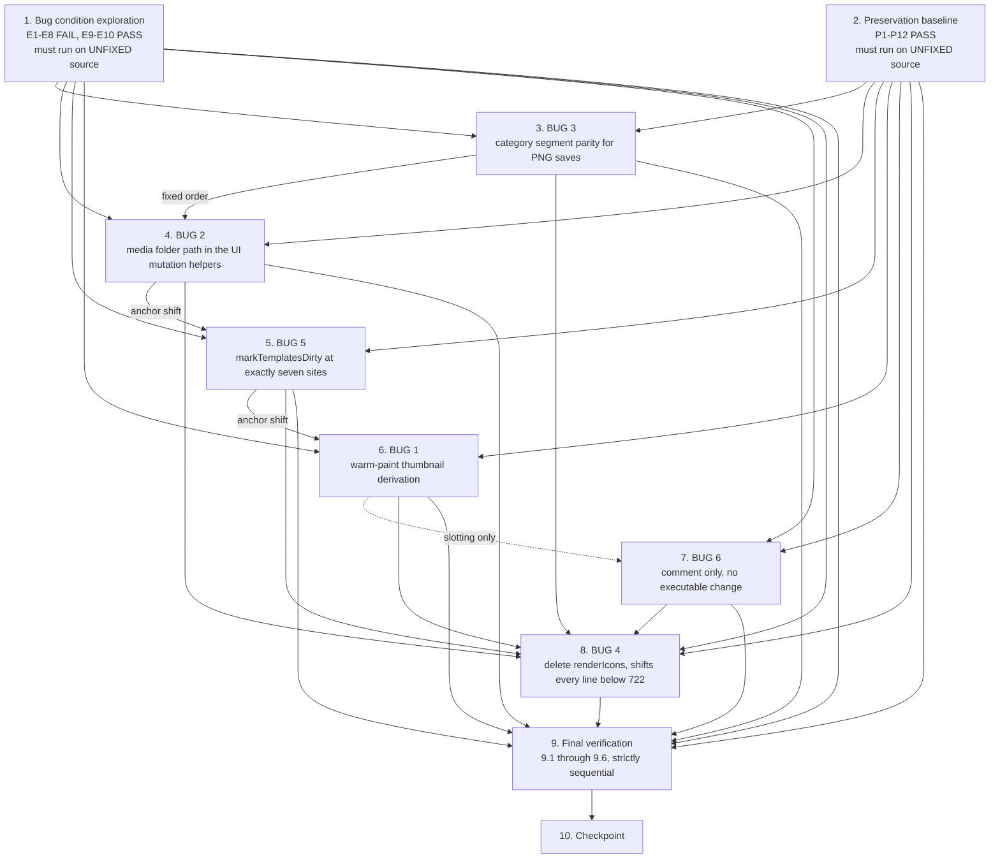

# Implementation Plan

## Overview

Four bugs need code, two do not. Every code edit lands in `js/templates/templates.js`. No file under `jsx/` is modified by any task, and `js/core/persistence.js`, `js/core/pathBuilders.js` and `js/core/fastMediaEngine.js` are read-only here — that is what keeps the whole change set out of `tests/media-cep-compatibility.test.js`'s whole-file scan scope (clause 3.16).

**Fixed implementation order: BUG 3 → BUG 2 → BUG 5 → BUG 1 → BUG 6 → BUG 4.** This order comes from the design's Conflicts and Ordering table and exists to avoid line-shift conflicts: BUG 4's deletion of `renderIcons` moves every line below 722 up by 64, and BUG 1's helper-B insertion above `:1148` shifts BUG 5's reconcile anchors at `:1833`, `:1838`, `:1897` down. Do not reorder. If applying edits by anchor text rather than line number the order is free, but the task list is written to the line-number-safe order.

All line references below are pre-BUG-4.

The two admissible execution schedules, and the reason behind every ordering edge, are in `## Task Dependency Graph`. The caveats that survive the fix — the test that stays red on purpose, the two bugs that turned out not to reproduce, the baseline that must not move, and the defect this spec declines to touch — are consolidated in `## Notes`.

## Property coverage map

| Design property | Owning task | Coverage |
| --- | --- | --- |
| Property 1 — warm paint renders a persisted thumbnail | 6 (BUG 1) | **New** — E1, E2 (task 1) + F1 (task 6.5) |
| Property 2 — warm paint leaves every other entry untouched | 6 (BUG 1) | **New** — P2, P2c (tasks 2, 6.5); P12 re-runs four existing startup suites unmodified |
| Property 3 — mutation helpers address a media entry's real folder | 4 (BUG 2) | **New** — E4, E5 (task 1) + F2 (task 4.3) |
| Property 4 — non-media path resolution is byte-identical | 4 (BUG 2) | **New** — P1, P8 (task 2) |
| Property 5 — category segment parity with the host | 3 (BUG 3) | **New** — E6, E7 (task 1) + F3 (task 3.5) |
| Property 6 — clean categories and the save contract are unmoved | 3 (BUG 3) | **Mixed** — P3 is new (tasks 2, 3.5); P4 is **already covered** by `tests/save-return-shape.test.js:561`, `:608`, and `cleanName` idempotence by `tests/save-path-builders.test.js:439-446` — neither is modified |
| Property 7 — no icon-path markup builder retains the asymmetry | 8 (BUG 4) | **Mixed** — P9's guard half is new (task 2) and its `renderIcons`-absent half is new (task 8.3); the never-reached-renderer witnesses are **already covered** by `tests/keyed-media-card-helper.test.js:255` and `tests/single-card-patch-job-completion.property.test.js:351` — neither is modified |
| Property 8 — unmirrored in-place mutations are detected | 5 (BUG 5) | **New** — E8 (task 1) + F4 over all seven S-sites (task 5.8) |
| Property 9 — freshness stays conditional and the probes stay live | 5 (BUG 5) | **New** — P5, P6, P7 (task 2) |
| Property 10 — the startup scan section list is unchanged | 7 (BUG 6) | **New** — P10 (task 2), the executable form of the no-change decision |
| Property 11 — runtime and scan constraints hold | 9 (verification) | **Already covered** — `tests/media-cep-compatibility.test.js` unmodified and green, plus the full-suite baseline; P11 holds by construction |

Two new test files carry all new coverage, so the comp-pipeline counts required by clause 3.18 (22/22 exploration, 47/47 preservation) are untouched — neither file is added to a comp-pipeline suite:

- `tests/media-card-lifecycle-exploration.test.js`
- `tests/media-card-lifecycle-preservation.property.test.js`

Both load `js/templates/templates.js` through `tests/helpers/loadHelpers.js` with `lenient: false`, following `tests/performance/startup-warm-paint.property.test.js`. The host side of the BUG 3 parity property comes from the sliced host realm in `tests/helpers/compPipelineHarness.js`, whose `CORE_PURE_NAMES` (`:94-99`) already exposes `cleanStr` and `getSafeName`.

## Task Dependency Graph

Top level. Tasks 3 through 8 are the six bug tasks in the mandated order **BUG 3 → BUG 2 → BUG 5 → BUG 1 → BUG 6 → BUG 4**, which is tasks 3 → 4 → 5 → 6 → 7 → 8. Solid edges are real dependencies; the dotted edge is slotting only.



Sub-tasks. Order inside a bug task is fixed by construction — a helper must exist before its call sites reference it, and a verify sub-task must follow what it verifies.

```mermaid
graph TD
    subgraph B3["3. BUG 3"]
        T31["3.1 cleanName into save-return-shape harness"]
        T32["3.2 cleanName into comp-pipeline-integration harness"]
        T33["3.3 add safeCategorySegment"]
        T34["3.4 switch both PNG derivation sites"]
        T35["3.5 verify"]
        T31 & T32 --> T33
        T31 & T32 --> T34
        T33 --> T34
        T31 & T32 & T33 & T34 --> T35
    end

    subgraph B2["4. BUG 2"]
        T41["4.1 add _findUITemplateRecord"]
        T42["4.2 media early return in _getTemplateFolderPath"]
        T43["4.3 verify"]
        T41 --> T42 --> T43
    end

    subgraph B5["5. BUG 5"]
        T51["5.1 S1 + S2 reconcile processor"]
        T52["5.2 S3 reconcile removal"]
        T53["5.3 S4 removeUITemplate"]
        T54["5.4 S5 patchUITemplate"]
        T55["5.5 S6 markCardFailed"]
        T56["5.6 S7 renderOptimisticCard"]
        T57["5.7 confirm the dropped candidates stay uncalled"]
        T58["5.8 verify"]
        T51 & T52 & T53 & T54 & T55 & T56 --> T57
        T51 & T52 & T53 & T54 & T55 & T56 --> T58
    end

    subgraph B1["6. BUG 1"]
        T61["6.1 add buildBustedThumbUrl, route refreshCardThumbnail"]
        T62["6.2 add hydrateWarmPaintThumbnail"]
        T63["6.3 call from startupWarmPaint"]
        T64["6.4 call from loadTemplates warm branch"]
        T65["6.5 verify"]
        T61 --> T62
        T62 --> T63 & T64
        T61 & T62 & T63 & T64 --> T65
    end

    subgraph B6["7. BUG 6"]
        T71["7.1 extend the STARTUP_SCAN_SECTIONS comment"]
        T72["7.2 confirm comment only"]
        T71 --> T72
    end

    subgraph B4["8. BUG 4"]
        T81["8.1 delete the renderIcons declaration"]
        T82["8.2 confirm the survivors are untouched"]
        T83["8.3 verify"]
        T81 --> T82 --> T83
        T81 --> T83
    end

    subgraph V["9. Final verification"]
        T91["9.1 exploration suite"]
        T92["9.2 preservation suite"]
        T93["9.3 spec verification command"]
        T94["9.4 CEP compatibility scan"]
        T95["9.5 four startup performance suites"]
        T96["9.6 full-suite baseline"]
        T91 --> T92 --> T93 --> T94 --> T95 --> T96
    end
```



The same graph as machine-readable schedule definitions. `waves` is the mandated schedule and matches the fixed order in the overview; `anchorTextWaves` is the alternative that opens up if every edit is applied by anchor text instead of by line number. `tasks` carries the per-task and per-sub-task `dependsOn` lists both wave assignments derive from, with `wave` naming the `waves` entry. `schedulingOnlyEdges` records the two edges that are ordering convenience and NOT dependencies.

```json
{
  "version": 1,
  "taskCount": 10,
  "fixedBugOrder": ["BUG 3", "BUG 2", "BUG 5", "BUG 1", "BUG 6", "BUG 4"],
  "fixedTaskOrder": ["3", "4", "5", "6", "7", "8"],
  "waves": [
    { "wave": 1, "name": "Observe on unfixed source", "tasks": ["1", "2"] },
    { "wave": 2, "name": "BUG 3", "tasks": ["3"] },
    { "wave": 3, "name": "BUG 2", "tasks": ["4"] },
    { "wave": 4, "name": "BUG 5", "tasks": ["5"] },
    { "wave": 5, "name": "BUG 1", "tasks": ["6"] },
    { "wave": 6, "name": "BUG 6", "tasks": ["7"] },
    { "wave": 7, "name": "BUG 4, last because it shifts every line below 722", "tasks": ["8"] },
    { "wave": 8, "name": "Final verification", "tasks": ["9"] },
    { "wave": 9, "name": "Checkpoint", "tasks": ["10"] }
  ],
  "anchorTextWaves": [
    { "wave": 1, "name": "Observe on unfixed source", "tasks": ["1", "2"] },
    { "wave": 2, "name": "All six bug tasks, parallelizable under anchor-text editing", "tasks": ["3", "4", "5", "6", "7", "8"] },
    { "wave": 3, "name": "Final verification", "tasks": ["9"] },
    { "wave": 4, "name": "Checkpoint", "tasks": ["10"] }
  ],
  "tasks": [
    {
      "id": "1",
      "title": "Bug condition exploration test",
      "wave": 1,
      "dependsOn": [],
      "subTasks": []
    },
    {
      "id": "2",
      "title": "Preservation property tests",
      "wave": 1,
      "dependsOn": [],
      "subTasks": []
    },
    {
      "id": "3",
      "title": "BUG 3 — category segment parity for PNG saves",
      "wave": 2,
      "dependsOn": ["1", "2"],
      "subTasks": [
        { "id": "3.1", "dependsOn": [] },
        { "id": "3.2", "dependsOn": [] },
        { "id": "3.3", "dependsOn": ["3.1", "3.2"] },
        { "id": "3.4", "dependsOn": ["3.1", "3.2", "3.3"] },
        { "id": "3.5", "dependsOn": ["3.1", "3.2", "3.3", "3.4"] }
      ]
    },
    {
      "id": "4",
      "title": "BUG 2 — media folder path resolution in the UI mutation helpers",
      "wave": 3,
      "dependsOn": ["1", "2", "3"],
      "subTasks": [
        { "id": "4.1", "dependsOn": [] },
        { "id": "4.2", "dependsOn": ["4.1"] },
        { "id": "4.3", "dependsOn": ["4.2"] }
      ]
    },
    {
      "id": "5",
      "title": "BUG 5 — wire markTemplatesDirty at exactly seven sites",
      "wave": 4,
      "dependsOn": ["1", "2", "4"],
      "subTasks": [
        { "id": "5.1", "dependsOn": [] },
        { "id": "5.2", "dependsOn": [] },
        { "id": "5.3", "dependsOn": [] },
        { "id": "5.4", "dependsOn": [] },
        { "id": "5.5", "dependsOn": [] },
        { "id": "5.6", "dependsOn": [] },
        { "id": "5.7", "dependsOn": ["5.1", "5.2", "5.3", "5.4", "5.5", "5.6"] },
        { "id": "5.8", "dependsOn": ["5.1", "5.2", "5.3", "5.4", "5.5", "5.6"] }
      ]
    },
    {
      "id": "6",
      "title": "BUG 1 — warm-paint thumbnail derivation",
      "wave": 5,
      "dependsOn": ["1", "2", "5"],
      "subTasks": [
        { "id": "6.1", "dependsOn": [] },
        { "id": "6.2", "dependsOn": ["6.1"] },
        { "id": "6.3", "dependsOn": ["6.2"] },
        { "id": "6.4", "dependsOn": ["6.2"] },
        { "id": "6.5", "dependsOn": ["6.1", "6.2", "6.3", "6.4"] }
      ]
    },
    {
      "id": "7",
      "title": "BUG 6 — record the host-expansion dependency, no code change",
      "wave": 6,
      "dependsOn": ["1", "2"],
      "subTasks": [
        { "id": "7.1", "dependsOn": [] },
        { "id": "7.2", "dependsOn": ["7.1"] }
      ]
    },
    {
      "id": "8",
      "title": "BUG 4 — delete renderIcons",
      "wave": 7,
      "dependsOn": ["1", "2", "3", "4", "5", "6", "7"],
      "subTasks": [
        { "id": "8.1", "dependsOn": [] },
        { "id": "8.2", "dependsOn": ["8.1"] },
        { "id": "8.3", "dependsOn": ["8.1", "8.2"] }
      ]
    },
    {
      "id": "9",
      "title": "Final verification",
      "wave": 8,
      "dependsOn": ["1", "2", "3", "4", "5", "6", "7", "8"],
      "subTasks": [
        { "id": "9.1", "dependsOn": [] },
        { "id": "9.2", "dependsOn": ["9.1"] },
        { "id": "9.3", "dependsOn": ["9.2"] },
        { "id": "9.4", "dependsOn": ["9.3"] },
        { "id": "9.5", "dependsOn": ["9.4"] },
        { "id": "9.6", "dependsOn": ["9.5"] }
      ]
    },
    {
      "id": "10",
      "title": "Checkpoint",
      "wave": 9,
      "dependsOn": ["9"],
      "subTasks": []
    }
  ],
  "schedulingOnlyEdges": [
    {
      "from": "3",
      "to": "4",
      "reason": "Fixed order from the design's Conflicts and Ordering table. BUG 3's helper is a hoisted declaration with a free insertion position, so landing it first keeps its line shift accounted for before BUG 2 and BUG 5 read their anchors. No anchor collision between the two is recorded."
    },
    {
      "from": "6",
      "to": "7",
      "reason": "Slotting only. Task 7 is comment-only with no executable change, so it depends on nothing but tasks 1 and 2 and can run at any point. It sits between 6 and 8 to keep the bug order readable."
    }
  ]
}
```

The same constraints as a listing, with the reason each edge exists. Every reason is already recorded in the task body it comes from.

- **1** and **2** gate every bug task, and are independent of each other. Both must be written and run against UNFIXED source: task 1's value is the eight recorded failures, task 2's is a green baseline of observed behaviour. Once any fix lands neither observation can be made again, so nothing from tasks 3-8 may be applied before both files exist and have been run.
- **3 (BUG 3)** is first among the bug tasks, per the fixed order.
  - **3.1** and **3.2** gate **3.3** and **3.4**: without the two one-line `cleanName` injections the vm harnesses build their context from the injected object only, so `safeCategorySegment` would exercise its guarded `typeof` fallback instead of the real fold and the fix would go unverified in the one suite that drives the real `confirmSave` PNG path. They are independent of each other.
  - **3.3** precedes **3.4**: the call sites switch to a helper that has to exist first.
  - **3.5** depends on all of **3.1-3.4**: it re-runs E6 and E7, adds F3, and re-runs both injected harnesses.
- **4 (BUG 2)** follows **3** as scheduling, and precedes **5** as a real dependency: **4.1** inserts above `:2161`, which shifts **5.3**'s `:2178` and **5.4**'s `:2208` down.
  - **4.1** gates **4.2**: the early return calls `_findUITemplateRecord`.
  - **4.3** depends on **4.2**: it re-runs E4 and E5 and adds F2.
- **5 (BUG 5)** precedes **6** as a real dependency: **6.2** inserts above `:1148`, which shifts **5.1**'s `:1833`, **5.2**'s `:1838` and **5.3**'s `:1897` down.
  - **5.1-5.6** are independent of each other. Each is one added line plus one comment at a distinct site, and `markTemplatesDirty` itself is not modified.
  - **5.7** and **5.8** both depend on all of **5.1-5.6**, and are independent of each other. 5.7's grep expects exactly eight occurrences of the identifier in `js/**` — one definition plus seven calls — so it cannot run until every call has landed. 5.8 re-runs E8 and adds F4 over all seven sites.
- **6 (BUG 1)** follows **5**.
  - **6.1** gates **6.2**: `hydrateWarmPaintThumbnail` derives its URL through `buildBustedThumbUrl`.
  - **6.2** gates **6.3** and **6.4**, which are the two call sites and are independent of each other.
  - **6.5** depends on all of **6.1-6.4**: it re-runs E1 and E2, confirms E3 still fails, and adds F1, P2's deferred half and P2c's byte-identity check.
- **7 (BUG 6)** is order-free — it is comment-only, so no line anchor anywhere depends on it and nothing it touches is executable. It is slotted between **6** and **8** to keep the bug order readable.
  - **7.1** gates **7.2**: 7.2 confirms from the diff that 7.1 changed comment lines only.
- **8 (BUG 4)** is last of the bug tasks, and this is a real constraint: **8.1** removes `:722-785`, moving every line below 722 up by 64, which would invalidate every unconsumed line anchor in tasks 3-7.
  - **8.1** precedes **8.2** and **8.3**; **8.2** precedes **8.3**.
- **9** depends on **1**, **2** and all of **3-8**: 9.1 and 9.2 re-run the two files written in tasks 1 and 2, now carrying the additions from 3.5, 4.3, 5.8, 6.5 and 8.3.
  - **9.1 → 9.2 → 9.3 → 9.4 → 9.5 → 9.6** is strictly sequential, narrowest scope first. A failure at 9.1 or 9.2 is a fix defect and localizes to one bug; a failure that first appears at 9.3-9.6 is a regression in code the spec did not intend to touch, and knowing which earlier stage was green is what makes it diagnosable. 9.6 is last because it is the full-suite baseline and subsumes the design's broader touched-suite sweep.
- **10** depends on all of **9**.

**Parallelization under anchor-text editing.** Every edge in the chain **3 → 4 → 5 → 6 → 7 → 8** exists for one of two reasons: a line-number shift, or readability of the bug order. None of them is a semantic dependency — the six bug tasks touch disjoint regions of `js/templates/templates.js`, which the task bodies state at each point of near-contact: BUG 2 edits only `_getTemplateFolderPath` and leaves `removeUITemplate` and `patchUITemplate` to BUG 5's S4 and S5; BUG 1 does not widen `renderOptimisticCard`'s `insertAtHead` literal that BUG 5's S7 sits beside; BUG 1 adds no `markTemplatesDirty` to `refreshCardThumbnail`, which is exactly what 5.7 asserts. So if edits are applied by anchor text rather than by line number, all six of **3, 4, 5, 6, 7 and 8** become mutually independent and can run in any order or in parallel, as `anchorTextWaves` records. Three things do not relax under that schedule: tasks **1** and **2** still gate all six, sub-task order inside each bug task is unchanged, and task **9** still follows all six. The task list is written to the line-number-safe order, so an implementer who has not switched to anchor-text editing must follow it exactly.

---

## Tasks

- [x] 1. Write bug condition exploration test
  - **Property 1: Bug Condition** - Warm paint renders a persisted thumbnail
  - **IMPORTANT**: Write this test file BEFORE any fix lands, in `tests/media-card-lifecycle-exploration.test.js`
  - **GOAL**: Surface counterexamples that demonstrate each root cause, so a refutation sends BUG 1, 2, 3 or 5 back to re-hypothesis instead of into a fix
  - **DO NOT attempt to fix the test or the code when a case fails** — the failures are the deliverable
  - **NOTE**: E1, E2, E4-E8 encode the expected behavior and will validate the fixes when they flip to passing; E3 is a diagnostic that will NOT flip (see task 6.5); E9 and E10 are refutation guards that pass on unfixed code
  - **Scoped PBT Approach**: every bug here is deterministic, so each case is scoped to concrete failing inputs for reproducibility rather than generated — generation moves to the fix-checking properties
  - Harness: vm realm with a real parsed DOM, a real `LibraryIndex`, and the real `pathBuilders` sanitizers injected; drive the real entry points
  - Bug condition under test is `isBug1 OR isBug2 OR isBug3 OR isBug5` from the design's `isBugCondition` — BUG 4 and BUG 6 contribute no clause, so their cases (E9, E10) are written as refutation guards
  - E1 — `isBug1`: persist `{ folderPath, thumbnailPath: "<folder>/thumbnail.png", thumbStatus: "ready" }` with **no** `thumbnail`, call `startupWarmPaint(li)`, assert `renderTemplateCardMarkup(allTemplates[0], section, [])` contains `/footage/Broll/media-<hex>`, call `removeUITemplate(name, cat)`, assert `li.has(folderPath) === false` **and** `li.needsFullScan() === false`. **Expect FAIL**
  - E5 — `isBug2`: same seed, `patchUITemplate(name, cat, { favorite: true })`, assert `li.getEntry(folderPath).favorite === true`. **Expect FAIL**
  - E6 — `isBug3`: for `"My\tCat"`, `"My  Cat"`, `" My Cat "`, `"My\r\nCat"` assert the panel's derived category segment equals `hostGetSafeName(hostCleanStr(cat))`. **Expect FAIL**
  - E7 — `isBug3` at both sites: drive the real `confirmSave` PNG path with `selectedCatValue: "My  Cat"`, assert the captured `renderOptimisticCard` argument's `folderPath` **and** the captured `refreshCardThumbnail` folder both equal the host-derived path. Proves the fix needs two call sites, not one. **Expect FAIL**
  - E8 — `isBug5`: build the catalog, run the reconcile processor with a scan record that changes only `category` on a **middle** record (no adds, no removes), assert `catalogSourceChanged() === true`. **Expect FAIL**
  - E9 — refutation guard for BUG 4: assert `renderIcons` has zero references in `js/**` and in `index.html`. **Expect PASS** — a failure refutes clause 1.8 and re-opens BUG 4 as a live defect rather than dead code
  - E10 — refutation guard for BUG 6: assert `STARTUP_SCAN_SECTIONS` has exactly seven entries and no `"element"`, and `SECTION_SCAN_FOLDERS.element === "overlay"`. **Expect PASS** — a failure refutes clause 2.11
  - Run the file on UNFIXED source and document the counterexamples: E1/E2 emit the placeholder `<rect>` SVG or a bare `` with no `src`; E4/E5 leave `li.size()` unchanged with `li.needsFullScan() === true` and `li.lastError()` naming a path that has no `media-<hex>` segment; E6/E7 show panel `icon/My  Cat/…` vs host `icon/My Cat/…` and panel `icon/My_Cat/…` vs host `icon/MyCat/…`; E8 returns `false` because the counter never moved and every shape probe matches
  - Mark complete when the file is written, run, and the eight failures plus two passes are recorded
  - _Requirements: 1.1, 1.2, 1.3, 1.4, 1.5, 1.6, 1.7, 1.8, 1.9, 1.10, 1.11, 1.12_

- [x] 2. Write preservation property tests (BEFORE implementing any fix)
  - **Property 2: Preservation** - Warm paint leaves every other entry untouched
  - **IMPORTANT**: Follow observation-first methodology — run the UNFIXED code for each non-bug input class, record what it actually does, then encode that
  - Write into `tests/media-card-lifecycle-preservation.property.test.js`. Property-based, because these obligations are universally quantified over path strings, category strings and mutation sequences
  - For BUG 2 and BUG 3 the "original" side is recomputed **inside the test** from the pre-fix expression, so equality is asserted against the old rule rather than against a snapshot
  - P1 → Property 4 (3.4): for 2000 generated **non-media** records (arbitrary name, category, section, sourcePath), `_getTemplateFolderPath(name, cat)` equals `normalizeFolderPath(getTemplateSourcePath(name,cat)) + "/" + normalizeSectionName(currentSection) + "/" + getSafeName(cat) + "/" + generateTemplateId(name)` recomputed in the test. Byte equality, not a shape check
  - P2 → Property 2 (3.2, 3.3), the part observable pre-fix: for **every** generated entry, `entry.thumbnailPath` is unchanged, contains no `file:` scheme and no `?v=`, and is accepted by a fake `existsSync` keyed on raw paths; and an entry with no `thumbnailPath` renders placeholder artwork
  - P2c → Property 2 (3.1), the part observable pre-fix: after `refreshCardThumbnail(folder, thumb)`, `allTemplates[i].thumbnail` is a `file:///…?v=` URL, `allTemplates[i].thumbnailPath` is the raw path, `TemplateCatalog.patch` was called once for that record, and the persisted entry carries `{ thumbStatus: "ready", thumbnailPath: <raw> }` and — asserted deliberately — **no** `thumbnail`. Record the pre-fix inline URL for the generated path corpus so task 6.5 can assert byte-identity against it
  - P3 → Property 6 (3.6), pre-fix form: for 3000 generated categories containing no TAB, no CR/LF and no run of two or more spaces, with no leading/trailing whitespace, assert `getSafeName(cleanName(cat)) === getSafeName(cat)` computed directly from `pathBuilders`. This is the observation that licenses the fix as a no-op on clean inputs
  - P4 → Property 6 (3.7): name the existing regression witnesses for the PNG host call's 5-argument monolithic form — `tests/save-return-shape.test.js:561` and `:608`. **Do not modify them**
  - P5 → Property 9 (3.10), the binding test: build the catalog, then perform K renders through `renderWindowedIds`/`filterAndRender` with **no** intervening mutation, assert `TemplateCatalog.build` was invoked exactly once across all K. Generated over K and over library sizes, because this is the test that catches an over-broad call-site set in task 5
  - P6 → Property 9 (3.10), the exclusion witness: after `ensureCatalogFresh()`, call `refreshCardThumbnail` M times for M distinct cards and assert `catalogSourceChanged()` stays `false` and `TemplateCatalog.build` is not called again. This is the executable form of D3's decision to exclude `refreshCardThumbnail` — if a later change adds `markTemplatesDirty()` there, this fails
  - P7 → Property 9 (3.11): simulate `_publishDurable` — array identity held constant, `length = 0` then re-push a shallow clone of every record, no `markTemplatesDirty` call — and assert `catalogSourceChanged() === true`. Generated over library sizes including 1 and 2, where first and last coincide
  - P8 → Property 4 (3.5): `patchUITemplate` matches by `name` + `category` + `section`, calls `TemplateCatalog.patch(mutated, before)` with the same `before` shape, and routes through `filterAndRender` exactly when `recordChangedView` holds and through `patchTemplateCard` otherwise. Generated over favourite/rename/move patches, with and without an active search, and with `currentCategory === "Favorites"`
  - P9 → Property 7 (3.8, 3.9), the part observable pre-fix: `renderTemplateCardMarkup` passes an already-`file:///` value through verbatim, prefixes and `encodeURI`s anything else, and emits the stable `` patch target for a pending media card. Name the existing never-reached-renderer witnesses — `tests/keyed-media-card-helper.test.js:255` and `tests/single-card-patch-job-completion.property.test.js:351`. **Do not modify them**
  - P10 → Property 10 (3.12, 3.13, 2.12): `STARTUP_SCAN_SECTIONS` is exactly `["comp","layer","text","footage","effect","icon","overlay"]` in that order, contains no `"element"`, `SECTION_SCAN_FOLDERS.element === "overlay"`, and `startupScanSectionOrder()` puts the active section first and keeps the remaining six in fixed order for every section including `element`
  - P12 → Property 2, the existing-fixture witness: record that the four startup performance suites seed `thumbnail: ""` with **no** `thumbnailPath` (`tests/performance/startup-warm-paint.property.test.js:378-389`, `startup-reconcile.property.test.js:377`, `startup-lifecycle.property.test.js:548`, `:1082`, `cold-start-progressive.property.test.js:192`), so the warm-paint derivation is inert for all four. Re-run as-is; **no edit**
  - **DEFERRED to the bug tasks, because they reference helpers that do not exist yet and so cannot pass on unfixed code**: P2's `hydrateWarmPaintThumbnail`-returns-false assertions and P2c's `buildBustedThumbUrl` byte-identity (task 6.5), P3's `safeCategorySegment` equality (task 3.5), P9's `renderIcons`-absent assertion (task 8.3)
  - Run on UNFIXED code. **EXPECTED OUTCOME: every case above PASSES**, establishing the baseline to preserve
  - Mark complete when the file is written, run, and green on unfixed code
  - _Requirements: 3.1, 3.2, 3.3, 3.4, 3.5, 3.6, 3.7, 3.8, 3.9, 3.10, 3.11, 3.12, 3.13_

- [ ] 3. BUG 3 — category segment parity for PNG saves (first, per the fixed order)

  - [x] 3.1 Inject `cleanName` into the `save-return-shape` harness
    - Add `cleanName: pathBuilders.cleanName` to the injected-globals object in `tests/save-return-shape.test.js`, alongside `getSafeName` and `generateTemplateId` (~`:190-191`)
    - The file already does `require("../js/core/pathBuilders")` — no new require
    - **No assertion is rewritten.** The suite's only category is `"TestCat"`, for which `cleanName` is the identity, so the folder-path assertions at `:571-572`, `:582-583`, `:609-610` and the host-call assertions at `:561`, `:608` produce byte-identical strings before and after
    - This gates 3.3: without it the suite exercises `safeCategorySegment`'s guarded fallback instead of the real fold, leaving the fix unverified in the one suite that drives the real `confirmSave` PNG path
    - Verify: `npx jest tests/save-return-shape.test.js --runInBand` green, same test count as before
    - _Requirements: 2.5, 3.7_

  - [x] 3.2 Inject `cleanName` into the `comp-pipeline-integration` harness
    - Add `cleanName: pathBuilders.cleanName` to the injected-globals object in `tests/comp-pipeline-integration.test.js`, alongside `getSafeName` and `generateTemplateId` (~`:925-926`)
    - Already requires `pathBuilders` — no new require
    - **No assertion is rewritten**, same `"TestCat"` identity reasoning as 3.1
    - Verify: `npx jest tests/comp-pipeline-integration.test.js --runInBand` green, and clause 3.18's 22/22 exploration + 47/47 preservation counts unmoved
    - _Requirements: 2.5, 3.7, 3.18_

  - [-] 3.3 Add the `safeCategorySegment(cat)` helper
    - Top-level `function` declaration in `js/templates/templates.js`, at any position before `:3400` — the declaration is hoisted
    - Body: `var folded = (typeof cleanName === "function") ? cleanName(cat) : cat; return (typeof getSafeName === "function") ? getSafeName(folded) : folded;`
    - The `typeof cleanName` guard is required: `cleanName` is a bare panel global declared at `pathBuilders.js:52` and loaded before `utils.js` in `index.html` (asserted by `tests/panel-script-manifest.test.js:68-84`), so production needs no new require — but the vm harnesses build their context only from the injected object, and a bare reference to an undeclared identifier throws `ReferenceError`. `typeof` on an undeclared identifier does not throw. Same style as `templates.js:2164-2166`
    - Comment it as the panel twin of the host's decode-time fold, and note idempotence. This helper sits outside both CEP-scanned regions, so clause 3.17 does not constrain its wording
    - _Bug_Condition: `isBug3(input)` — `getSafeName(cat) !== getSafeName(hostFold(cat))`, i.e. `cat` contains a TAB, a CR/LF, a run of 2+ spaces, or leading/trailing whitespace_
    - _Expected_Behavior: Property 5 — the derived segment equals the host's `getSafeName(cleanStr(cat))` for every input_
    - _Preservation: Property 6 — byte-identical to `getSafeName(cat)` for every clean category; `cleanName` is idempotent_
    - _ES5_Safe: no arrow functions, no let/const, no template literals, no spread/rest, no class, no async/await, no optional chaining, no nullish coalescing (3.15)_
    - _Requirements: 1.5, 1.6, 2.5_

  - [ ] 3.4 Switch both PNG derivation sites to the helper
    - `scheduleBackground`, PNG branch (`:3400`): `getSafeName(cat)` → `safeCategorySegment(cat)` in the `pngFolder` expression
    - `onEssentialSuccess`, PNG branch (`:3666`): `getSafeName(cat)` → `safeCategorySegment(cat)` in the `optFolder` expression
    - Only the category segment changes. The name segment stays `generateTemplateId(name)`, and neither the host call shape nor its `"true"`/`"ERROR:"` return contract is touched
    - Both sites are required — E7 exists to prove one is not enough
    - _Bug_Condition: `isBug3(input)` at both derivation sites_
    - _Expected_Behavior: Property 5 — the optimistic card and `refreshCardThumbnail` both address the folder the host created_
    - _Preservation: Property 6 — clean categories unmoved (3.6); `generateTemplateId(name)` and the 5-argument monolithic save call unmoved (3.7)_
    - _ES5_Safe: no arrow functions, no let/const, no template literals, no spread/rest, no class, no async/await, no optional chaining, no nullish coalescing (3.15)_
    - _Requirements: 1.5, 1.6, 2.5, 2.6, 3.6, 3.7_

  - [ ] 3.5 Verify BUG 3 — fix check and preservation
    - Re-run E6 and E7 from task 1. **EXPECTED OUTCOME: both flip from FAIL to PASS**
    - Add F3 → Property 5 to the preservation file: for 2000 generated category strings drawn from an alphabet including TAB, CR, LF, multi-space runs, reserved characters and the reserved device stems, assert `safeCategorySegment(cat) === hostGetSafeName(hostCleanStr(cat))`; plus the integration form of E7 on fixed code, asserting the optimistic-card folder and the `refreshCardThumbnail` folder equal each other and the host-derived path
    - Add P3's fixed form: for the 3000 clean categories from task 2, `safeCategorySegment(cat) === getSafeName(cat)` byte-identical, so no existing library folder is re-keyed or orphaned
    - Unit cases for `safeCategorySegment`: `"a\tb"`, `"  a  b  "`, `"a\r\nb"`, `"a\n \tb"`, `null`, `undefined`, `""`, a reserved device stem, a trailing-dot category
    - Re-run `tests/save-return-shape.test.js` and `tests/comp-pipeline-integration.test.js` — both green with unchanged counts
    - _Properties: Property 5 (fix), Property 6 (preservation)_
    - _Requirements: 2.5, 2.6, 3.6, 3.7_

- [ ] 4. BUG 2 — media folder path resolution in the UI mutation helpers

  - [ ] 4.1 Add the `_findUITemplateRecord(name, cat)` helper
    - Insert immediately above `_getTemplateFolderPath`, after the section comment at `:2161`
    - Linear scan of `allTemplates` returning the first record where `rec.name === name && rec.category === cat && rec.section === currentSection`, else `null`
    - This is exactly the match rule `removeUITemplate` (`:2176`) and `patchUITemplate` (`:2195`) already use, so the path resolved here and the record mutated there are always the same card
    - _ES5_Safe: no arrow functions, no let/const, no template literals, no spread/rest, no class, no async/await, no optional chaining, no nullish coalescing (3.15)_
    - _Requirements: 2.3_

  - [ ] 4.2 Add the media early return inside `_getTemplateFolderPath`
    - Edit `_getTemplateFolderPath` (`:2162-2169`) — one early return at the top, existing body untouched below it
    - Resolve `rec = _findUITemplateRecord(name, cat)`; treat it as media via `(typeof isMediaIndexEntry === "function") ? isMediaIndexEntry(rec) : rec.type === "media"`; normalize its own `folderPath` via `normalizeFolderPath` when available, else the inline backslash/trailing-slash fold; return it only when non-empty so a media entry with an empty `folderPath` falls through to the reconstruction
    - **Signature unchanged, and `removeUITemplate` (`:2171`) and `patchUITemplate` (`:2185`) are NOT edited by this bug.** Per D4 that avoids duplicating the caller-side scan in three places, and it keeps BUG 2's edit in a disjoint line range from BUG 5's S4/S5 edits inside those two functions
    - `normalizeFolderPath` (`persistence.js:34-36`) is the same normalizer `removeEntry`, `patchEntry`, `has` and `getEntry` apply to their key, so the returned string matches the index key exactly; `patchEntry` pins `merged.folderPath = key` (`:449`) so a patch cannot move an entry
    - Comment the reason: the last folder segment of a media entry is `media-<hex>` derived from the entry ID by the media writer, never from the display name, so the name-based reconstruction can never reproduce it and the index mutation silently missed
    - _Bug_Condition: `isBug2(input)` — the matched record is a media index entry and `_getTemplateFolderPath(name, cat) !== normalizeFolderPath(entry.folderPath)`_
    - _Expected_Behavior: Property 3 — `removeUITemplate` removes and `patchUITemplate` patches the entry that actually backs the card, leaving `li.needsFullScan()` false_
    - _Preservation: Property 4 — non-media entries never enter the new branch, so their path is the same unmodified expression (3.4 by construction); `patchUITemplate`'s match rule, `TemplateCatalog.patch(mutated, before)` call and `recordChangedView` routing are untouched (3.5)_
    - _ES5_Safe: no arrow functions, no let/const, no template literals, no spread/rest, no class, no async/await, no optional chaining, no nullish coalescing (3.15)_
    - _Requirements: 1.3, 1.4, 2.3, 2.4, 3.4, 3.5_

  - [ ] 4.3 Verify BUG 2 — fix check and preservation
    - Re-run E4 and E5 from task 1. **EXPECTED OUTCOME: both flip from FAIL to PASS**, with `li.needsFullScan() === false`
    - Add F2 → Property 3 to the preservation file: generate media entries with arbitrary categories and hex id segments; after `removeUITemplate`, `li.has(folderPath) === false`, `li.needsFullScan() === false`, and no record remains in `allTemplates`; after `patchUITemplate(name, cat, patch)`, `li.getEntry(folderPath)` carries every patched field and its `folderPath` is unmoved
    - Re-run P1 and P8 from task 2 unchanged. **EXPECTED OUTCOME: still PASS** — P1 is the byte-identity witness for clause 3.4
    - Unit cases: `_findUITemplateRecord` with no match, a match in the wrong section, duplicate names in different categories; `_getTemplateFolderPath` with a media entry that has a usable `folderPath`, a media entry with an empty `folderPath` (falls through), a non-media entry, and a name absent from `allTemplates`
    - _Properties: Property 3 (fix), Property 4 (preservation)_
    - _Requirements: 2.3, 2.4, 3.4, 3.5_

- [ ] 5. BUG 5 — wire `markTemplatesDirty` at exactly seven sites

  `markTemplatesDirty` itself (`:661-664`) is **not** modified. Each site gets one added line plus a one-line comment naming why. The decision rule from D3: call it where the mutation is not fully absorbed by a hand-written catalog mirror, or where a shape probe already forces a rebuild so the call is free; never where a complete hand mirror exists on a hot path.

  - [ ] 5.1 S1 + S2 — `startupReconcileScanned`'s processor
    - S1: add `markTemplatesDirty();` after `copyStartupRecordFields(record, existing)` (`:1833`), before `patchTemplateCard(existing)`
    - S2: add `markTemplatesDirty();` after `allTemplates.push(record)` (`:1838`), before `counters.added++`
    - S1 is the entire mechanism — the one path that writes catalog-derived fields with no mirror and no shape change. S2 is additive and free: the length probe already fires
    - _Bug_Condition: `isBug5(input)` — mutates `allTemplates`, changes no observable array shape, is mirrored into no `TemplateCatalog.patch`/`remove`, and touches a derived field_
    - _Expected_Behavior: Property 8 — `catalogSourceChanged()` returns true afterwards and the next `ensureCatalogFresh()` rebuilds_
    - _Preservation: Property 9 — the shape probes stay live and additive (3.11)_
    - _ES5_Safe: no arrow functions, no let/const, no template literals, no spread/rest, no class, no async/await, no optional chaining, no nullish coalescing (3.15)_
    - _Requirements: 1.9, 1.10, 2.9, 2.10, 3.11_

  - [ ] 5.2 S3 — `startupReconcileFinish`'s removal pass
    - Add `markTemplatesDirty();` after `allTemplates.splice(i, 1)` (`:1897`), before `removeTemplateCardNode(entry)`
    - Additive and free: the length probe already fires. It also closes the add-1-remove-1 case where length returns to its original value
    - _Bug_Condition: `isBug5(input)` at the reconcile removal site_
    - _Expected_Behavior: Property 8_
    - _Preservation: Property 9 (3.11)_
    - _ES5_Safe: no arrow functions, no let/const, no template literals, no spread/rest, no class, no async/await, no optional chaining, no nullish coalescing (3.15)_
    - _Requirements: 2.9, 2.10, 3.11_

  - [ ] 5.3 S4 — `removeUITemplate`
    - Add `markTemplatesDirty();` after `TemplateCatalog.remove(removed)` (`:2178`), before the `break`
    - Additive and free: the length probe already fires, and it already does so once per iteration of the bulk-delete loop at `:2461-2465`, so this adds no rebuild that does not already happen
    - Disjoint from BUG 2's edit, which touched only `_getTemplateFolderPath`
    - _Bug_Condition: `isBug5(input)` at the remove site_
    - _Expected_Behavior: Property 8_
    - _Preservation: Property 9 — `TemplateCatalog.remove` stays (3.11)_
    - _ES5_Safe: no arrow functions, no let/const, no template literals, no spread/rest, no class, no async/await, no optional chaining, no nullish coalescing (3.15)_
    - _Requirements: 2.9, 2.10, 3.11_

  - [ ] 5.4 S5 — `patchUITemplate`
    - Add `markTemplatesDirty();` after `TemplateCatalog.patch(mutated, before)` (`:2208`), before the `break` at `:2209`
    - Not free, and deliberately so: `confirmRename` calls `patchUITemplate(oldName, cat, { name: newName, id: newId }, newName, undefined)` (`:2703`), which patches **`id`**. `TemplateCatalog.patch` keys on `recordId(t)` and takes its `addToLists` branch when `byId[id] === undefined` (`:172-176`), so with a new id the record is appended to `sectionIds` a second time while `byId[oldId]` still points at the same object, and `rebuildSectionCategories` then counts it twice. The rebuild produces a correct catalog
    - Cost: one O(N) rebuild per user-initiated favourite toggle (`:2269`), rename (`:2703`) or move (`:2759`) — three single user actions, none in a loop
    - Clause 3.5 requires the `TemplateCatalog.patch(mutated, before)` call to remain, so this is strictly additive
    - **Out of scope, recorded not fixed**: the id-change duplication inside `TemplateCatalog.patch` is a separate defect and needs its own spec. Do not repair `patch` here
    - _Bug_Condition: `isBug5(input)` at the patch site, where the hand mirror is incomplete for an id change_
    - _Expected_Behavior: Property 8_
    - _Preservation: Property 4 and Property 9 — the existing `TemplateCatalog.patch(mutated, before)` call, the match rule and the `recordChangedView` routing all stay (3.5, 3.11)_
    - _ES5_Safe: no arrow functions, no let/const, no template literals, no spread/rest, no class, no async/await, no optional chaining, no nullish coalescing (3.15)_
    - _Requirements: 2.9, 2.10, 3.5, 3.11_

  - [ ] 5.5 S6 — `markCardFailed`
    - Add `markTemplatesDirty();` after `allTemplates[a].thumbStatus = "failed"` (`:3070`), before the `break`
    - Included even though the near-identical `refreshCardThumbnail` is excluded: `markCardFailed` mirrors nothing into the catalog and would silently break if `hayFor` ever grows a field, while `refreshCardThumbnail` hand-patches and stays correct under any future `hayFor`. The cost settles it — `markCardFailed`'s only caller is the render queue's exhausted-retry handler (`js/textanim/textanim.js:1234`), so it fires on terminal failure, not on every success
    - _Bug_Condition: `isBug5(input)` at an unmirrored field write_
    - _Expected_Behavior: Property 8_
    - _Preservation: Property 9 — one rebuild per exhausted-retry failure is acceptable; the hot path is untouched (3.10)_
    - _ES5_Safe: no arrow functions, no let/const, no template literals, no spread/rest, no class, no async/await, no optional chaining, no nullish coalescing (3.15)_
    - _Requirements: 2.9, 2.10, 3.10_

  - [ ] 5.6 S7 — `renderOptimisticCard`
    - Add `markTemplatesDirty();` after `TemplateCatalog.patch(tpl)` (`:3036`), which follows `allTemplates.unshift(tpl)` (`:3035`)
    - Additive and free: both the length and the first-element probes already fire
    - Do **not** widen the `insertAtHead` literal at `:2994-3003` — D1 chose read-side derivation, so BUG 1 does not touch it and there is no overlap between the two fixes in this function
    - _Bug_Condition: `isBug5(input)` at the optimistic insert_
    - _Expected_Behavior: Property 8_
    - _Preservation: Property 9 (3.11); Property 2 — `thumbnailPath` stays the raw disk path the `existsSync` probe reads (3.2)_
    - _ES5_Safe: no arrow functions, no let/const, no template literals, no spread/rest, no class, no async/await, no optional chaining, no nullish coalescing (3.15)_
    - _Requirements: 2.9, 2.10, 3.2, 3.11_

  - [ ] 5.7 Confirm the three dropped candidates stay uncalled
    - **No `markTemplatesDirty()` in `refreshCardThumbnail`** (`:2915-2917`): the hand `TemplateCatalog.patch(allTemplates[a])` at `:2922` is complete — records are shared references, and none of `thumbnail`, `thumbnailPath`, `thumbStatus` participates in `hayFor` (`templateCatalog.js:51-54`) or `counts`. Marking dirty would force one O(N) rebuild per completed thumbnail, O(N²) across an N-item import batch, on the media hot path. Clause 3.10 forbids it, clause 3.1 requires the direct patch to remain, and the comment at `:2918-2923` exists to prevent it
    - **No call in `markThumbnailForRegen`** (`:3164`): it writes a `.needsthumb` marker file and does not touch `allTemplates` at all
    - **No call in the media-completion `patchById` path**: the shared-model mutation is `_publishDurable` (`persistence.js:981-1000`), which does `mirror.length = 0` and re-pushes fresh clones, so every element identity changes and the first/last-element probes fire without any counter. Clause 3.11 names those probes as the mechanism for this case. Excluding it also keeps `js/core/persistence.js` — a whole-file CEP-scanned unit — unmodified
    - **No calls added** at `loadTemplates:53`, `:111`, `:190`, `startupWarmPaint:1171` or `mergeSurvivingMediaEntries` (`:1677-1700`): all reassign `allTemplates` wholesale, so the array-identity probe fires
    - Verify by grep that the repo contains exactly eight occurrences of the identifier `markTemplatesDirty` in `js/**` — one definition plus seven calls — and none in `js/core/persistence.js`
    - _Properties: Property 9 (the exclusion is what P6 makes executable)_
    - _Requirements: 3.1, 3.10, 3.11_

  - [ ] 5.8 Verify BUG 5 — fix check and preservation
    - Re-run E8 from task 1. **EXPECTED OUTCOME: flips from FAIL to PASS**
    - Add F4 → Property 8 to the preservation file: for each of the seven S-sites, drive the real entry point and assert `catalogSourceChanged()` is true afterwards and that the following `ensureCatalogFresh()` invokes `TemplateCatalog.build` exactly once. Spy `TemplateCatalog.build` by wrapping it in the vm context
    - Re-run P5, P6, P7 from task 2. **EXPECTED OUTCOME: still PASS.** P5 is the test that catches an over-broad call-site set; P6 is the `refreshCardThumbnail` exclusion witness; P7 confirms the clone-rewrite is still caught by the shape probes with no counter involvement
    - Add the mutation-sequence property: generate sequences over `allTemplates` (field write, push, splice, unshift, clone rewrite, no-op render) and assert `catalogSourceChanged()` is true exactly when a mutation occurred since the last sync — no false negatives, and no false positives on the no-op render
    - Unit case: `markTemplatesDirty` returns a strictly increasing integer, and N calls before one `ensureCatalogFresh` yield exactly one rebuild
    - Re-run `tests/template-catalog.test.js`, `tests/performance/startup-reconcile.property.test.js` and `tests/performance/startup-lifecycle.property.test.js`
    - _Properties: Property 8 (fix), Property 9 (preservation)_
    - _Requirements: 2.9, 2.10, 3.10, 3.11_

- [ ] 6. BUG 1 — warm-paint thumbnail derivation (after BUG 5, so the reconcile anchors do not shift)

  Per D1: derive on **read**, in **both** warm-paint branches, as a cache-busted `file:///…?v=<token>` URL, with **no** filesystem access. The write side is deliberately not widened — a write-side fix cannot repair entries already persisted without `thumbnail`, and a persisted busting token is stale by construction because it is the one the embedded browser already cached against.

  - [ ] 6.1 Add `buildBustedThumbUrl(raw, token)` and route `refreshCardThumbnail` through it
    - Insert the helper immediately above `refreshCardThumbnail`, after `nextThumbCacheToken` (which ends at `:2864`)
    - Body: forward-slash the input, return `""` for empty, strip a single leading `/`, return `"file:///" + encodeURI(fwd) + "?v=" + token`
    - Replace the three-line construction at `:2888-2890` with `var url = buildBustedThumbUrl(thumbPath, version);`. Output must be byte-identical for every non-empty `thumbPath` — that identity is what licenses the refactor and is asserted in 6.5
    - Nothing else in `refreshCardThumbnail` changes: the `li.patchEntry` at `:2897`, the three field writes at `:2915-2917`, the `TemplateCatalog.patch` at `:2922` and the DOM patch all stay, and no `markTemplatesDirty()` is added (task 5.7)
    - _Bug_Condition: shared URL rule, kept in one place so the in-session refresh and the warm-paint derivation cannot drift_
    - _Expected_Behavior: Property 1 — one `file:///`-schemed, `encodeURI`-ed, `?v=`-busted rule_
    - _Preservation: Property 2 — byte-identical in-session URL and the direct catalog patch retained (3.1)_
    - _ES5_Safe: no arrow functions, no let/const, no template literals, no spread/rest, no class, no async/await, no optional chaining, no nullish coalescing (3.15)_
    - _Requirements: 1.1, 3.1_

  - [ ] 6.2 Add `hydrateWarmPaintThumbnail(entry)`
    - Insert immediately above `startupWarmPaint`'s comment block (`:1148`)
    - Guards, in order: reject a non-object entry; reject a `thumbnailPath` that is not a non-empty string; reject when the entry already has a non-empty string `thumbnail` **and** `thumbStatus !== "ready"`; then derive `buildBustedThumbUrl(raw, nextThumbCacheToken(normFolder))` from the entry's forward-slashed `folderPath` and assign it to `entry.thumbnail`. Return true only when hydrated
    - **No filesystem call is permitted.** `tests/performance/startup-warm-paint.property.test.js:536` injects `nfs: function () { return { existsSync: function () { return false; } }; }` — `existsSync` only — so a `statSync` for a real mtime would throw there as well as violating that suite's no-disk-before-first-paint property. `nextThumbCacheToken` falls back to a clock read when no mtime is supplied
    - **Never writes `thumbnailPath`**, so clause 3.2's raw-path `existsSync`/`statSync` invariant holds by construction
    - Comment the reason and the two leave-alone cases (no `thumbnailPath` → placeholder stands; a `thumbnail` with `thumbStatus !== "ready"` → in-session value stands). This helper is outside both CEP-scanned regions, but if any comment does land in `js/core/persistence.js` or inside the `escapeTemplateCardAttribute` / `renderTemplateCardMarkup` regions of `templates.js`, describe the host **by role, never by filename** — `tests/media-cep-compatibility.test.js`'s Req 7.7 guard scans raw comment text for `/\.jsx\b/` (3.17). The design modifies neither surface, so the guard holds by construction
    - Accepted and recorded, not worked around: under the entry-identity rule the derived value lands on the index's own entry object, so a later `saveLibraryIndex()` persists it. A `"ready"` entry is re-derived every warm paint so a persisted token is always replaced; a non-`"ready"` entry keeps its value, which is exactly what clause 3.3 requires and is never worse than today's behaviour
    - _Bug_Condition: `isBug1(input)` — non-empty `thumbnailPath` and either `thumbStatus === "ready"` or a falsy `thumbnail`, with the renderer emitting no ``_
    - _Expected_Behavior: Property 1 — the entry's `thumbnail` is set to a renderable busted URL, with zero filesystem calls_
    - _Preservation: Property 2 — every non-condition entry keeps its `thumbnail` byte-identical, and `thumbnailPath` is never written (3.2, 3.3)_
    - _ES5_Safe: no arrow functions, no let/const, no template literals, no spread/rest, no class, no async/await, no optional chaining, no nullish coalescing (3.15)_
    - _Requirements: 1.1, 1.2, 2.1, 2.2, 3.2, 3.3, 3.17_

  - [ ] 6.3 Call it from `startupWarmPaint` — the production reopen path
    - In the `section` back-fill loop at `:1171-1174`, add `hydrateWarmPaintThumbnail(allTemplates[i]);` after the `section` assignment
    - This is the branch users hit on every reopen (called from `js/main.js:375`); the requirements name only the `loadTemplates` branch, so this site is the one that actually removes the reported symptom
    - The loop runs before `renderCardsFirstBatch`, satisfying clause 2.2's ordering requirement
    - _Bug_Condition: `isBug1(input)` on entries read from the persisted index at reopen_
    - _Expected_Behavior: Property 1 — hydrated before the first paint_
    - _Preservation: Property 2 — P12's four startup suites seed no `thumbnailPath`, so the call is inert for all of them_
    - _ES5_Safe: no arrow functions, no let/const, no template literals, no spread/rest, no class, no async/await, no optional chaining, no nullish coalescing (3.15)_
    - _Requirements: 1.2, 2.1, 2.2_

  - [ ] 6.4 Call it from `loadTemplates`'s warm branch
    - In the loop at `:53-57`, add `hydrateWarmPaintThumbnail(allTemplates[k]);` after the conditional `section` back-fill
    - This branch is taken on library-path change and manual refresh; E2 exists to prove the defect lives here too
    - The loop runs before `filterAndRender`, satisfying clause 2.2's ordering requirement
    - Cold-boot and background-rescan flows are **not** touched: their records arrive from the host already carrying a renderable `thumbnail`
    - No change to `renderOptimisticCard`'s `insertAtHead` literal (`:2994-3003`), to `refreshCardThumbnail`'s `li.patchEntry` (`:2897`), or to `js/core/persistence.js`
    - _Bug_Condition: `isBug1(input)` on the second warm-paint implementation_
    - _Expected_Behavior: Property 1 — both warm-paint branches hydrate before render_
    - _Preservation: Property 2 (3.1, 3.2, 3.3)_
    - _ES5_Safe: no arrow functions, no let/const, no template literals, no spread/rest, no class, no async/await, no optional chaining, no nullish coalescing (3.15)_
    - _Requirements: 1.2, 2.1, 2.2, 3.3_

  - [ ] 6.5 Verify BUG 1 — fix check and preservation
    - Re-run E1 and E2 from task 1. **EXPECTED OUTCOME: both flip from FAIL to PASS**
    - Re-run E3. **EXPECTED OUTCOME: still FAILS, and that is correct.** It is a diagnostic that proved the write-side half of hypothesis 1 on unfixed code; D1 declines to make it true. Do not "fix" it and do not delete it — keep it labelled as a diagnostic in the file
    - Add F1 → Property 1: generate entries with arbitrary Windows/POSIX raw thumbnail paths, arbitrary `thumbStatus`, and `thumbnail` present or absent. For every entry satisfying the condition, `hydrateWarmPaintThumbnail` returns true, the result starts `file:///`, decodes back to the raw path, carries a `?v=` token distinct from the previous token issued for that folder, and `renderTemplateCardMarkup` emits ``. Assert the injected `nfs()` recorded **zero** calls during hydration
    - Add P2's deferred half: for generated entries where the condition does **not** hold, `hydrateWarmPaintThumbnail` returns false and `entry.thumbnail` is `===` its prior value including `undefined`
    - Add P2c's deferred half — the E3 inverse that makes D1 enforceable rather than merely documented: after `refreshCardThumbnail(folder, thumb)` the persisted entry carries `thumbStatus` and `thumbnailPath` and **no** `thumbnail`; and `buildBustedThumbUrl(thumbPath, token)` is byte-identical to the pre-fix inline expression for the 2000 generated paths recorded in task 2
    - `hydrateWarmPaintThumbnail` decision table: the four `(thumbnailPath present?) × (thumbnail present?) × (thumbStatus === "ready"?)` classes, plus `null`, `undefined`, non-object and empty-string inputs
    - `buildBustedThumbUrl` units: leading-slash stripping, backslash conversion, `""` for empty input, and characters `encodeURI` does and does not escape
    - Integration: persist an index from a session that saved an image, run the real `startupWarmPaint`, assert the first painted grid carries the same `` the closing session showed, with zero filesystem and zero bridge calls before that first grid write
    - _Properties: Property 1 (fix), Property 2 (preservation)_
    - _Requirements: 2.1, 2.2, 3.1, 3.2, 3.3_

- [ ] 7. BUG 6 — record the host-expansion dependency (no code change)

  - [ ] 7.1 Extend the comment above `STARTUP_SCAN_SECTIONS`
    - Comment-only edit to the existing block at `:222-226`. **No executable change of any kind**
    - Record the dependency from D6: the panel's seven-folder list is complete *only because* the host expands an `overlay`-filtered `getAllTemplates` to `["overlay", "element"]` and normalizes records scanned out of the alias folder back to the canonical `overlay` section. Adding `element` would make the panel issue two chunks that each return both folders, duplicating every overlay and element record in the flattened result and in the persisted index. If a future change removes that host-side expansion, this list is the correct place to fix it — by adding `element` and flattening it into the fixed order
    - `STARTUP_SCAN_SECTIONS` stays `["comp","layer","text","footage","effect","icon","overlay"]` in that order; `SECTION_SCAN_FOLDERS.element` stays `"overlay"` (`:28`)
    - This comment sits outside both CEP-scanned regions and already names the host file today, so clause 3.17 does not constrain it
    - _Bug_Condition: none — BUG 6 does not reproduce, so no input satisfies a condition for it (clause 2.11)_
    - _Expected_Behavior: Property 10 — `element` is not added; the list, its order and the alias mapping are unchanged_
    - _Preservation: Property 10 — one `getAllTemplates` call per entry, active-section first, flattened into the fixed seven-folder order; `element/` assets surface exactly once under `overlay` (3.12, 3.13)_
    - _ES5_Safe: no arrow functions, no let/const, no template literals, no spread/rest, no class, no async/await, no optional chaining, no nullish coalescing (3.15)_
    - _Requirements: 1.11, 1.12, 2.11, 2.12_

  - [ ] 7.2 Verify BUG 6 is comment-only
    - Re-run E10 from task 1 and P10 from task 2. **EXPECTED OUTCOME: both still PASS** — E10 never failed, and P10 is the executable form of this no-change decision
    - Confirm from the diff that task 7.1 changed comment lines only
    - _Properties: Property 10_
    - _Requirements: 2.11, 2.12, 3.12, 3.13_

- [ ] 8. BUG 4 — delete `renderIcons` (last, because it shifts every line below 722 up by 64)

  - [ ] 8.1 Delete the declaration
    - Remove `js/templates/templates.js:722-784` in full — `function renderIcons(icons) { … }` from its signature at `:722` through its closing `}` at `:784` — plus the blank separator at `:785`. 63 lines of code, 64 with the separator
    - Nothing replaces it. No import, no export, no call site to update: it has zero references in `js/**` and in `index.html`, and `#icon-list-container` is populated by `renderCards` via `resolveSectionGridId`, which is why `renderIcons` went dead
    - Per D2, delete beats align: aligning would duplicate the scheme-prefix-and-encode rule in code with no callers, and factoring a shared helper would pull it into a `tests/media-cep-compatibility.test.js` region-scanned unit to serve dead code
    - _Bug_Condition: none — BUG 4 does not reproduce at the reported location; `renderIconCardsMarkup` does not exist and `renderIcons` is unreachable (clauses 1.7, 1.8, 2.7)_
    - _Expected_Behavior: Property 7 — no `js/**` markup builder emits an `` from a `thumbnail` without the scheme-prefix-and-`encodeURI` handling_
    - _Preservation: Property 7 — `renderTemplateCardMarkup` keeps passing `file:///` through verbatim, keeps prefixing and encoding anything else, and keeps emitting the stable `` patch target (3.8); the keyed media path still reaches none of `renderCards`, `renderIcons`, `filterAndRender` (3.9)_
    - _ES5_Safe: no arrow functions, no let/const, no template literals, no spread/rest, no class, no async/await, no optional chaining, no nullish coalescing (3.15)_
    - _Requirements: 1.7, 1.8, 2.7, 2.8, 3.8_

  - [ ] 8.2 Confirm the survivors are untouched
    - **`forceIconGrid` stays.** It lives at `js/ui/header.js:56` and keeps its two other references — `js/main.js:861` as a call and `js/ui/header.js:296` as a `requestAnimationFrame` argument. `tests/performance/contract-baseline.test.js:605` injects its own stub
    - **The `.icon-card` selectors stay.** `refreshCardThumbnail:2928`, `markCardFailed:3077` and `js/main.js:388,390` are left alone: `js/textanim/textanim.js:1260` queries `.icon-card` too, the CSS class stays, and pruning them is scope creep with a live-code blast radius
    - **No test edits.** `tests/keyed-media-card-helper.test.js:161` and `tests/single-card-patch-job-completion.property.test.js:247` assign a stub over the definition after `templates.js` is evaluated in the vm context and assert `rendererCalls` is empty (`:255`, `:351`); `tests/performance/contract-baseline.test.js:613` does `context.renderIcons = context.renderCards` as wiring only. All three survive the deletion unchanged, and none reads or asserts the original function. `contract-baseline` is one of the nine known-failing baseline suites and its failure count must not move
    - `tests/media-cep-compatibility.test.js:343` requires each scanned source to exceed 4000 characters and `:44` anchors `templates.js` on `renderTemplateCardMarkup` and `escapeTemplateCardAttribute`; `extractRegion` locates its regions by marker text, so both scanned regions extract identical text at a shifted start line
    - _Properties: Property 7 (preservation), Property 11_
    - _Requirements: 3.8, 3.9, 3.16_

  - [ ] 8.3 Verify BUG 4 — fix check and preservation
    - Re-run E9 from task 1. **EXPECTED OUTCOME: still PASSES** — it asserted zero references, which the deletion strengthens
    - Add P9 → Property 7's deferred half: `renderIcons` is absent from `js/templates/templates.js` and unreferenced in `js/**` and `index.html`, and no remaining `js/**` markup builder emits `` from a `thumbnail` without the guard
    - Re-run `tests/keyed-media-card-helper.test.js` and `tests/single-card-patch-job-completion.property.test.js` unmodified. **EXPECTED OUTCOME: green** — they stay green by construction and this is the confirmation
    - _Properties: Property 7 (fix and preservation)_
    - _Requirements: 2.7, 2.8, 3.8, 3.9_

- [ ] 9. Final verification — run in this order

  - [ ] 9.1 Re-run the exploration suite
    - **Property 1: Expected Behavior** - Warm paint renders a persisted thumbnail
    - **IMPORTANT**: re-run the SAME file from task 1 — do NOT write a new test. It encodes the expected behavior, so its passing is what confirms the fixes
    - `npx jest tests/media-card-lifecycle-exploration.test.js --runInBand`
    - **EXPECTED OUTCOME**: E1, E2, E4, E5, E6, E7, E8 PASS (flipped by tasks 3-6); E9, E10 PASS (never failed); **E3 still FAILS by design** — it is the diagnostic D1 deliberately declines to satisfy, and its post-fix inverse is asserted in P2c
    - _Requirements: 2.1, 2.2, 2.3, 2.4, 2.5, 2.6, 2.9, 2.10_

  - [ ] 9.2 Re-run the preservation suite
    - **Property 2: Preservation** - Warm paint leaves every other entry untouched
    - **IMPORTANT**: re-run the SAME file from task 2, now carrying the additions from 3.5, 4.3, 5.8, 6.5 and 8.3 — do NOT rewrite the baseline cases
    - `npx jest tests/media-card-lifecycle-preservation.property.test.js --runInBand`
    - **EXPECTED OUTCOME**: every case PASSES, including P5 (one rebuild across K no-op renders), P6 (the `refreshCardThumbnail` exclusion witness), P7 (clone rewrite still caught by the shape probes) and P2c (the persisted entry still carries no `thumbnail`)
    - _Requirements: 3.1, 3.2, 3.3, 3.4, 3.5, 3.6, 3.7, 3.8, 3.9, 3.10, 3.11, 3.12, 3.13_

  - [ ] 9.3 (a) Run the spec's verification command
    - `npx jest tests/media-pipeline-integration.test.js tests/media-import-coordinator.test.js tests/media-thumbnail-resources.property.test.js tests/performance/media-import-batch.property.test.js tests/comp-pipeline-units.test.js --runInBand`
    - **EXPECTED OUTCOME**: all green, no count moved
    - _Requirements: 3.19_

  - [ ] 9.4 (b) Run the CEP compatibility scan
    - `npx jest tests/media-cep-compatibility.test.js --runInBand`
    - **EXPECTED OUTCOME**: 25/25. Nothing in this spec edits a whole-file-scanned unit (`fastMediaEngine.js`, `scheduler.js`, `persistence.js`, `observability.js`, `keyedMediaCardHelper.js`) or either region-scanned body (`escapeTemplateCardAttribute`, `renderTemplateCardMarkup`), so it holds by construction
    - If it fails on the Requirement 7.7 guard, the cause is a comment: the guard scans **raw** text for `/\.jsx\b/`, so any comment added for BUG 1 in `js/core/persistence.js` or inside the `escapeTemplateCardAttribute` / `renderTemplateCardMarkup` regions of `templates.js` must describe the host **by role, never by filename**
    - _Requirements: 3.14, 3.15, 3.16, 3.17_

  - [ ] 9.5 (c) Run the four startup performance suites that touch warm paint
    - `npx jest tests/performance/startup-warm-paint.property.test.js tests/performance/startup-reconcile.property.test.js tests/performance/startup-lifecycle.property.test.js tests/performance/cold-start-progressive.property.test.js --runInBand`
    - **EXPECTED OUTCOME**: all green with no fixture edits. Per P12 each seeds `thumbnail: ""` with **no** `thumbnailPath`, so `hydrateWarmPaintThumbnail` returns false on its second guard for every record and all four are byte-unaffected. `startup-warm-paint`'s no-disk-before-first-paint property is the check that the derivation makes zero filesystem calls
    - _Requirements: 2.2, 3.2, 3.3, 3.19_

  - [ ] 9.6 (d) Hold the full-suite baseline
    - `npx jest --runInBand`
    - **EXPECTED OUTCOME**: exactly **9 failed suites / 97 failed tests and 109 passed suites / 1304 passed tests**, plus the two new files' passes and nothing else moved
    - The nine known pre-existing failures stay **unfixed and out of scope**: `tests/token-stability`, `tests/shared-systems`, `tests/accent-theme`, `tests/header-contract`, `tests/templates-contract`, `tests/class-contract`, `tests/token-foundation`, `tests/responsive-grid`, `tests/performance/contract-baseline`
    - Confirm clause 3.18 inside the run: comp-pipeline still reports 22/22 exploration and 47/47 preservation
    - This run subsumes the design's broader touched-suite sweep, so no separate sweep is needed
    - _Requirements: 3.18, 3.19_

- [ ] 10. Checkpoint - Ensure all tests pass
  - All of 9.1 through 9.6 green, with the two documented exceptions: E3 still fails by design, and the nine baseline suites still fail at their existing counts
  - Confirm the change set is `js/templates/templates.js` plus two new test files plus the two one-line harness injections in `tests/save-return-shape.test.js` and `tests/comp-pipeline-integration.test.js` — and nothing else. **No file under `jsx/` is modified** (3.14), and `js/core/persistence.js`, `js/core/pathBuilders.js` and `js/core/fastMediaEngine.js` are unmodified
  - Confirm every `js/**` edit is ES5-safe: no arrow functions, no `let`/`const`, no template literals, no spread/rest, no `class`, no `async`/`await`, no optional chaining, no nullish coalescing (3.15)
  - Ask the user if questions arise

---

## Notes

Every caveat below is already stated inside the task that owns it. This section exists so none of them has to be rediscovered by reading the whole plan.

**E3 stays failing after the fix, and that is correct.** E3 is the write-side half of hypothesis 1: after `refreshCardThumbnail(folder, folder + "/thumbnail.png")` it asserts `li.getEntry(folder).thumbnail` is a non-empty string. It fails on unfixed code, which is what proved the hypothesis, and D1 declines to make it true — the design derives the thumbnail URL on **read**, because a write-side fix cannot repair entries already persisted without `thumbnail`, and a persisted busting token is stale by construction. So E3 is labelled a DIAGNOSTIC inside `tests/media-card-lifecycle-exploration.test.js`, must not be "fixed", and must not be deleted. Its post-fix inverse is **P2c**, which asserts the persisted entry carries `thumbStatus` and `thumbnailPath` and deliberately **no** `thumbnail` — that is what makes D1 enforceable rather than merely documented. Owned by tasks 1, 6.5 and 9.1.

**BUG 4 and BUG 6 do not reproduce as reported.** Neither contributes a clause to `isBugCondition`, and neither is a behavioural fix:

- **BUG 4** is a deletion. `renderIconCardsMarkup` does not exist and `renderIcons` has zero references in `js/**` and in `index.html`, so the asymmetry sits in unreachable code. E9 is the refutation guard for that claim — if it ever fails, clause 1.8 is refuted and BUG 4 reopens as a live defect. Per D2, delete beats align: aligning would duplicate the scheme-prefix-and-encode rule in code with no callers, and factoring a shared helper would pull it into a region-scanned unit to serve dead code.
- **BUG 6** is a comment. The panel's seven-folder `STARTUP_SCAN_SECTIONS` list is complete only because the host expands an `overlay`-filtered `getAllTemplates` to `["overlay", "element"]`; adding `element` would duplicate every overlay and element record. E10 is the refutation guard, and P10 is the executable form of the no-change decision. Task 7 changes comment lines only.

**The nine pre-existing suite failures are out of scope and must stay unfixed.** `tests/token-stability`, `tests/shared-systems`, `tests/accent-theme`, `tests/header-contract`, `tests/templates-contract`, `tests/class-contract`, `tests/token-foundation`, `tests/responsive-grid` and `tests/performance/contract-baseline` already fail on unfixed source. The baseline to hold at 9.6 is exactly **9 failed suites / 97 failed tests and 109 passed suites / 1304 passed tests**, plus the two new files' passes. Do not repair them, and do not let their failure counts move — `contract-baseline` matters twice, because task 8.2 leaves its `context.renderIcons = context.renderCards` wiring alone and its count is one of the nine.

**The `TemplateCatalog.patch` id-change duplication is a separate defect, recorded not fixed.** Found while designing S5: `TemplateCatalog.patch` keys on `recordId(t)` and takes its `addToLists` branch when `byId[id] === undefined` (`templateCatalog.js:172-176`), so `confirmRename`'s `patchUITemplate(oldName, cat, { name: newName, id: newId }, newName, undefined)` (`:2703`) appends the record to `sectionIds` a second time while `byId[oldId]` still points at the same object, and `rebuildSectionCategories` then counts it twice. S5's `markTemplatesDirty()` forces a rebuild that produces a correct catalog, so the symptom is covered — but the underlying `patch` bug is untouched here and **needs its own spec**. Do not repair `patch` in task 5.4 or anywhere else in this plan.

**The whole change set.** One production file, two new test files, two one-line test-harness injections:

- `js/templates/templates.js` — every code edit in the spec lands here.
- `tests/media-card-lifecycle-exploration.test.js` — new.
- `tests/media-card-lifecycle-preservation.property.test.js` — new.
- `tests/save-return-shape.test.js` and `tests/comp-pipeline-integration.test.js` — one injected-globals line each, added by tasks 3.1 and 3.2. No assertion in either file is rewritten.

Nothing else. **No file under `jsx/` is modified** (3.14), and `js/core/persistence.js`, `js/core/pathBuilders.js` and `js/core/fastMediaEngine.js` are read-only throughout — that is what keeps the change set outside `tests/media-cep-compatibility.test.js`'s whole-file scan scope (3.16) and leaves clause 3.18's comp-pipeline counts of 22/22 exploration and 47/47 preservation untouched.
