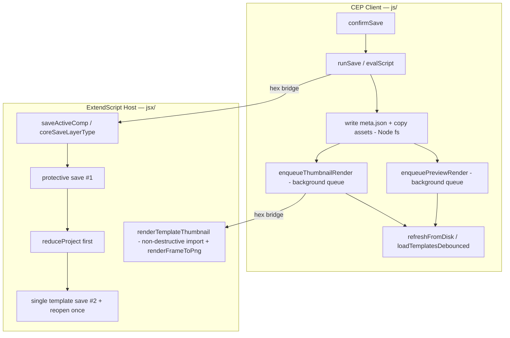

# Design Document: save-performance-optimization

## Overview

Saving a template in CompSaver freezes After Effects ("Not Responding") and keeps the panel in a
loading state long after the visible frame render finishes. The blocking work lives in ExtendScript
(`jsx/templates_save.jsx`), where `coreSaveLayerType()` and `saveActiveComp()` manipulate the WHOLE
live project: up to **three full `app.project.save()` calls**, a **synchronous thumbnail render**
(`saveFrameToPng`), a **destructive `reduceProject`**, and a **reopen from disk**. The client
(`js/templates/templates.js`) then opens `project.aep` again to render a preview video.

This design keeps the code in JavaScript/ExtendScript (the host language of this codebase) and
applies the already-decided **"reduce-first, single template save"** redesign:

1. Keep ONE protective `save(originalFile)`, but fix the swallowed-failure bug — abort before any
   destructive op if it fails.
2. Do `reduceProject([tempComp])` BEFORE the template save, then a SINGLE `save(targetFile)`
   (dropping the redundant third full save), then `app.open(originalFile)` once.
3. Move thumbnail + preview rendering OUT of the blocking save path into a client-side
   deferred/background job that imports `project.aep` non-destructively.

The blocking JSX writes the `.aep` and returns metadata FAST with no frame render. The
`evalScript` hex-bridge return shapes are preserved so the client pipeline keeps working.

---

## Architecture

The feature spans two runtime layers connected by the CEP `evalScript` hex bridge:



The blocking host path (C→D→E→F) returns fast with metadata and performs NO frame render. Thumbnail
and preview rendering are pushed to the client background queue (H/I), which calls back into the host
non-destructively (K).

## Current-Flow Analysis (annotated)

### `coreSaveLayerType(name, cat, r, saveTypeStr, thumbnailMode, section, templateId)`

Source: `jsx/templates_save.jsx` ~L432–620. Current ordered operations inside the undo group:

```text
                                                              full-save?  destructive?  UI-freeze?
0. validate comp/selection/section guardrails                   -            -            -
1. capture layerState (single-layer case)  [CORRECT — keep]     -            -            -
2. app.beginUndoGroup("Save …")                                 -            -            -
3. app.project.save(originalFile)   ── SAVE #1 (protective)     YES          -            -
     try{…}catch(e){}   ← BUG: failure SWALLOWED, flow continues
4. generate<Mode>Thumbnail(...)  (saveFrameToPng path)          -            -           YES  ← freeze
5. tempComp = items.addComp(...)                                -            -            -
6. copySelectedLayersToTempComp(...)                            -            -            -
7. app.project.save(targetFile)     ── SAVE #2 (template.aep)  YES          -            -
8. app.project.reduceProject([tempComp])                        -           YES  ← strips live project
9. tempComp.name = name                                         -           -            -
10. collect assetsList  (after reduce)  [CORRECT — keep]        -           -            -
11. app.project.save()              ── SAVE #3 (redundant)     YES          -            -   ← overwrites #2
12. app.endUndoGroup()                                          -           -            -
13. app.open(originalFile)          (reopen user project)       -           -           YES  ← reload
14. return { ok, layerCount, …, assetsList, layerState, folderPath }
```

**Redundancy / bug findings**

- **SAVE #3 (step 11) is redundant.** SAVE #2 (step 7) already wrote `project.aep`. Between them only
  `reduceProject` + rename happen. If the reduce happens BEFORE the single save, `project.aep` is
  written once in its final reduced form. → Eliminate one full-project write.
- **SAVE #1 failure is swallowed** (`try{ save(originalFile) }catch(e){}`). If the protective save
  fails, the code still proceeds to `reduceProject` (step 8), which destroys the in-memory project.
  The user's unsaved work can then be lost with no on-disk backup. → Must ABORT on failure.
- **Thumbnail render (step 4) freezes the UI.** `saveFrameToPng` is synchronous and sits directly in
  the blocking path. → Move to background.
- **Reopen (step 13) is REQUIRED and must stay.** `reduceProject` mutates the live in-memory project
  (removes every item except the temp comp). The only reliable way to restore the user's project is
  to reload `originalFile` from disk. Undo is not reliable across `reduceProject` + save-as. → Keep,
  but exactly once.

### `saveActiveComp(nHex, cHex, rHex, oldIdHex)`

Source: `jsx/templates_save.jsx` ~L626–897. Same skeleton with a verbose `log()` trail and an
inline thumbnail (temp `__CS_BG__` solid + `precomp.saveFrameToPng`). Ordered ops:

```text
                                                              full-save?  destructive?  UI-freeze?
1. decode nHex/cHex/rHex/oldIdHex (hex bridge)                   -           -            -
2. resolveCompForSave()                                         -           -            -
3. originalFile = app.project.file (guard)                      -           -            -
4. ensureDeepFolder(target)                                     -           -            -
5. app.beginUndoGroup("Save Comp")                              -           -            -
6. app.project.save(originalFile)   ── SAVE #1 (protective)    YES          -            -
     failure only LOGGED, flow continues   ← same swallow bug
7. precomp.openInViewer()                                       -           -            -
8. bitsPerChannel = 8; add __CS_BG__ solid                     -           -            -
9. precomp.saveFrameToPng(thumbTime, thumbFile)                -           -           YES  ← freeze
10. remove __CS_BG__; restore bitsPerChannel                    -           -            -
11. app.project.save(targetFile)    ── SAVE #2 (project.aep)   YES          -            -
12. precomp.name = name                                         -           -            -
13. app.project.reduceProject([precomp])                       -           YES  ← strips live project
14. collect assetsList (after reduce) [CORRECT — keep]         -           -            -
15. app.project.save()              ── SAVE #3 (redundant)     YES          -            -   ← overwrites #2
16. app.open(originalFile)          (reopen)                    -           -           YES
17. app.endUndoGroup()
18. return encodeBridge(JSON{ ok, templateId, …, assetsList, thumbnailPath })
```

Same three findings apply: redundant SAVE #3, swallowed SAVE #1 failure, and a blocking
`saveFrameToPng`. `saveActiveComp` additionally returns a `thumbnailPath` in its JSON (the client
uses it), so the return-shape change for the deferred thumbnail must be handled (see Data/Return
Shapes).

### Wrapper callers (contract consumers)

`saveActiveLayer`, `saveActiveText`, `saveActiveTextProperties`, `saveActiveFootage`,
`saveActiveEffect` all call `coreSaveLayerType(...)` and read `result.folderPath`,
`result.assetsList`, `result.layerCount`, `result.isAdjustment`, `result.is3D`, `result.blendMode`,
`result.label`, `result.layerState`. `savePNGOnly` is a pure file-copy path (no live-project
manipulation, no reduce, no reopen) and is **out of scope** for the sequence change.

### Client pipeline (`js/templates/templates.js` `confirmSave`)

`confirmSave` → `validateSaveRequest` → `itemExists` → `runSave()` → `evalScript(saveActiveX)` →
on success, writes `meta.json` + copies assets via Node fs, then calls
`TextAnim.enqueuePreviewRender(aepPath, name, cb)` (already deferred via `setTimeout`). Preview
rendering already runs through a serialized background queue (`enqueuePreviewRender` →
`drainPreviewQueue` → `runOnePreview` → `taRenderPresetPreview`) that imports the saved `.aep`
non-destructively. This design extends that same background path to also produce the **thumbnail**.

---

## Chosen Redesign: "reduce-first, single template save"

### Design principles

- The blocking JSX save does the minimum: protective save (with abort-on-failure), build temp comp,
  reduce-first, ONE template save, reopen once, return metadata. **No frame render** in this path.
- Total full-project saves per template save: **exactly 2** (protective + single template save).
- `app.open(originalFile)` is called **exactly once** on the success path (and on the destructive-
  window failure path — see Error Handling).
- Thumbnail + preview generation happen in the **client background queue** after the blocking save
  returns, by non-destructively importing `project.aep` and calling `renderFrameToPng` (reused from
  the engine-robustness-hardening work) for the thumbnail.

### New step sequence — `coreSaveLayerType()`

Each line is marked **[KEEP]**, **[REMOVE]**, **[REORDER]**, or **[NEW]** relative to the current
code.

```pascal
FUNCTION coreSaveLayerType(name, cat, r, saveTypeStr, thumbnailMode, section, templateId):
    originalFile = null
    tempComp = null
    reduced = false          // [NEW] tracks whether we entered the destructive window

    TRY:
        comp = app.project.activeItem                                      // [KEEP]
        IF comp is not CompItem: RETURN "Open a composition first!"        // [KEEP]
        selectedLayers = comp.selectedLayers                               // [KEEP]
        IF selectedLayers empty: RETURN "Please select at least 1 layer."  // [KEEP]
        <section guardrails: layer/text/footage validation>               // [KEEP]

        originalFile = app.project.file                                    // [KEEP]
        IF NOT originalFile: RETURN "Please save your project first!"      // [KEEP]

        layerCount = selectedLayers.length                                 // [KEEP]
        <capture isAdjustment / is3D / blendMode / label (single layer)>   // [KEEP]
        layerState = captureLayerState(selectedLayers[0])   // [KEEP] BEFORE any destructive op

        targetFolderPath = r + "/" + section + "/" + getSafeName(cat) + "/" + templateId  // [KEEP]
        f = ensureDeepFolder(targetFolderPath)                             // [KEEP]

        app.beginUndoGroup("Save " + saveTypeStr)                          // [KEEP]

        // ── PROTECTIVE SAVE (abort-on-failure) ───────────────────────── [REORDER+FIX]
        protectOk = TRUE                                                   // [NEW]
        TRY:
            app.project.save(originalFile)         // SAVE #1  (full save) // [KEEP call]
        CATCH saveErr:
            protectOk = FALSE                                             // [NEW]
        IF NOT protectOk:                                                  // [NEW] was: swallowed
            app.endUndoGroup()                                            // [NEW]
            RETURN "Protective save failed — aborted, your project is untouched: " + saveErr
            // NOTE: no temp comp created, no reduce, no reopen. Live project 100% intact.

        // ── REMOVED: synchronous thumbnail render ─────────────────────── [REMOVE]
        // generate<Mode>Thumbnail(comp, selectedLayers, thumbFile, r, section)   // DELETED
        // (thumbnail now produced by client background job — see Deferred Rendering)

        // ── BUILD TEMP COMP ────────────────────────────────────────────
        tempComp = app.project.items.addComp(name + " [Temp]", comp.width, comp.height,
                                             comp.pixelAspect, comp.duration, comp.frameRate)  // [KEEP]
        IF NOT tempComp: app.endUndoGroup(); RETURN "Could not create temp comp!"              // [KEEP]
        tempComp.workAreaStart/Duration = comp.workArea…                                        // [KEEP]
        copied = copySelectedLayersToTempComp(comp, selectedLayers, tempComp)                   // [KEEP]
        IF copied == 0 OR tempComp.numLayers == 0:                                              // [KEEP]
            tempComp.remove(); app.endUndoGroup(); RETURN "Layer copy failed!"

        // ── REDUCE FIRST (before the template save) ───────────────────── [REORDER]
        targetFile = new File(f + "/project.aep")                                               // [KEEP]
        reduced = TRUE                                       // [NEW] entering destructive window
        TRY:
            app.project.reduceProject([tempComp])            // [REORDER] moved BEFORE save
        CATCH reduceErr:
            // reduce failed; project may be partially altered → restore from disk (see err handling)
            RESTORE_AND_RETURN(originalFile, "Reduce failed: " + reduceErr)                     // [NEW]
        tempComp.name = name                                                                     // [KEEP]

        // ── SINGLE TEMPLATE SAVE (the only remaining full save) ───────── [REORDER]
        TRY:
            app.project.save(targetFile)                     // SAVE #2  (final, reduced .aep)   // [KEEP call, moved]
        CATCH saveErr:
            RESTORE_AND_RETURN(originalFile, "Template save failed: " + saveErr)                 // [NEW]

        // ── REMOVED: redundant third full save ────────────────────────── [REMOVE]
        // app.project.save()                                // DELETED (was overwriting SAVE #2)

        // ── COLLECT ASSETS (after reduce — correct) ─────────────────────
        assetsList = collectFootageAssets(app.project)       // [KEEP] (unchanged loop)

        app.endUndoGroup()                                                                       // [KEEP]

        // ── REOPEN ONCE ────────────────────────────────────────────────
        app.beginSuppressDialogs()                                                               // [KEEP]
        TRY: app.open(originalFile) CATCH e: {}               // [KEEP] required after reduce
        app.endSuppressDialogs(false)                                                            // [KEEP]

        RETURN {                                                                                  // [KEEP shape]
            ok: true, layerCount, isAdjustment, is3D, blendMode, label,
            layerState, assetsList,
            folderPath: targetFolderPath,
            needsThumbnail: true            // [NEW] hint for client deferred thumbnail
        }

    CATCH e:                                                                                      // [KEEP]
        // outer safety net — see Error Handling for the reduced-flag logic
        IF originalFile: suppressDialogs → app.open(originalFile)                                  // [KEEP]
        app.endUndoGroup()                                                                         // [KEEP]
        RETURN "Save Error: " + e
```

Helper used above:

```pascal
FUNCTION RESTORE_AND_RETURN(originalFile, message):   // [NEW]
    // Called only AFTER reduceProject has run (destructive window). The in-memory
    // project is compromised, so reload the on-disk copy written by SAVE #1.
    TRY: tempComp.remove() CATCH {}          // best-effort (may already be gone)
    app.endUndoGroup()
    app.beginSuppressDialogs()
    TRY: app.open(originalFile) CATCH {}      // restore user's project from disk
    app.endSuppressDialogs(false)
    RETURN message
```

### New step sequence — `saveActiveComp()`

Same transformation. The verbose `log()` trail is **[KEEP]** (useful for the hex-bridge error
string). The inline thumbnail block (`openInViewer` + `__CS_BG__` solid + `saveFrameToPng` + restore)
is **[REMOVE]**.

```pascal
FUNCTION saveActiveComp(nHex, cHex, rHex, oldIdHex):
    originalFile = null; precomp = null; reduced = false                  // [KEEP + NEW reduced]
    TRY:
        <decode name/cat/r/oldId via decodeBridge>                        // [KEEP]
        resolved = resolveCompForSave(); IF not ok: RETURN encodeBridge(Error) // [KEEP]
        precomp = resolved.comp; IF null: RETURN encodeBridge(Error)      // [KEEP]
        originalFile = app.project.file; IF null: RETURN encodeBridge(Error) // [KEEP]

        templateId = generateTemplateId(name)                             // [KEEP]
        targetFolderPath = r + "/comp/" + getSafeName(cat) + "/" + templateId // [KEEP]
        f = ensureDeepFolder(targetFolderPath); IF not exists: RETURN Error   // [KEEP]

        app.beginUndoGroup("Save Comp")                                   // [KEEP]

        // ── PROTECTIVE SAVE (abort-on-failure) ───────────────────────── [FIX]
        TRY: app.project.save(originalFile)   // SAVE #1                   // [KEEP call]
        CATCH e:
            app.endUndoGroup()                                            // [NEW]
            RETURN encodeBridge("Error: protective save failed — aborted, project untouched: " + e)  // [NEW]

        // ── REMOVED: openInViewer + __CS_BG__ solid + saveFrameToPng + restore depth ── [REMOVE]
        //   (thumbnail now produced by client background job)

        precomp.name = name                                               // [REORDER] (rename before reduce)
        targetFile = new File(f + "/project.aep")                         // [KEEP]

        // ── REDUCE FIRST ───────────────────────────────────────────────
        reduced = TRUE                                                    // [NEW]
        TRY: app.project.reduceProject([precomp])                         // [REORDER] before save
        CATCH e: RESTORE_AND_RETURN_HEX(originalFile, "Reduce failed: " + e)  // [NEW]

        // ── SINGLE TEMPLATE SAVE ───────────────────────────────────────
        TRY: app.project.save(targetFile)     // SAVE #2 (final)          // [KEEP call, moved]
        CATCH e: RESTORE_AND_RETURN_HEX(originalFile, "Template save failed: " + e)  // [NEW]

        // ── REMOVED: redundant third full save ─────────────────────────  [REMOVE]
        // app.project.save()                                             // DELETED

        assetsList = collectFootageAssets(app.project)                    // [KEEP] (after reduce)

        app.endUndoGroup()                                                // [KEEP]

        // ── REOPEN ONCE ────────────────────────────────────────────────
        app.beginSuppressDialogs(); TRY app.open(originalFile); app.endSuppressDialogs(false)  // [KEEP]

        RETURN encodeBridge(JSON{                                          // [KEEP shape, +needsThumbnail]
            ok:true, templateId, name, category:cat,
            folderPath:targetFolderPath, assetsList, oldId,
            needsThumbnail:true            // [NEW] replaces eager thumbnailPath
        })
    CATCH e:
        <restore precomp/depth best-effort>                               // [KEEP]
        IF originalFile: suppressDialogs → app.open(originalFile)         // [KEEP]
        app.endUndoGroup()                                                // [KEEP]
        RETURN encodeBridge("Error: " + logMsg + " -> Exception: " + e)   // [KEEP]
```

`RESTORE_AND_RETURN_HEX` is the `encodeBridge`-wrapping variant of `RESTORE_AND_RETURN`.

---

## Components and Interfaces

### Component: `coreSaveLayerType` (host, modified)

**Purpose**: Blocking save for layer/text/footage templates. Reduce-first, single template save, no
frame render.

```pascal
coreSaveLayerType(name, cat, r, saveTypeStr, thumbnailMode, section, templateId)
    -> ResultObject | ErrorString
```

### Component: `saveActiveComp` (host, modified)

**Purpose**: Blocking save for comp templates. Same reduce-first sequence.

```pascal
saveActiveComp(nHex, cHex, rHex, oldIdHex) -> encodeBridge(JSON ResultObject | ErrorString)
```

### Component: `renderTemplateThumbnail` (host, NEW)

**Purpose**: Non-destructively import a saved `project.aep` and render its thumbnail via reused
`renderFrameToPng`.

```pascal
renderTemplateThumbnail(aepPathHex, outPngPathHex) -> encodeBridge(JSON { ok, error? })
```

### Component: `runReduceFirstSave` (host, NEW pure orchestrator)

**Purpose**: Extracted, `app`-injected sequence used by the two save functions and asserted by jest.

```pascal
runReduceFirstSave(app, ctx) -> { ok, aborted?, reason?, assetsList?, folderPath?, needsThumbnail? }
```

### Component: `enqueueThumbnailRender` (client, NEW)

**Purpose**: Schedule a background thumbnail render on the existing serialized queue.

```pascal
enqueueThumbnailRender(aepPath, outPngPath, onDone)
```

### Component: `enqueuePreviewRender` (client, reused, unchanged)

```pascal
enqueuePreviewRender(presetPath, displayName, onDone, force)
```

## Data Models

### ResultObject (host → client, hex bridge)

```pascal
STRUCTURE ResultObject
    ok: Boolean                 // success flag (or literal "true" on monolithic path)
    templateId: String
    name: String
    category: String
    section: String             // "comp" | "layer" | "text" | "footage" | "effect"
    type: String
    folderPath: String          // normalized, forward slashes
    assetsList: Array<Asset>    // collected AFTER reduceProject
    oldId: String
    needsThumbnail: Boolean      // NEW — replaces eager thumbnailPath
    // layer-only fields (preserved):
    layerCount, isAdjustment, is3D, blendMode, label, layerState
    assetKind?, precompName?     // Utility Pre-Comp
END STRUCTURE
```

### Asset

```pascal
STRUCTURE Asset
    fsPath: String    // absolute source path of referenced footage
    name: String      // file name written under <folderPath>/assets/
END STRUCTURE
```

### SaveContext (`ctx` for the pure orchestrator)

```pascal
STRUCTURE SaveContext
    undoLabel: String
    originalFile: File     // user's project on disk (protective-save target)
    targetFile: File       // <folderPath>/project.aep
    folderPath: String
    buildTempComp: Function(app) -> Comp | null
END STRUCTURE
```

## Deferred / Background Thumbnail + Preview

### Where the work moves

| Stage            | Before (blocking JSX)                              | After                                            |
|------------------|----------------------------------------------------|--------------------------------------------------|
| Thumbnail render | `saveFrameToPng` inside `coreSaveLayerType`/`saveActiveComp` (UI freeze) | Client background job → non-destructive import of `project.aep` → `renderFrameToPng` |
| Preview video    | Already client-side via `enqueuePreviewRender`     | Unchanged path; thumbnail piggybacks on the same queue |

The blocking JSX returns as soon as `project.aep` is on disk. It no longer renders any frame. This
removes both UI-freeze points (steps 4 / 9 in the old flows) from the critical path.

### How the blocking path returns fast

`coreSaveLayerType` / `saveActiveComp` no longer call `saveFrameToPng`. The return object gains
`needsThumbnail: true` and drops the eager `thumbnailPath`. The client sees `needsThumbnail` and
schedules a background thumbnail render (same deferred pattern already used for previews).

### Background thumbnail flow (client, `js/templates/templates.js` + `js/textanim/textanim.js`)

```pascal
// After the blocking save returns ok and meta.json + assets are written:
IF resObj.needsThumbnail:
    showToast("Generating thumbnail…", "info")
    setTimeout(function ():                       // yield so the panel paints first
        enqueueThumbnailRender(folderPath + "/project.aep", folderPath + "/thumbnail.png",
            function (err):
                IF err: leave CSS placeholder; log; (thumbnail retried on next load)
                ELSE:   refreshCard(folderPath)    // swap placeholder → thumbnail.png (cache-busted)
        )
    , 0)
// Preview enqueue is UNCHANGED and runs after the thumbnail job:
enqueuePreviewRender(folderPath + "/project.aep", name, cb)
```

`enqueueThumbnailRender` reuses the existing serialized queue infrastructure
(`previewQueue`/`drainPreviewQueue`) so thumbnail + preview renders never overlap and never pile up.
The new JSX entry point it calls, `renderTemplateThumbnail`, imports the `.aep` **non-destructively**
(the exact pattern of `taRenderPresetPreview`: `app.newProject()`-style scratch import or import into
the current project, render, then discard the imported item without touching the user's project):

```pascal
FUNCTION renderTemplateThumbnail(aepPathHex, outPngPathHex):   // [NEW jsx entry]
    aepPath = decodeBridge(aepPathHex); outPng = decodeBridge(outPngPathHex)
    imported = importAepNonDestructively(aepPath)      // like taRenderPresetPreview
    comp = firstCompOf(imported)
    time = comp.workAreaStart + comp.workAreaDuration * 0.3
    res = renderFrameToPng(comp, time, new File(outPng))  // REUSED from helpers.jsx
    cleanupImported(imported)                          // discard scratch import
    RETURN encodeBridge(JSON{ ok: res.success, error: res.error })
```

### How the card updates when ready

`runOnePreview`/thumbnail-completion already calls `refreshFromDisk()` + `loadTemplatesDebounced()`.
The card's `` is re-read from disk with a cache-busting `?v=<mtime>` query (the same
mechanism `previewUrlAttr` uses for `data-preview`). When the background thumbnail lands, the next
debounced refresh swaps the CSS placeholder for the real `thumbnail.png`. No manual DOM surgery is
required beyond the existing refresh path.

---

## Data / Return-Shape Changes (hex bridge)

The `evalScript` contract is **string in (hex) → string out (hex)**. All existing consumers keep
working; only additive/subtractive fields on the decoded object change.

| Function            | Field removed        | Field added         | Consumer impact |
|---------------------|----------------------|---------------------|-----------------|
| `coreSaveLayerType` | (none — was internal)| `needsThumbnail:true`| wrappers pass it through; harmless if ignored |
| `saveActiveComp`    | `thumbnailPath`      | `needsThumbnail:true`| client no longer reads `thumbnailPath`; must branch on `needsThumbnail` |
| wrappers (`saveActiveLayer`/`Text`/`Footage`/…) | none | `needsThumbnail` forwarded from core | additive |

Rules to preserve contracts:

- Success is still signalled by `resObj.ok === true` (object path) or literal `"true"` (monolithic
  path). Error is still a plain string / `encodeBridge("Error: …")`. The client's existing
  `result.indexOf("{") === 0` vs `"true"` vs error-string dispatch is unchanged.
- `folderPath`, `assetsList`, `layerCount`, `isAdjustment`, `is3D`, `blendMode`, `label`,
  `layerState`, `templateId`, `name`, `category`, `oldId`, `section`, `type`, `assetKind`,
  `precompName` are all preserved exactly (the wrappers and `meta.json` writer depend on them).
- `thumbnailPath` removal: the client currently does not persist `thumbnailPath` into `meta.json`
  (it hardcodes `thumbnail: "thumbnail.png"`), so dropping it is safe. Client code that references
  `resObj.thumbnailPath` (if any) is replaced by the deferred thumbnail scheduling.
- `savePNGOnly` return shape is unchanged (out of scope).

---

## Error Handling

(Error handling and rollback.) The invariant: **the user's live project must never be lost.** The only dangerous interval is
between `reduceProject` and the successful `app.open(originalFile)` ("the destructive window").
`reduced` tracks whether we have entered it.

| Failure point                                   | State of live project | Action taken | Result |
|-------------------------------------------------|-----------------------|--------------|--------|
| Validation / no active comp / no selection      | untouched             | return error string, no undo group opened | intact |
| No `originalFile` (project never saved)          | untouched             | return "Please save your project first!" | intact |
| **Protective SAVE #1 fails**                     | untouched (nothing written, nothing destroyed) | `endUndoGroup`; **ABORT** with error; **no reduce, no reopen** | intact, unsaved edits preserved in memory |
| `addComp` / `copyLayers` fail (before reduce)    | untouched             | remove temp comp; `endUndoGroup`; return error | intact |
| **`reduceProject` throws** (in destructive window) | possibly partially stripped | `RESTORE_AND_RETURN`: `endUndoGroup` → `app.open(originalFile)` (reload disk copy from SAVE #1) | restored from disk |
| **Template SAVE #2 fails** (after reduce)         | reduced in memory     | `RESTORE_AND_RETURN`: reopen `originalFile` from disk | restored from disk; template `.aep` not written (client reports failure) |
| `app.open(originalFile)` itself fails             | reduced/closed        | suppress-dialogs already on; error logged; on-disk `originalFile` is the SAVE #1 copy — user can reopen manually | recoverable (disk copy exists) |
| Outer `catch (e)`                                 | unknown               | if `originalFile` set → reopen; `endUndoGroup` | best-effort restore |

Key point: because the protective SAVE #1 is now **guaranteed to have succeeded** before we ever
call `reduceProject`, an on-disk snapshot of the user's project always exists throughout the
destructive window. Any failure inside that window is recoverable by reopening `originalFile`.

Undo-group discipline: every path calls `app.endUndoGroup()` exactly once (matched with the single
`app.beginUndoGroup`), including all early returns and the restore helper — preserved via the
try/finally-style structure. `beginSuppressDialogs()`/`endSuppressDialogs(false)` remain balanced
around every `app.open`.

---

## Correctness Properties

### Property 1: Template opens standalone
After a successful save, `project.aep` contains the reduced project whose only remaining comp is the
saved template comp (renamed to `name`) plus its dependencies. Because `reduceProject` runs BEFORE
the single save, the written `.aep` is exactly the reduced graph — opening it in AE shows the
comp/layers with no orphan items.

### Property 2: assetsList validity
Assets are collected AFTER `reduceProject`, so the list contains only footage still referenced by the
saved comp. (Timing preserved from current code.)

### Property 3: layerState capture timing
`captureLayerState(selectedLayers[0])` runs BEFORE any destructive op and before reopen, so layer
references are still valid. (Preserved.)

### Property 4: Exactly two full saves
Per template save: SAVE #1 (protective) + SAVE #2 (template). The redundant third save is removed.
Verified by the orchestrator test (`fullSaveCount === 2`).

### Property 5: Reopen exactly once
`app.open(originalFile)` is called exactly once on the success path (and once on destructive-window
failure). Never zero after a reduce.

### Property 6: No frame render in the blocking path
Neither `coreSaveLayerType` nor `saveActiveComp` calls `saveFrameToPng`/`renderFrameToPng`.
Thumbnails are produced only by the background job.

### Property 7: Abort-before-destroy
If SAVE #1 fails, `reduceProject` is never reached and the live project is untouched.

### Property 8: Undo/suppress balance
`begin/endUndoGroup` and `begin/endSuppressDialogs` are balanced on every code path.

---

## Risks and Mitigations

| Risk | Likelihood | Impact | Mitigation |
|------|-----------|--------|------------|
| Protective save is slow on huge projects (still one full save on critical path) | med | UI pause (not freeze) during a normal save AE already does | Unavoidable to guarantee the disk snapshot; it's the one save that protects the user. Reduced from 3 → 2 net. |
| Background thumbnail import fails (corrupt/locked `.aep`) | low | Card shows CSS placeholder, no thumbnail | Reuse `renderFrameToPng` (returns `{success,error}`, never throws); retry via existing queue backoff (`PREVIEW_MAX_ATTEMPTS`); thumbnail regenerates on next `loadTemplates`. |
| Reduce succeeds but SAVE #2 fails, leaving reduced project in memory | low | User project altered in memory | `RESTORE_AND_RETURN` reopens `originalFile` from the SAVE #1 disk copy. |
| `app.open(originalFile)` fails after reduce | very low | User project not auto-restored | On-disk `originalFile` (SAVE #1) is intact; user reopens manually; error surfaced. |
| Background render contends with a user render | low | Transient failure | Serialized queue + `markFolderBusy`/retry already handle contention. |
| Client branches on `needsThumbnail` incorrectly for older cached JSX | low | Missing thumbnail | Treat missing `needsThumbnail` as "no deferred thumbnail" (back-compat default); preview path unchanged. |
| Reopen changes `app.project.activeItem` / selection | med | User's prior selection lost | Same behavior as current code (already reopens); no regression. Documented in manual checklist. |

---

## Testing Strategy

(Testing / verification strategy.)

### Unit-testable: extract a pure orchestrator

Extract the save sequence into a pure function `planSaveSequence(app, opts)` (or an orchestrator that
takes an injected `app`-like object) so jest can assert **call ordering** without After Effects.

```pascal
// Pure orchestrator — no globals; `app` is injected (real ExtendScript app OR jest fake).
FUNCTION runReduceFirstSave(app, ctx):
    app.beginUndoGroup(ctx.undoLabel)
    IF NOT tryProtectiveSave(app, ctx.originalFile):   // returns false on throw
        app.endUndoGroup(); RETURN { ok:false, aborted:true, reason:"protective-save-failed" }
    temp = buildTempComp(app, ctx)                     // may return null
    IF NOT temp: app.endUndoGroup(); RETURN { ok:false, reason:"temp-comp" }
    app.project.reduceProject([temp])                  // destructive
    app.project.save(ctx.targetFile)                   // SINGLE template save
    assets = collectFootageAssets(app.project)
    app.endUndoGroup()
    app.open(ctx.originalFile)                          // reopen once
    RETURN { ok:true, assetsList:assets, folderPath:ctx.folderPath, needsThumbnail:true }
```

Jest asserts, using a **fake `app`** that records a call log:

- **Ordering**: `beginUndoGroup` → `save(originalFile)` → `reduceProject` → `save(targetFile)` →
  `endUndoGroup` → `open(originalFile)` (protective-save → reduce → single template-save → reopen).
- **`fullSaveCount === 2`** — count of `app.project.save(...)` calls equals exactly 2.
- **`reduceProject` called exactly once**, and BEFORE the second `save`.
- **`open(originalFile)` called exactly once** on success.
- **No `saveFrameToPng` / `renderFrameToPng`** appears in the blocking-path call log.
- **Abort path**: fake `app.project.save` throws on the first call → assert `reduceProject` and
  `open` are **never** called, result `{aborted:true}`, and `endUndoGroup` still called once.
- **Reduce-window failure**: fake throws on second `save` → assert `open(originalFile)` IS called
  (restore) and result is a failure.

### Unit-testable: path builders

Extract and test pure path helpers used by both JSX and client:

- `buildTemplateFolderPath(root, section, safeCat, templateId)` →
  `root/section/safeCat/templateId` (normalized slashes, collapsed `//`).
- `buildAepPath(folderPath)` / `buildThumbPath(folderPath)`.
- `getSafeName` / `generateTemplateId` behavior for names with spaces, unicode, path separators.

These give deterministic assertions independent of AE.

### Not unit-testable — manual before/after checklist

AE freeze/timing and real `reduceProject`/`app.open` behavior cannot be unit-tested. Manual checklist:

- [ ] Save a heavy comp (many layers/effects); confirm AE does NOT show "Not Responding".
- [ ] Panel returns to idle immediately after `.aep` is written (before thumbnail appears).
- [ ] Thumbnail appears shortly after via background job; card updates without manual refresh.
- [ ] Preview video still renders via `enqueuePreviewRender`.
- [ ] Open the saved `project.aep` standalone → the saved comp/layers are present, no orphans.
- [ ] Simulate protective-save failure (e.g., read-only project path) → save aborts, user project
      intact, clear error toast, NO destructive changes.
- [ ] Kill/deny disk mid-save after reduce (best-effort) → user project reopens from disk.
- [ ] Confirm exactly one reopen (project reloads once, not twice).
- [ ] Verify each save section: Comp, Layer, Text, Text Properties, Footage, Effect, Utility
      Pre-Comp — all still produce valid templates and `meta.json`.

---

## Out of Scope (explicit)

- **Load-scan manifest caching** — not touched by this design.
- **HTML5 hover preview** — the hover/APNG preview UX is unchanged; only where the preview render is
  triggered is reused, not redesigned.
- **engine-robustness-hardening helpers** — `renderFrameToPng` and related helpers are **reused
  only**, not modified.
- **`savePNGOnly`** — pure file-copy path with no live-project manipulation; unchanged.
- Rejected alternatives (documented, not implemented):
  - **BridgeTalk / second AE instance** — fragile and heavy; rejected.
  - **No-reopen + delete-temp-comp** — hijacks `app.project.file` and bloats the template; rejected.
  - **Undo-based restore** — `reduceProject`/save-as are not reliably undoable; rejected.
