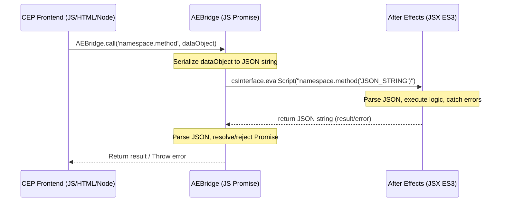

# Architecture & Data Flow Guidelines

This document outlines the system architecture, file organization, environment settings, and data flow for the CompSaver Adobe CEP extension.

---

## 1. Hybrid Environment Architecture

Adobe CEP (Common Extensibility Platform) functions as a dual-engine architecture:
* **Frontend Layer (Chromium CEF Webview)**: Runs modern HTML5, CSS3, and JavaScript (ES6+). It has access to Node.js APIs (`fs`, `path`, `child_process`, etc.) because Node integration is enabled.
* **Backend Layer (ExtendScript Host)**: Runs inside Adobe After Effects. It executes ExtendScript (based on ECMAScript 3 / ES3, circa 1999). It does **not** support ES6 features.



---

## 2. Folder Structure Conventions

To maintain a professional, scalable codebase, the project follows this folder structure:

```
CompSaver/
│
├── .agents/                 # Local AI settings and tools config
├── CSXS/
│   └── manifest.xml         # CEP Extension metadata and execution parameters
│
├── docs/                    # Technical documentation and AI guidelines
│   ├── architecture.md      # Systems architecture (this file)
│   └── extendscript_rules.md# ExtendScript environment constraints and guidelines
│
├── DESIGN.md                # CSS tokens, typography, layout systems (Linear design)
│
├── css/
│   └── style.css            # Redesigned flat CSS variables and component styles
│
├── js/
│   ├── CSInterface.js       # Official Adobe CEP communication library
│   ├── AEBridge.js          # Promise-wrapped JS-JSX communications utility
│   └── main.js              # UI controller, event listeners, and Node.js state manager
│
├── jsx/
│   └── compSaver.jsx        # Host ExtendScript logic (encapsulated in namespace)
│
├── presets/                 # Local JSON configurations, swatches, and asset cache
├── README.md                # General user setup and installation guide
└── index.html               # Main CEP panel layout markup
```

---

## 3. Communication Bridge Pattern (JSON Serialization)

Direct execution via `csInterface.evalScript` using string concatenation is highly prone to escaping syntax errors and code injection bugs. Professional CEP extensions enforce the **Bridge Pattern**:

### Rules for Frontend-to-Backend Calls:
1. **Single Entry Point**: All communications must pass through a Promise-based wrapper utility (`AEBridge.js`).
2. **JSON Serialization**: 
   - Never pass raw strings or variables. Always pass a single stringified JSON object as the argument.
   - The JSX backend parses the JSON string, performs operations, and returns a stringified JSON response.
3. **Error Handling**: The JSX function must wrap all executions in a `try-catch` block. If an error occurs, it should return a serialized error object (`{ error: "Error message details" }`) rather than failing silently.

### Bridge JS Example Interface (Logical Guideline):
* JS Side: `AEBridge.call("CompSaverGlobal.layers.createNull", { name: "Control", is3D: true })`
* JSX Side: `CompSaverGlobal.layers.createNull = function(jsonStr) { ... var args = JSON.parse(jsonStr); ... return JSON.stringify(result); }`

---

## 4. State Management and Preservation

ExtendScript memory is volatile and subject to garbage collection or namespace pollution by other installed extensions.
* **Rule**: Maintain all application state (active lists, configuration settings, user preferences, history) inside the **Frontend JavaScript engine** (or write to disk in the `presets/` folder using Node.js filesystem `fs` APIs).
* **Rule**: Treat After Effects (JSX) as a **stateless executor**. It should receive instructions, perform the surgical scripting task in the composition, and return the result immediately.

---

## 5. Node.js Integration & OS Paths

* **Node.js Environment**: CEP runs Node.js natively. Load standard modules using `window.require('fs')` or `window.require('path')`.
* **Path Traversal**: Always use `path.join()` or `path.normalize()` for filesystem operations. When passing paths to After Effects (JSX), convert them to ExtendScript `File` or `Folder` objects using absolute, URI-decoded paths (e.g., `File(myPath)`).
